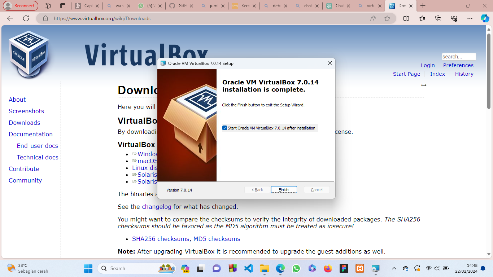
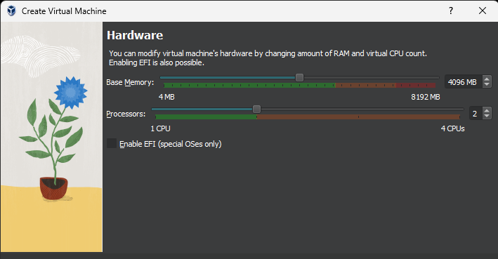
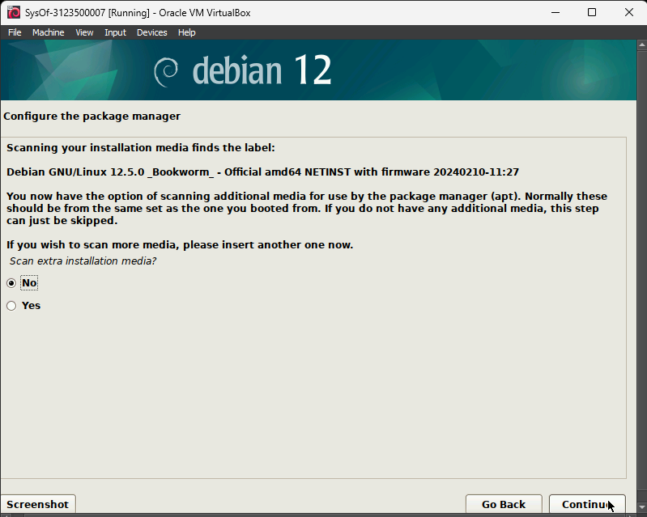
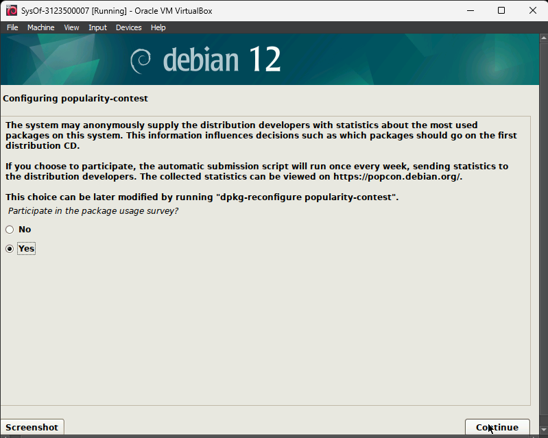
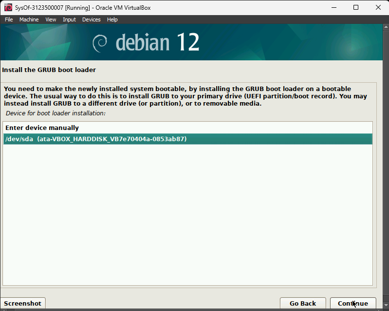
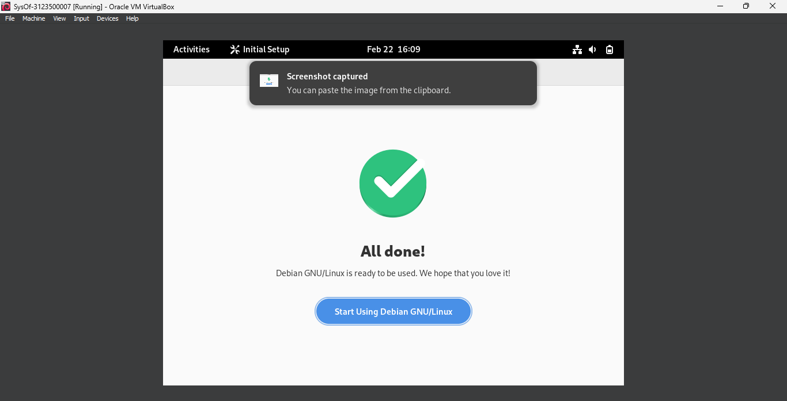

  <h1 style="text-align: right;font-weight: bold"> Laporan Praktikum 1 Sistem Operasi</h1>
  <h4 style="text-align: center;">Dosen Pengampu : Dr. Ferry Astika Saputra, S.T., M.Sc.</h4>

 
 

  
  <h3 style="text-align: center;">Disusun Oleh : </h3>
  

    Wildan Krisna Hakim (3123500002) 
    Firsty Angelica Valency (3123500029) 
    Hazel Mangadaralam Pratama Rayes (3123500024) 
  

  <h3 style="text-align: center;line-height: 1.5">Program Studi Teknik Informatika Departemen Teknik Informatika Dan Komputer Politeknik Elektronika Negeri Surabaya 2023/2024</h3>
  

# Daftar isi
 - [Pendahuluan (dasar teori)](#pendahuluan)
 - [Soal 1 dan jawaban](#soal-nomer-1)
 - [Soal 2 dan jawaban](#soal-nomer-2)
 - [Kesimpulan](#kesimpulan)
 - [Daftar Pustaka](#daftar-pustaka)

# Pendahuluan

### Apa itu Sistem operasi dan Debian 12?
**Sistem operasi** adalah perangkat lunak sistem yang digunakan untuk mengontrol dan mengelola perangkat keras dan operasi sistem dasar, termasuk menjalankan perangkat lunak aplikasi seperti pengolah kata dan browser web.
Sistem operasi adalah salah satu dari empat komponen utama komputer.Sistem operasi adalah koneksi antara komputer Anda (brainware) dan perangkat keras (hardware) yang memungkinkan Anda menggunakan komputer dengan lebih nyaman.
Hal ini dimaksudkan untuk itu.
Sistem komputer Anda akan digunakan lebih efisien.
Sebagai penghubung antara pengguna komputer dan perangkat keras,  sistem operasi memegang peranan yang sangat penting. Oleh karena itu, sistem operasi yang baik akan memaksimalkan kenyamanan pengguna dan pekerjaan komputer.
Oleh karena itu, perusahaan-perusahaan besar yang menerapkan sistem informasi untuk menjalankan bisnisnya sangat bergantung pada sistem operasi yang andal untuk mendukung operasionalnya.
Dalam artikelnya, NetMarket Share meyakini bahwa Windows adalah pemimpin pasar sistem operasi, disusul oleh sistem operasi  MAC dan Linux.

Sedangkan **Debian-12** adalah sistem operasi komputer yang terdiri dari paket perangkat lunak yang dirilis sebagai perangkat lunak bebas dan terbuka di bawah Lisensi Publik Umum GNU  dan lisensi perangkat lunak gratis lainnya.
Debian GNU/Linux menyertakan alat sistem operasi GNU dan kernel Linux adalah distribusi Linux  yang populer dan berpengaruh.
Debian didistribusikan  dengan akses ke repositori  ribuan paket perangkat lunak  yang siap diinstal dan digunakan.
Debian dikenal karena pendiriannya yang kuat terhadap Unix dan filosofi perangkat lunak bebas.
Debian dapat digunakan  pada berbagai perangkat keras, mulai dari laptop dan desktop hingga ponsel dan server.
Debian berfokus pada stabilitas dan keamanan .
Debian sering digunakan sebagai  basis bagi banyak distribusi GNU/Linux lainnya.

# Soal Nomer 1
### Jelaskan dan Sebutkan proses Booting
**jawaban** 
Proses booting adalah langkah-langkah yang diperlukan untuk menginisialisasi dan mempersiapkan sistem komputer agar dapat beroperasi penuh setelah dihidupkan.
Ini merupakan proses yang penting karena menentukan bagaimana sistem akan beroperasi dan berinteraksi dengan pengguna dan perangkat lain.

Langkah - langkah dalam proses booting :
1. **Power on** : 
Saat tombol power atau tombol reset dihidupkan, sumber daya listrik akan mengalir ke komputer. Kemudian, perangkat keras akan menerima daya untuk dinyalakan.
                

2. **Power-On Self-Test (POST)** : Komputer melakukan 
serangkaian tes untuk memastikan bahwa perangkat keras (hardware) utama berfungsi dengan baik. Ini meliputi memeriksa RAM, kartu grafis, keyboard, dan perangkat keras lainnya
                 

3. **Inisialisasi Hardware** :sistem BIOS menginisialisasi dan mengkonfigurasi Hardware seperti hard disk, memori, dan perangkat input/output
              
  

4. **Loading Boot Loader**: Sistem kemudian mencari dan memuat boot loader dari perangkat penyimpanan yang telah ditentukan sebelumnya, biasanya hard disk atau solid-state drive (SSD). Boot loader bertanggung jawab untuk memulai sistem operasi yang sesuai. 
            

5. **Inisialisasi sistem** : proses booting melanjutkan dengan inisialisasi berbagai layanan dan perangkat lunak yang diperlukan, serta konfigurasi lingkungan sistem seperti pengaturan jaringan, pengaturan waktu, dan lainnya.
            

6. **Memuat Sistem Operasi**:sistem operasi yang dipilih dimuat ke dalam memori dari penyimpanan utama. Proses ini melibatkan file inti sistem operasi dan menginisialisasi berbagai layanan dan komponen yang diperlukan
            

# Soal Nomer 2
**Bagaimana cara install Linux Debian di Virtual box ?**

**Installation**

1. Masuk ke page Virtual Box, lalu pilih OS yang sesuai  

2. Welcome  to Oracle VM VirtualBox! Klik **Next**

3. Custom Setup lalu klik **next**

4. Warning network Interface lalu klik **yes**

5. Missing Dependencies python core lalu klik **yes**

6. Persiapan untuk install Virtual Box lalu klik **install**

7. proses install Virtual Box

8. proses install telah selesai lalu tekan **finish**

9. Masuk kedalam Virtual Box lalu klik **new**

10. Buat nama SysOp lalu nrp ,serta masukkan file iso linux debian yang telah di download dan klik cheklist ,terus klik Next 

11. Atur RAM  sebesar  4096mb dan dan CPU sebesar 2

12. Setelah custom ukuran seperti NAME,ISO,RAM,CPU,DISK dan beberapa input lainnya maka akan muncul tampilan berikut

13. Klik start

14. Pilih bahasa untuk proses instalasi debian12 lalu pilih **english**

15. Pilih lokasi wilayah negara kamu  saat ini lalu pilih **asia**

16. lalu pilih kamu berada di negara mana lalu pilih **Indonesia**

17. pilih **United Status**

18. konfigurasi keyboard lalu pilih **American English**

19. Tunggu proses loading hingga selesai

20. Masukkan hostname berupa SysOp-NRP

21. Kosongkan domainnya

22. Buat password baru untuk debiannya

23. Buat fullname untuk pengguna baru

24. buat usernamenya

25. setup users and passwords

26. konfigurasi zona waktu lalu pilih **western**

27. pilih **manual**

28. pilih **SCSI3(0,0,0)(sda)**

29. klik yes

30. pilih **SCSI3(0,0,0)(sda)**

31. pilih **create a new partition**

32. lalu berikan ukuran 20GB

33. pilih primary

34. pilih beginning

35. klik **done setting up the partition**

36. setting **pri/log** sebesar 8,5GB

37. klik **create a new partition**

38. lalu atur sizenya

39. lalu pilih primary

40. lalu pilih beginning

41. Kemudian kllik done setting untuk menyelesaikan setelan penggunakan disks**done setting up the partition**

42. Setelan disks tersebut akan tersimpan sebagai penyimpanan primer ke 2 sebesar 5 GB **done setting up the partition**

43. Edit letak mount poin partison ke-2 dengan menambah partition disk **done setting up the partition**

44. Pilih penyimpanan jenis primary**done setting up the partition**

45. klik beginning **done setting up the partition**

46. kemudian klik done setting  **done setting up the partition**

47.  Simpan partiton disks pada storage**done setting up the partition**
img src="debian/41.png" alt="">
48. lalu klik done setting up the partition **done setting up the partition**
                            
49. Lalu base system akan  melakukan proses installing **done setting up the partition**

50. klik no, karena tidak ada keperluan untuk melakukan scan media **done setting up the partition**

51. Pilih server Indonesia **done setting up the partition**

52. pilih archieve mirror kebo.pens.ac.id  **done setting up the partition**

53. klik continue**done setting up the partition**

54. lalu pakage manager melakukan proses konfigurasi **done setting up the partition**

55. Klik yes bahwa kita akan ikut berpatisipasi dalam penggunaan pakage **done setting up the partition**

56. klik continue **done setting up the partition**

57. kemudian sowftware akan melakukan proses penginstallan **done setting up the partition**

58. **done setting up the partition**

59. lalu pilih yes untuk menginstall GRUB **done setting up the partition**

60. klik /dev/sda sebagai device boot loader  **done setting up the partition**

61. klik continue untuk mereboot sistem **done setting up the partition**

62. Pilih Bahasa Inggris**done setting up the partition**

64. klik English (US) sebagai setting keyboard/input method **done setting up the partition**

65. lalu izinkan aplikasi untuk emngakses lokasi kita di peta geografi **done setting up the partition**

67. lalu kaitkan dengan alamat email kalian **done setting up the partition**

68. Debian GNU/Linux dapat dujalankan dengan cara klik start using Debian GNU/Linux **done setting up the partition**

67. Screen Debian GNU**done setting up the partition**

# Kesimpulan 
Dalam praktikum ini, kita belajar mengenai pentingnya sistem operasi dan proses booting dalam penggunaan komputer sehari-hari. Debian-12, sistem operasi Linux yang kita pelajari, menawarkan tingkat keandalan dan keamanan yang tinggi. praktikum ini memberikan wawasan yang baik tentang konsep dasar sistem operasi dan bagaimana komputer bekerja. Debian-12 juga dipertimbangkan sebagai solusi yang efektif dalam berbagai kebutuhan komputasi.

# Daftar Pustaka 
- Basorudin, Gunarso, Erni Rouza, Luth Fimawahib, Asep Supriyanto (2022). "Perancangan dan Implementasi Sistem Operasi Linux Debian untuk
Konfigurasi Content Management System (CMS) Wordpress
Dengan Winscp ". BULLETIN OF COMPUTER SCIENCE RESEARCH, 1-9. Diakses 24 Februari 2024, dari https://hostjournals.com/bulletincsr/article/download/188/121

- Fachmi Rahmat Hambali Badar(2017). "RANCANG BANGUN DAN IMPLEMENTASI MANAGEMENT
BANDWIDTH PADA ROUTER BERBASIS SISTEM OPERASI GNULINUX DEBIAN". (Jurusan Ilmu Komputer, 
Fakultas Matematika dan Ilmu Pengetahuan Alam Universitas Lampung, 2017) Diakses dari https://digilib.unila.ac.id/26862/3/SKRIPSI%20TANPA%20BAB%20PEMBAHAN.pdf
