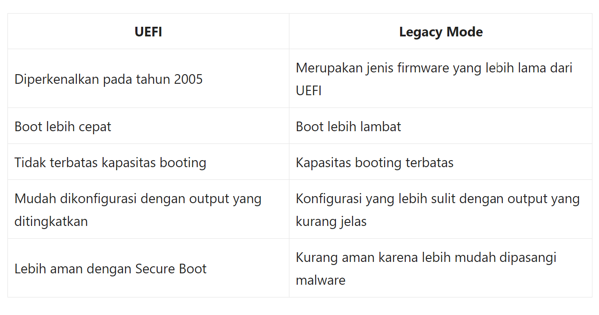
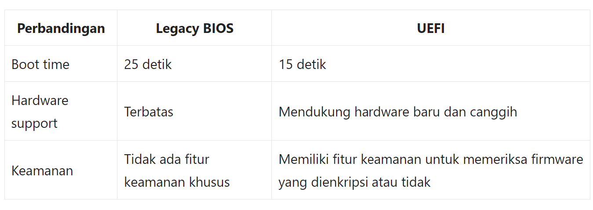
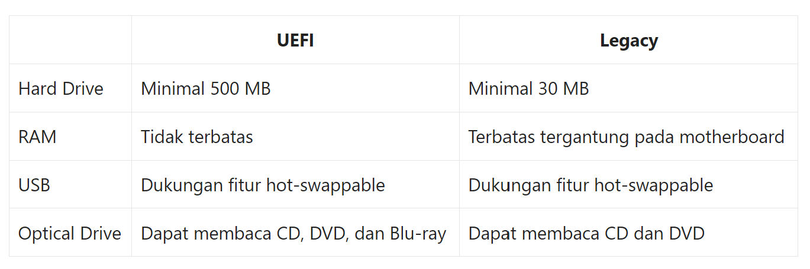

  <h1 style="font-weight: bold"> LAPORAN PRAKTIKUM II SISTEM OPERASI Perbedaan Legacy dan UEFI</h1>
  <h4 style="text-align: center;">Dosen Pengampu : Dr. Ferry Astika Saputra, S.T., M.Sc.</h4>

 
 

  
  <h3 style="text-align: center;">Disusun Oleh : </h3>
  

    Wildan Krisna Hakim (3123500002) 
    Firsty Angelica Valency (3123500029) 
    Hazel Mangadaralam Pratama Rayes (3123500024) 
  

  <h3 style="text-align: center;line-height: 1.5">Program Studi Teknik Informatika Departemen Teknik Informatika Dan Komputer Politeknik Elektronika Negeri Surabaya 2023/2024</h3>
  

# Daftar Isi
 - [Pendahuluan ](#pendahuluan)
 - [Perbedaan Legacy dan UEFI](#perbedaan-legacy-dan-uefi)
 - [Kesimpulan](#kesimpulan)
 - [Daftar Pustaka](#daftar-pustaka)

# Pendahuluan
Banyak pengguna Windows yang masih bingung  memilih antara mode Legacy BIOS dan UEFI saat menginstal sistem operasi.
Untuk memahami istilah BIOS dan UEFI, kita  harus  terlebih dahulu memahami perbedaan kedua istilah  yang  dibahas pada ulasan kali ini.  
Kedua jenis BIOS ini adalah tabel partisi yang digunakan untuk menjalankan perangkat keras dan perangkat lunak komputer.

## Definisi Legacy
**Apa itu Legacy ?**
 
**Legacy** adalah Sistem warisan atau sistem peninggalan (bahasa Inggris: legacy system) yang merupakan **metode sistem komputasi lawas atau yang sudah tua** di teknologi sistem komputer atau program aplikasi dari yang berkaitan dengan sistem komputer tua yang sudah tertinggal zaman. Namun saat ini sistem legacy masih digunakan untuk menjalankan program atau sistem operasi lawas.

## Definisi UEFI
**Apa itu UEFI**
 
**UEFI** singkatan dari **Unified Extensible Firmware Interface.** UEFI adalah pembaruan teknologi terbaru dari BIOS yang berfungsi **mengupdate fungsi BIOS yang sudah ketinggalan zaman.** UEFI hadir untuk mengatasi permasalahan BIOS yang sudah ketinggalan zaman. 

# Perbedaan Legacy dan UEFI

**Firmware**
 
Untuk lebih memahami perbedaan antara UEFI dan BIOS, berikut adalah tabel **perbandingan untuk kedua jenis firmware (perangkat lunak yang digunakan untuk menghubungkan sistem operasi dengan bagian hardware dari sebuah komputer)**.

**Performa**
 
UEFI dan Legacy BIOS memiliki perbedaan performa yang signifikan. Berikut adalah beberapa perbandingan antara keduanya:

**Kompatibilitas Perangkat keras**
 

# Kesimpulan
- UEFI sudah mendukung kapasitas penyimpanan hardisk lebih dari 2 TB, sedangkan pada BIOS maksimal adalah 2 TB.
- UEFI sudah mendukung tipe partisi GPT yang diwajibkan pada saat melakukan instalasi sistem operasi terbaru khususnya Windows 10/Linux, Sedangkan BIOS hanya dapat menjalankan tipe partisi MBR atau Master Boot Record.
Sudah memungkinkan untuk menggunakan touchpad, mouse, bahkan touchscreen saat berada didalam UEFI, sedangkan pada BIOS hanya menggunakan keyboard.
- Tampilan User Interface pada UEFI sudah jauh lebih menarik dan user friendly dari pada BIOS yang masih menggunakan mode display standar
Jika menggunakan UEFI + sistem partisi GPT maka kamu lebih mudah mengelola bootloader pad a komputer dengan dualboot/triple boot

Jadi, meskipun Legacy Mode masih digunakan, UEFI merupakan teknologi yang lebih inovatif dan ramah pengguna. UEFI dapat diandalkan untuk mem-boot sistem dengan kecepatan boot yang lebih cepat dan kapasitas booting yang lebih besar.

# Daftar Pustaka
- https://blog.dimensidata.com/pengertian-dan-perbedaan-uefi-dan-legacy-pada-bios/
- https://www.localstartupfest.id/faq/perbedaan-uefi-dan-legacy/
- https://dianisa.com/perbedaan-legacy-bios-dan-uefi/#google_vignette
- https://p2k.stekom.ac.id/ensiklopedia/Sistem_legacy
- https://www.perbedaan.co.id/perbedaan-uefi-dan-legacy/
