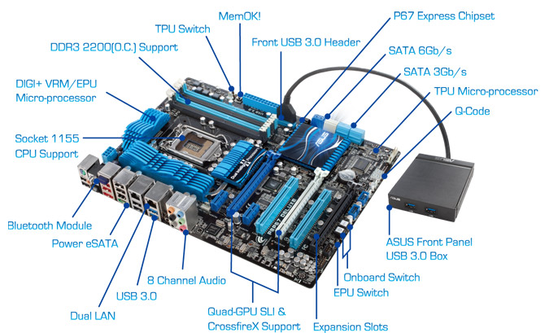
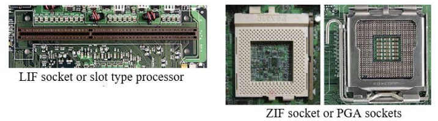
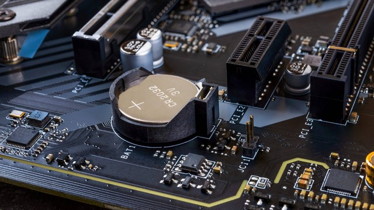
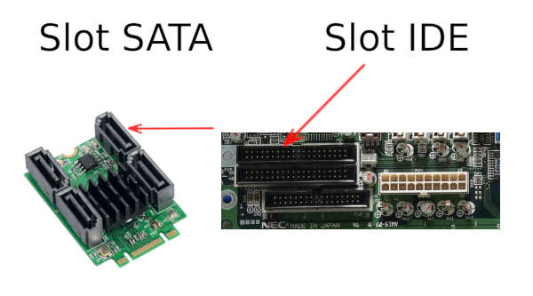
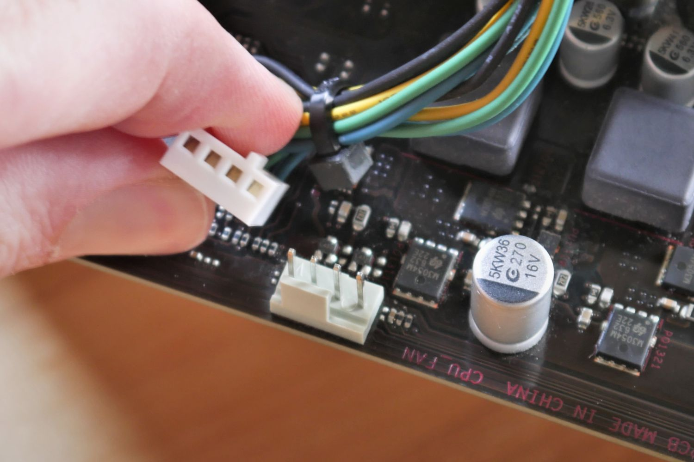
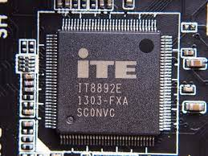
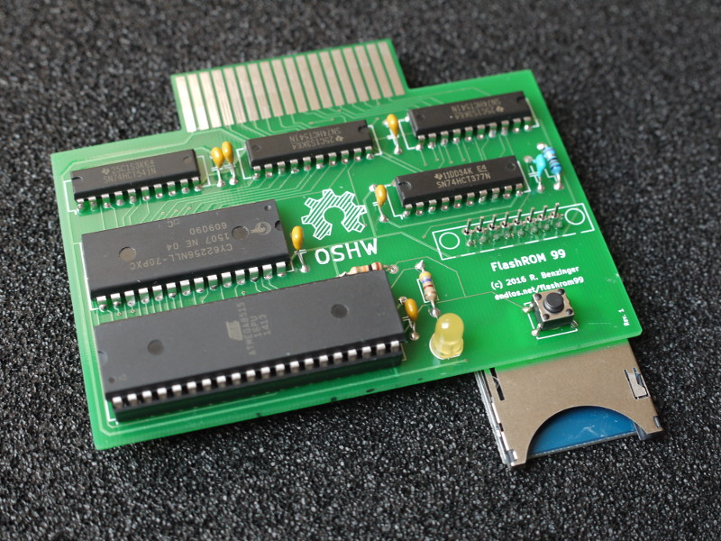
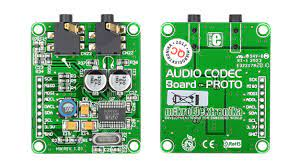

  <h1 style="font-weight: bold"> LAPORAN PRAKTIKUM II SISTEM OPERASI  STRUKTUR MOTHERBOARD</h1>
  <h4 style="text-align: center;">Dosen Pengampu : Dr. Ferry Astika Saputra, S.T., M.Sc.</h4>

 
 

  
  <h3 style="text-align: center;">Disusun Oleh : </h3>
  

    Wildan Krisna Hakim (3123500002) 
    Firsty Angelica Valency (3123500029) 
    Hazel Mangadaralam Pratama Rayes (3123500024) 
  

  <h3 style="text-align: center;line-height: 1.5">Program Studi Teknik Informatika Departemen Teknik Informatika Dan Komputer Politeknik Elektronika Negeri Surabaya 2023/2024</h3>
  

# Daftar Isi
 - [Pendahuluan ](#pendahuluan)
 - [Definisi Motherboard](#definisi-motherboard)
 - [Struktur Motherboard](#struktur-motherboard)
 - [Kesimpulan](#kesimpulan)
 - [Daftar Pustaka](#daftar-pustaka)

# Pendahuluan

## Definisi Motherboard
** Motherboard ** adalah PCB (printed circuit board) utama pada sebuah komputer untuk melakukan komunikasi antar komponen elektronik penting pada suatu sistem (seperti CPU dan memori) serta menyediakan konektor untuk peripheral lainnya.

Sebagai PCB, motherboard berperan seperti tulang belakang komputer yang mana menyediakan konektivitas elektrik sehingga berbagai komponen PC dapat berhubungan.

Motherboard pertama kali digunakan pada PC produksi IBM yang dirilis pada tahun 1981.

# Struktur Motherboard

Seperti yang telah dijelaskan sebelumnya, **motherboard** terdiri dari beberapa bagian yang memiliki fungsi dan cara kerjanya tersendiri. Komponen didalam **motherboard** dibagi menjadi dua yaitu komponen utama dan komponen tambahan.

## Komponen utama
1. **Soket CPU** 

**Soket CPU(Central Prosessing Unit) atau Soket Prosesor** 
digunakan untuk meletakkan prosesor dengan melewati lubang-lubang sesuai dengan kaki komputer.

2. **BIOS (Basic Input-Output Unit)**

**BIOS** berfungsi untuk menghubungkan perangkat kerja dan perangkat lunak 

3. **Chip North Bridge Controller**

**Chip North Bridge Controller** mempunyai fungsi sebagai penghubung antara slot RAM, slot AGP, dan socket CPU

4. **Chip South Bridge Controller**

    **Chip South Bridge Controller** mempunyai fungsi mengendalikan periferal(perangkat tambahan komputer) pada perangkat komputer, seperti ROM BIOS, USB, keyboard, IDE controller, mouse, modem, LAN, dan lainnya.

5. **Power Supply Unit Connectors**

**Power Supply Unit Connectors** berupa pin untuk menghubungkan motherboard dengan power supply(jenis ATX banyak digunakan) yang membantu mematikan daya komputer tanpa menekan tombol.

6. **CMOS (Complementary Metal Oxide Semiconductor)**

**CMOS** bisa dikatakan sebagai RAM yang memiliki kapasitas kecil dan menjadi media penyimpanan data hardware, pengaturan tanggal dan waktu, pengaturan BIOS, pengaturan booting, dll.

7. **Slot IDE (Integrated Device Electronic)**

**Slot IDE** adalah tempat menempatkan IDE di dalam motherboard dimana emiliki fungsi untuk menghubungkan Harddisk atau Optical Drive seperti CD-ROM, DVD, dan sebagainya.

8. **Slot SATA (Serial Advance Technology Attachment)**

**Slot SATA** memiliki kegunaan sama dengan slot IDE namun bentuknya berbeda. Sekarang ini slot SATA lebih banyak digunakan motherboard dari pada slot IDE. Slot SATA memiliki bentuk lebih kecil seperti USB,Sedangkan slot IDE berbentuk memanjang dan memiliki banyak pin.

9. **Slot RAM**

      

    **Slot RAM** Slot memory RAM memiliki bentuk yang mudah dikenali yaitu memanjang berada di dekat soket prosesor dan fungsinya untuk memasang RAM pada motherboard.  Fungsi RAM untuk menyimpan data sementara dari suatu program yang sedang dijalankan.  Saat ini, perangkat komputer banyak menggunakan untuk motherboard baru yang menggunakan tipe DDR3.

10. **Slot AGP**

**Slot AGP** berfungsi untuk meningkatkan grafis pada komputer, meningkatkan kecepatan gambar, menghemat CPU usage.

11. **Slot PCI**

**Slot PCI** berfungsi sebagai tempat untuk kartu Eternet, kartu LAN, kartu suara, kartu USB, kartu SATA.

12. **CPU Fan Power Supply Connector**

**CPU Fan Power Supply Connector** berfungsi untuk
menghubungkan komputer dengan kipas CPU. Kipas ini memiliki fungsi mendinginkan CPU. 

13. **Super I/O Controller**

      

      **Super I/O Controller** Sedangkan Pengontrol Super I/O merupakan bagian tempat terkumpulnya beberapa soket seperti untuk mouse, keyboard, serta percetakan dan lainnya.

14. **Flash Rom**

**Flash Rom** Memori flash atau flash ROM merupakan salah satu jenis PROM (Programmable Read Only Memory). Berbeda dengan RAM, memori jenis  ini dapat menyimpan data tanpa memerlukan daya.

15. **Audio Codec**

    

**Audio Codec** 

## Komponen Pendukung

1. Audio line in jack 
Komponen audio berwarna biru untuk tape, CD, dan pemutar DVD.

2. Audio line out jack
yaitu komponen audio berwarna kuning cerah untuk penyuara kuping dan pengeras suara.

3. Microphone
yaitu komponen audio berwarna merah muda yang berperan sebagai mikrofon.

4. USB Port 1 dan 2
yaitu komponen yang digunakan untuk memasukan perangkat USB.

5. Serial port com 2
yaitu komponen yang digunakan untuk menyambungkan monitor.

6. Serial port com 1
yakni komponen yang digunakan untuk menyambungkan mouse.

7. PS/2 keyboard port
yakni komponen dengan 6 pin yang berfungsi untuk menyambungkan keyboard (warna biru kehijauan).

8. PS/2 mouse port
yaitu komponen dengan 6 pin untuk menghubungkan komputer dengan mouse (warna ungu).

9. Paralel port
yaitu komponen yang digunakan untuk menghubungkan mesin pencetak dan mesin pemindai.

10. RJ45 port
yaitu komponen untuk menghubungkan dengan kabel ethernet.

# Kesimpulan
Motherboard adalah komponen utama dalam sebuah komputer yang berperan sebagai tulang belakang, menyediakan konektivitas elektrik antara berbagai komponen penting seperti CPU, RAM, dan periferal lainnya. Struktur motherboard mencakup berbagai komponen utama seperti soket CPU, BIOS, chip North Bridge dan South Bridge, serta slot untuk RAM, kartu grafis, dan penyimpanan. Komponen tambahan juga hadir untuk mendukung fungsionalitas seperti audio, USB, dan koneksi jaringan. Dengan peranannya yang vital, motherboard memungkinkan kerja yang efisien antar komponen dalam sistem komputer

# Daftar Pustaka
- https://kumparan.com/kabar-harian/bagian-bagian-motherboard-dan-fungsinya-1xjCtdWcq23/3
- https://qwords.com/blog/bagian-motherboard-dan-fungsinya/
- https://www.murdockcruz.com/2022/02/26/istilah-fungsi-konektor-daya-di-motherboard-hal-yang-perlu-kalian-ketahui/
- https://www.soaltekno.com/bagian-bagian-motherboard-dan-fungsinya/

