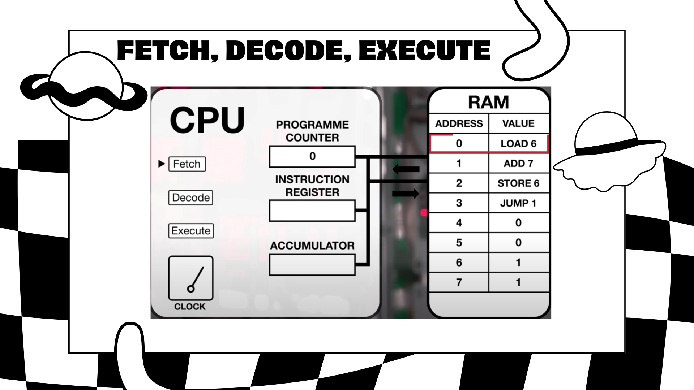

  <h1 style="font-weight: bold"> PRESENTASI SIKLUS CPU</h1>
  <h4 style="text-align: center;">Dosen Pengampu : Dr. Ferry Astika Saputra, S.T., M.Sc.</h4>

 
 

  
  <h3 style="text-align: center;">Disusun Oleh : </h3>
  

    Wildan Krisna Hakim (3123500002) 
    Firsty Angelica Valency (3123500029) 
    Hazel Mangadaralam Pratama Rayes (3123500024) 
  

  <h3 style="text-align: center;line-height: 1.5">Program Studi Teknik Informatika Departemen Teknik Informatika Dan Komputer Politeknik Elektronika Negeri Surabaya 2023/2024</h3>
  

## POWER POINT (SLIDES)
### Slide 1
Pembukaan

### Slide 2
Daftar anggota kelompok

### Slide 3
Pengertian Sistem Operasi

### Slide 4
Pengertian CPU

### Slide 5
Pengenalan siklus CPU

### Slide 6
Apa itu Fetch?

### Slide 7
Apa itu Decode?

### Slide 8
Apa itu Execute?

### Slide 9
Proses Fetch

### Slide 10
Proses Decode

### Slide 11
Proses Execute

### Slide 12 - Slide 16
Kurva Kerja CPU

### Slide 17
Pengertian bahasa Pemrograman

### Slide 18
Pengertian Compiler

### Slide 17
Penutup

### Link Power Point
- https://s.id/pptsikluscpukelompok6

## Referensi
- https://youtu.be/Z5JC9Ve1sfI?si=Gnmc8WsX7ZfFlKio

- https://youtu.be/jFDMZpkUWCw?si=bc1iltWwGN9noeDH

