<div align="center">
  <h1 style="font-weight: bold">Pratikum Operasi Input & Output Minggu 4</h1>
  <h4 style="text-align: center;">Dosen Pengampu : Dr. Ferry Astika Saputra, S.T., M.Sc.</h4>
</div>
<br />
<br />
<div align="center">
  
  <h3 style="text-align: center;">Disusun Oleh : </h3>
  <p style="tex-align: center;">
    Wildan Krisna Hakim (3123500002)<br>
    Firsty Angelica Valency (3123500029)<br>
    Hazel Mangadaralam Pratama Rayes (3123500024)<br>
  </p>
  <h3 style="text-align: center;line-height: 1.5">Program Studi Teknik Informatika<br>Departemen Teknik Informatika Dan Komputer<br>Politeknik Elektronika Negeri Surabaya<br>2023/2024</h3>
  <hr>
</div>

## TUGAS PENDAHULUAN:

## Jawablah pertanyaan-pertanyaan di bawah ini :

1. Apa yang dimaksud redirection?
2. Apa yang dimaksud pipeline?
3. Apa yang dimaksud perintah di bawah ini :
   echo, cat, more, sort, grep, wc, cut, uniq

## Jawaban:

1. <b>Redirection (Pembelokan) :</b>
   Membelokkan strandar output suatu program ke file atau membelokkan standar input suatu program dari suatu file.

2. <b>Pipeline (Pipa):</b>
   Mekanisme pipa digunakan sebagai alat komunikasi antar proses.
   Input => Proses 1 => Output = Input => Proses 2 => Output
   Proses 1 menghasilkan output yang selanjutnya digunakan sebagai input oleh Proses 2. Hubungan output input ini dinamakan pipa, yang menghubungkan Proses 1 dengan Proses 2 dan dinyatakan dengan symbol "|".

```
   Proses1 | Proses
```

3. yang dimaksud perintah di bawah ini :
   <br><b>echo :</b> Menampilkan text
   <br><b>cat :</b> Melihat isi file
   <br><b>more :</b> Membuka file satu per satu
   <br><b>sort :</b> Digunakan untuk mengurutkan masukannya berdasarkan urutan nomor ASCII dari karakter
   <br><b>grep :</b> Digunakan untuk menyaring masukannya dan menampilkan baris-baris yang hanya mengandung pola yang ditentukan.
   <br><b>wc :</b> Digunakan untuk menghitung jumlah baris, kata dan karakter dari baris-baris masukan yang diberikan kepadanya. Untuk mengetahui berapa baris gunakan option -1. Untuk mengetahui berapa kata, gunakan option -w dan untuk mengetahui berapa karakter, gunakan option -c. Jika salah satu option tidak digunakan, maka tampilannya adalah jumlah baris, jumlah kata dan jumlah karakter .
   <br><b>cut :</b> Digunakan untuk mengambil kolom tertentu dan baris-baris masukannya, yang ditentukan pada opinion -c
   <br><b>uniq :</b> Digunakan untuk menghilangkan baris-baris berurutan yang mengalami duplikasi, biasanya digabungkan dalam pipeline dengan sort.

<br>

## PERCOBAAN:

1. Login sebagai user.
2. Bukalah Console Terminal dan lakukan percobaan-percobaan di bawah ini. Perhatikan hasil setiap percobaan.
3. Selesaikan soal-soal latihan.

## Percobaan 1 : File descriptor

1. Output ke layar (standar output), input dari system (kernel)

   ```
   $ ps
   ```

   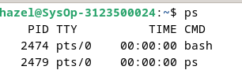
   <br>
   Analisis:
   <br>Perintah ps untuk mendaftar process yang sedang berjalan dan menampilkan informasi tentang process tersebut. ps sederhana akan mencetak 4 kolom informasi untuk minimum dua proses yang berjalan di shell saat ini, shell itu sendiri, dan proses yang berjalan di shell ketika perintah dipanggil. Output termasuk informasi tentang shell (bash) dan proses yang berjalan di shell ini:<br>
   -  PID – process ID. Biasanya, saat menjalankan perintah ps, informasi paling penting yang dicari pengguna adalah proses PID. Mengetahui PID memungkinkan Anda untuk menghentikan proses yang tidak berfungsi.<br>
   - TTY – Nama terminal pengendali untuk proses.<br>
   - TIME – Waktu CPU kumulatif dari proses, ditampilkan dalam menit dan detik.<br>
   - CMD – Nama perintah yang digunakan untuk memulai proses.<br>


2. Output ke layar (standar output), input dari keyboard (standard input)

   ```
    $ cat
    hallo, apa kabar
    hallo, apa kabar
    exit dengan ^d
    exit dengan ^d
    [Ctrl-d]
   ```

   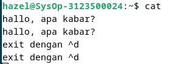
   <br>
   Analisis:
   <br>cat digunakan untuk menampilkan konten dengan melakukan klik ctrl-d jika ingin keluar.

3. Input nama direktori, output tidak ada (membuat direktori baru), bila terjadi error maka tampilan error pada layar (standard error)

   ```
   $ mkdir mydir
   $ mkdir mydir **(Terdapat pesan error)**

   ```

    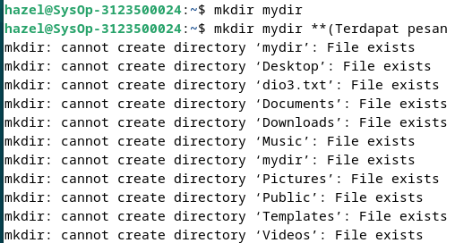
    <br>
    Analisis:
   <br>Mkdir adalah perintah membuat direktori baru dan tidak menampilkan apapun karena error.
## Percobaan 2 : Pembelokan (redirection)

1. Pembelokan standar output

   ```
    $ cat 1> myfile.txt
    Ini adalah teks yang saya simpan ke file myfile.txt
   ```

   
   <br>Analisis:
      <br>perintah cat1> myfile.txt digunakan untuk menyalin input dan menyimpannya didalam file myfile.txt.


2. Pembelokan standar input, yaitu input dibelokkan dari keyboard menjadi dari file

   ```
    $ cat 0< myfile.txt
    $ cat myfile.txt
   ```

   
   <br>Analisis:
      <br>cat merupakan perintah untuk menampilkan konten dari dalam teks. Perintah cat 0< menunjuk sebuah input berasal dari myfile.


3. Pembelokan standar error untuk disimpan di file

   ```
    $ mkdir mydir (Terdapat pesan error)
    $ mkdir mydir 2> myerror.txt
    $ cat myerror.txt
   ```

   
   <br>Analisis:
     <br> perintah mkdir digunakan untuk membuat direktori (folder) baru di sistem file. Jika terdapat kesalahan saat mencoba membuat directory akan muncul pesan error yang akan diambil dan dialihkan ke file myerror menggunakan 2>

4. Notasi 2>&1 : pembelokan standar error (2>) adalah identik dengan file descriptor 1.

   ```
    $ ls filebaru (Terdapat pesan error)
    $ ls filebaru 2> out.txt
    $ cat out.txt
    $ ls filebaru 2> out.txt 2>&
    $ cat out.txt
   ```

    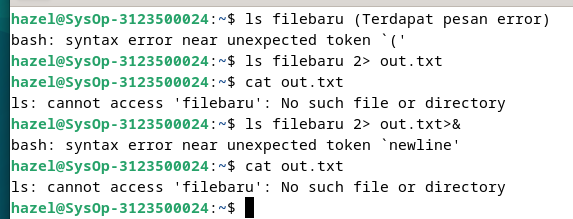
    <br>Analisis:
    <br>Is filebaru menampilkan pesan error karena directory tidak ada. kemudian Is filebaru 2> berfungsi mengalihkan pesan errornya kedalam out.txt, lalu akan 2>&1 untuk mengalihkan stderr ke stdout yang ditampilkan dengan cat berupa baris kosong.


5. Notasi 1>&2 (atau >&2) : pembelokan standar output adalah sama dengan file descriptor 2 yaitu standar error

   ```
   $ echo “mencoba menulis file” 1> baru
   $ cat filebaru 2> baru 1>&
   $ cat baru
   ```

   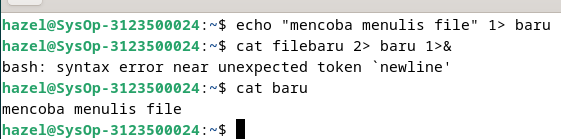
   <br>Analisis:
   <br>Perintah echo digunakan untuk menulis teks kedalam file baru menggunakan operator 1>. kemudian pesan dari echo akan dimasukkan kedalam file baru. cat baru menampilkan standar error.

6. Notasi >> (append)

   ```
   $ echo “kata pertama” > surat
   $ echo “kata kedua” >> surat
   $ echo “kata ketiga” >> surat
   $ cat surat
   $ echo “kata keempat” > surat
   $ cat surat
   ```

    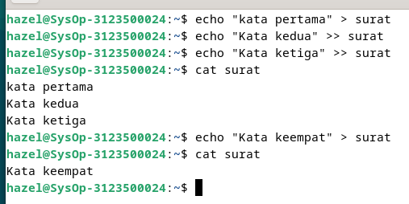
    <br>Analisis:
    <br>
    - $ echo “kata pertama” > surat akan menambahkan text kedalam file surat. jika file surat sudah ada maka akan ditimpa.
    <br>
   -  $ echo “kata kedua” >> surat dan $ echo “kata ketiga” >> surat  menambahkan kata kedua tanpa menghapus kata pertama.
    <br>
   - $cat surat menampilkan tiga baris teks yakni kata pertama, kata kedua, kata ketiga.
   <br>
   - $ echo “kata keempat” > surat menimpa tiga baris text sebelumnya sehingga ketika di cat hanya menampilkan kata keempat

7. Notasi here document (<<++ .... ++) digunakan sebagai pembatas input dari keyboard. Perhatikan bahwa tanda pembatas dapat digantikan dengan tanda apa saja, namun harus sama dan tanda penutup harus diberikan pada awal baris

   ```
   $ cat <<++
   Hallo, apa kabar?
   Baik-baik saja?
   Ok!
   ++
   $ cat <<%%%
   Hallo, apa kabar?
   Baik-baik saja?
   Ok!
   %%%
   ```

   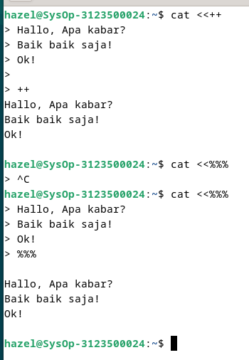
   <br>Analisis:
  <br> cat << digunakan untuk menampilkan teks yang diikuti oleh delimiter (pemisah) yang ditentukan, dalam hal ini, ++ dan %%%. sehingga 3 teks tersebut tidak sebaris linear.


8. Notasi – (input keyboard) adalah representan input dari keyboard. Artinya menampilkan file 1, kemudian menampilkan input dari keyboard dan menampilkan file 2. Perhatikan bahwa notasi “-“ berarti menyelipkan input dari keyboard
   ```
   $ cat myfile.txt – surat
   ```
   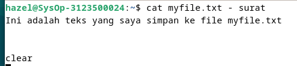
   <br>Analisis: 
   <br>$ cat myfile.txt surat Menampilkan isi dari file myfile.txt diikuti oleh isi dari file surat yaitu ini adalah text yang saya simpan ke file myfile.txt

## Percobaan 3 : Pipa (pipeline)

1. Operator pipa (|) digunakan untuk membuat eksekusi proses dengan melewati data langsung ke data lainnya.

   ```
   $ who
   $ who | sort
   $ who | sort –r
   $ who > tmp
   $ sort tmp
   $ rm tmp
   $ ls –l /etc | more
   $ ls –l /etc | sort | more
   ```

   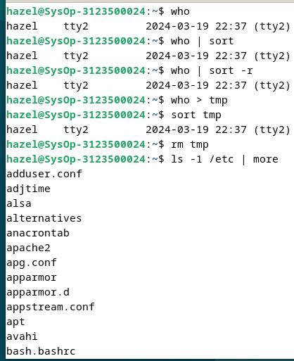
   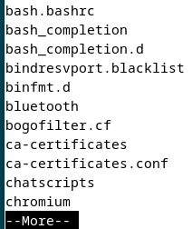
   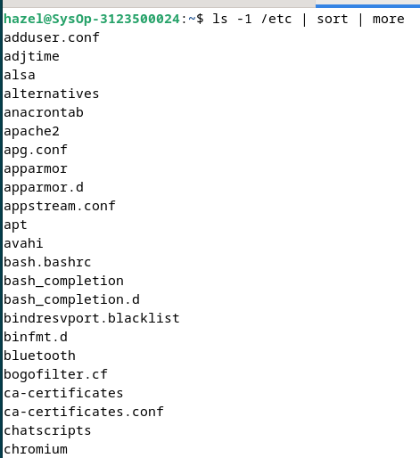
   Analisis:
   - $ who menampilkan daftar pengguna yang sedang masuk (logged in) ke sistem <br>
   - $ who | sort engalihkan output dari perintah who ke perintah sort, yang kemudian mengurutkan daftar pengguna sesuai abjad berdasarkan nama pengguna <br>
   - $ who | sort –r mengurutkan daftar pengguna secara terbalik (dari belakang ke depan)<br>
   - $ who > tmp mengalihkan output dari perintah who ke dalam file tmp. Ini menyimpan daftar pengguna yang sedang masuk ke dalam file yang disebut tmp<br>
   - $ sort tmp engurutkan isi dari file tmp, yang berisi daftar pengguna yang sedang masuk sesuai urutan abjad
   - $ rm tmp menghapus file tmp yang sudah tidak diperlukan lagi setelah penggunaan sebelumnya <br>
   -  ls –l /etc | more menampilkan daftar isi dari direktori /etc yang lebih detail dengan perintah ls -l, dan outputnya dialihkan ke program more <br>
   - $ ls –l /etc | sort | more mengurutkan daftar isi dari perintah sebelumnya<br>

2. Untuk membelokkan standart output ke file, digunakan operator ">"

   ```
   $ echo hello
   $ echo hello > output
   $ cat output
   ```

   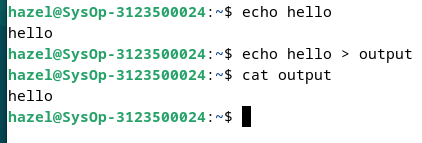
   <br>Analisis:
   <br>($ echo hello) akan menampilkan teks "hello" di terminal pada baris pertama. Tanda > digunakan untuk mengarahkan (redirect) output dari perintah echo ke dalam file output yang menampilkan hello.

3. Untuk menambahkan output ke file digunakan operator ">>"

   ```
   $ echo bye >> output
   $ cat output
   ```

   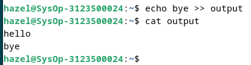
   <br>Analisis:
   <br>($ echo bye >> output) akan menambahkan teks "bye" ke dalam file. Tanda >> digunakan untuk menambahkan teks ke akhir file tanpa menghapus konten yang sudah ada sehingga akan menampilkan hello bye pada baris berbeda

4. Untuk membelokkan standart input digunakan operator "<"
   ```
   $ cat < output
   ```
   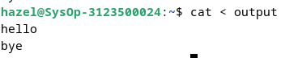
   <br>Analisis:
   <br>Tanda < mengalihkan input ke dalam file lainnya.

5. Pembelokan standart input dan standart output dapat dikombinasikan tetapi tidak boleh menggunakan nama file yang sama sebagai standart input dan output.
   ```
   $ cat < output > out
   $ cat out
   $ cat < output >> out
   $ cat out
   $ cat < output > output
   $ cat output
   $ cat < out >> out (Proses tidak berhenti)
   [Ctrl-c]
   $ cat out
   ```
   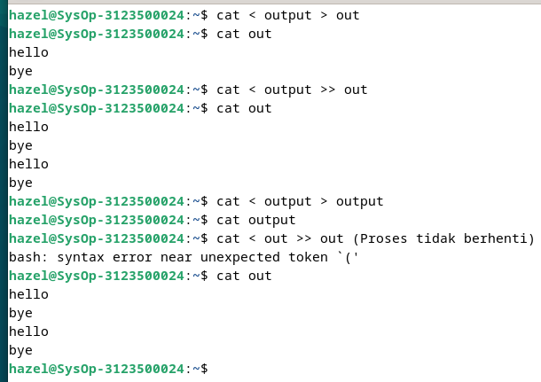
   <br>Analisis:
   <br>
   - $ cat < output > out membaca isi dari file output dan menyalinnya ke dalam file out. Pada dasarnya, ini hanya menghasilkan salinan file output ke file baru out.<br>
   - $ cat out menampilkan isi file out <br>
   - $ cat < output >> out membaca isi dari file output dan menambahkannya ke dalam file out <br>
   - Ctrl-c digunakan untuk menghentikan proses yang sedang berjalan di terminal <br>
   - $cat out menampilkan hello bye <br>

## Percobaan 4 : Filter
1. Pipa juga digunakan untuk mengkombinasikan utilitas sistem untuk membentuk fungsi yang lebih kompleks
   ```
    $ w –h | grep <user>
    $ grep <user> /etc/passwd
    $ ls /etc | wc
    $ ls /etc | wc –l
    $ cat > kelas1.txt
    Badu
    Zulkifli
    Yulizir
    Yudi
    Ade
    [Ctrl-d]
    $ cat > kelas2.txt
    Budi
    Gama
    Asep
    Muchlis
    [Ctrl-d]
    $ cat kelas1.txt kelas2.txt | sort
    $ cat kelas1.txt kelas2.txt > kelas.txt
    $ cat kelas.txt | sort | uniq
   ```

      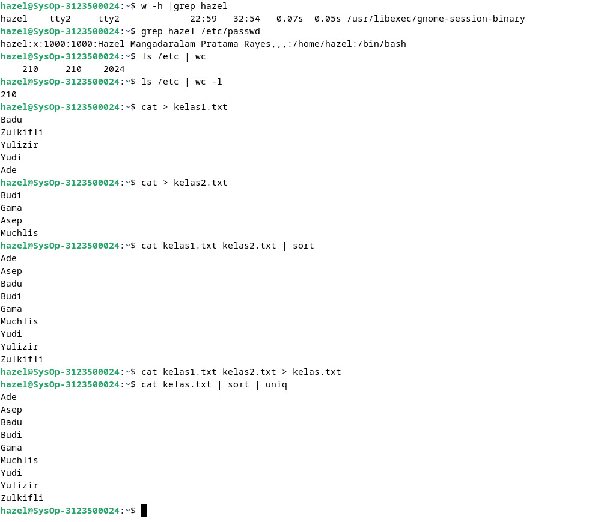
      <br>Analisis:
      <br>
      - $ w –h | grep <user>  menyimpan data logged in ke sistem
      - $ grep <user> /etc/passwd mencari informasi user yang ada didalam file /etc/passw<br>
      - $ ls /etc | wc menghitung jumlah baris, kata, dan bite dalam output dari perintah Is /etc<br>
      - $ ls /etc | wc –l menghitung jumlah baris dalam output dari perintah ls /etc.<br>
      - $ cat > kelas1.txt membuka editor teks dan memungkinkan pengguna untuk memasukkan teks secara interaktif ke dalam file kelas1.txt. Ketika pengguna menekan Ctrl-d, editor teks akan ditutup dan input akan disimpan dalam file kelas1.txt.<br>
      - $ cat > kelas2.txt: Perintah yang sama seperti sebelumnya, tetapi kali ini input disimpan dalam file kelas2.txt.<br>
      - $ cat kelas1.txt kelas2.txt | sort: Perintah ini menggabungkan isi dari file kelas1.txt dan kelas2.txt, kemudian mengurutkannya secara alfabetis menggunakan perintah sort.<br>
      - $ cat kelas1.txt kelas2.txt > kelas.txt menggabungkan isi dari file kelas1.txt dan kelas2.txt menjadi satu file yang disebut kelas.txt.<br>
      - $ cat kelas.txt | sort | uniq: menggabungkan isi dari file kelas.txt, kemudian mengurutkannya secara alfabetis menggunakan sort, dan menghapus baris-baris yang duplikat menggunakan uniq.<br>
   


## LATIHAN:

1. Lihat daftar secara lengkap pada direktori aktif, belokkan tampilan standard output   ke file baru.
2. Lihat daftar secara lengkap pada direktori /etc/passwd, belokkan tampilan standard output ke file baru tanpa menghapus file baru sebelumnya.
3. Urutkan file baru dengan cara membelokkan standard input.
4. Urutkan file baru dengan cara membelokkan standard input dan standard output ke file baru.urut.
5. Buatlah direktori latihan 2 sebanyak 2 kali dan belokkan standard error ke file rmdirerror.txt.
6. Urutkan kalimat berikut :
   ```
   Jakarta
   Bandung
   Surabaya
   Padang
   Palembang
   Lampung
   ```
  Dengan menggunakan notasi **here document (<@@@ ...@@@)** . [HINT](https://www.geeksforgeeks.org/how-to-use-here-document-in-bash-programming/)
  

7. Hitung jumlah baris, kata dan karakter dari file baru.urut dengan menggunakan filter dan tambahkan data tersebut ke file baru.
8. Gunakan perintah di bawah ini dan perhatikan hasilnya.
   ```
    $ cat > hello.txt
    dog cat
    cat duck
    dog chicken
    chicken duck
    chicken cat
    dog duck
    [Ctrl-d]
    $ cat hello.txt | sort | uniq
    $ cat hello.txt | grep “dog” | grep –v “cat”
   ```
## Kesimpulan

Operasi input-output pipeline redirection pada sistem Debian/Linux memungkinkan pengguna untuk: <br><br>
 - Mengalihkan Output: Mengarahkan output dari suatu perintah ke file atau perangkat lain.<br>
 - Menggunakan Pipelines: Mengalirkan output dari satu perintah ke input dari perintah berikutnya.<br> 
 - Penanganan Pesan Kesalahan: Memisahkan penanganan pesan kesalahan dari output utama.<br> 
 - Mengatur Aliran Data: Menggunakan operator seperti >, >>, <, |, 2>, 2>&1 untuk mengatur arah aliran data input dan output
 <br>
 - Fleksibilitas: Menyediakan fleksibilitas dalam mengelola output dan input perintah-perintah, memungkinkan penyimpanan output dalam file untuk analisis atau referensi di masa mendatang

<br>

## LAPORAN RESMI:

1. Analisa hasil percobaan 1 sampai dengan 4, untuk setiap perintah jelaskan tampilannya.
2. Kerjakan latihan diatas dan analisa hasilnya
3. Berikan kesimpulan dari praktikum ini.
