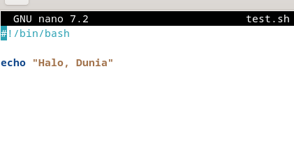

<div align="center">
  <h1 style="text-align: center;font-weight: bold">Minggu 8<br>Sistem Operasi</h1>
  <h4 style="text-align: center;">Dosen Pengampu : Dr. Ferry Astika Saputra, S.T., M.Sc.</h4>
</div>
<br />
<div align="center">
  
  <h3 style="text-align: center;">Disusun Oleh : </h3>
  <p style="text-align: center;">
    <strong>Wildan Krisna Hakim (31210000002) </strong>
  </p>
<h3 style="text-align: center;line-height: 1.5">Politeknik Elektronika Negeri Surabaya<br>Departemen Teknik Informatika Dan Komputer<br>Program Studi Teknik Informatika<br>2023/2024</h3>
  <hr><hr>
</div>

# Daftar Isi
1.  [Apa itu Bash?](#apa-itu-bash) 
    - [penjelasan](#penjelasan-singkat-bash)
    - [mode bash](#jenis-mode-bash)
    - [langkah menulish Bash](#langkah-menulis-bash)
    - [tipe shell](#tipe-shell)
    - [perbedaan script dan command line](#perbedaan-script-dan-comand-line)

2. [Cara deklarasi variabel](#bagaimana-cara-membuat-variabel-di-bash)
    - [penjelasan variabel](#penjelasan-variabel-shell-bash)
    - [mengisi variabel dengan value](#cara-mengakses-variabel-di-bash)
    - [readonly variabel](#variabel-readonly-shell-bash)
    - [menghapus value dari variabel](#menghapus-variabel-shell-bash)
    - [varibel global dan lokal](#variabel-global-dan-lokal)
    - [tipe data](#tipe-data-variabel)
    - [printenv dan env](#menampilkan-enviroment-variable-di-bash)
    - [standar penuisan variabel](#cara-penulisan-variabel)
    - [default variabel dari shell](#variabel-shell)

3. [Loop file](#loop-file-di-bash)

4. [Memberikan komen di Bash](#comment-di-bash)

5. [Array dalam Bash](#array-di-bash)
    - [pengenalan array di bash](#pengenalan-tentang-array-di-bash)
    - [membuat array di bash](#membuat-array-di-bash)
    - [cara akses array](#mengakses-nilai-dalam-array)
    - [cara menambahkan nilai di array](#menambahkan-nilai-ke-array)
    - [menghapus nilai dalam array](#menghapus-nilai-dari-array)
    - [menampilkan seluruh isi dari array](#menampilkan-seluruh-array)
    - [menghitung jumlah elemen dalam array](#menghitung-jumlah-elemen-dalam-array)

6. [Expansion](#expansion)

    
# Apa itu Bash ?
## penjelasan singkat Bash
Bash adalah singkatan dari "Bourne Again Shell," sebuah shell untuk sistem operasi Unix dan Linux yang membantu pengguna untuk berinteraksi dengan sistem melalui baris perintah, menjalankan perintah sistem, dan menulis skrip untuk otomatisasi tugas-tugas sistem.

## jenis mode bash
dua jenis bash mode : 

- Interactive mode adalah saat pengguna berinteraksi langsung dengan shell melalui terminal, di mana pengguna dapat menjalankan perintah satu per satu dan menerima respons langsung.

- Non-interactive mode digunakan saat menjalankan skrip Bash atau ketika tidak ada interaksi langsung yang diperlukan dari pengguna. Dalam mode ini, perintah-perintah dieksekusi dari skrip secara otomatis, dan biasanya outputnya disimpan dalam file atau digunakan oleh program lain.

singkatnya, Bash adalah shell yang disempurnakan.

## Langkah menulis bash
Sebelum belajar ke selanjutnya kita harus mengerti bagaimana cara menulis Bash script.

langkah menulis Bash script : 
1. buka terminal, buat file dengan perintah ```vi tesh.sh```
2. tambahkan ```#!/bin/bash``` di bagian atas file
3. setelah itu tulis code shell di file tersebut
4. jika sudah, simpan file tersebut dengan ekstensi ```.sh```
5. jika ingin run kode tersebut, gunakan perintah ```./namafile.sh``` di terminal.


## Tipe shell
shell memiliki beberapa tipe, berikut contoh tipe shell dan shebangnya. she bang atau hashbang adalah karakter khusus dalam skrip shell atau file eksekusi yang memberi tahu sistem operasi cara mengeksekusi file tersebut.

 - Bourne shell(sh) dengan hasbangnya adalah ```#!/bin/sh```
 - Bourne again shell(bash) dengan hasbangnya adalah ```#!/bin/bash```
 - C shell(cshell) dengan hasbangnya adalah ```#!/bin/csh```


 ## perbedaan script dan comand line

Pada Mata Kuliah sistem operasi kali ini kan kita belajar Bash script, namun sebelum-sebelumnya kita juga belajar command line atau perintah di Linux, Lalu apa sih bedanya?

Berikut adalah perbedaan antara keduanya : 

- Jika command line itu tidak disimpan berupa File oleh sistem operasi, namun jika Script disimpan dan dapat ditulis ulang atau diubah di file script tersebut.
- jika command line hanya bisa menjalankan satu perintah dalam satu waktu, namun jika Script dapat menjalankan beberapa perintah dalam satu file.


# Bagaimana cara membuat variabel di Bash?

## Penjelasan  Variabel Shell Bash

Dalam pemrograman shell dan script bash, variabel digunakan seperti dalam bahasa pemrograman lainnya. Variabel berfungsi sebagai wadah untuk menyimpan data dalam pemrograman, yang mencakup pointer ke lokasi memori data tersebut.

```bash
#!/bin/bash
NamaVariabel=NilaiVariabel
```
variabel "NamaVariabel" diisi dengan value "NilaiVariabel

```bash
#!/bin/bash
NilaiMahasiswa=85
```
variabel `NilaiMahasiswa` diberikan nilai 85.

## cara mengakses Variabel di Bash

cara mengakses Variabel adalah menggunakan simbol dolar ($) diikuti dengan nama variabel. Sebagai contoh,

```bash
#!/bin/bash
NilaiMahasiswa=85
echo $NilaiMahasiswa
```

variabel `NilaiMahasiswa` diisi dengan nilai 85 dan kemudian menggunakan `echo` untuk menampilkan nilai variabel `NilaiMahasiswa`. `echo` di bahasa C sama saja dengan `Printf` gampangnya seperti itu.

## Variabel Readonly Shell Bash

Variabel yang sudah dideklarasikan bisa diganti valuenya dengan cara mendeklarasi ulang variabel tersebut namun dengan nilai yang berbeda. Sebagai contoh,

```bash
#!/bin/bash
NilaiMahasiswa=85
echo $NilaiMahasiswa
NilaiMahasiswa=100
echo $NilaiMahasiswa
```

output :

```
85
100
```
diatas Variabel NilaiMahasiswa yang semua 85 diubah menjadi 100. Namun jika kita menggunakan perintah `readonly`, maka variabel tidak bisa dirubah karena variabel tersebut menjadi konstan, dan jika tetap mencoba mendeklarasi ulang namun dengan value yang beda maka outpunya akan error. Sebagai contoh,

```bash
#!/bin/bash
NilaiMahasiswa=85
echo $NilaiMahasiswa
readonly NilaiMahasiswa
NilaiMahasiswa=100
echo $NilaiMahasiswa
```

menghasilkan error, menunjukkan bahwa `NilaiMahasiswa` hanya bisa dibaca:

```
85
line 6: NilaiMahasiswa: is read-only
```

## Menghapus Variabel Shell Bash

`unset` digunakan untuk menghapus nilai variabel yang ditentukan, Varibel tetap bisa diakses namun valuenya kosong. Sebagai contoh,

```bash
#!/bin/bash
NilaiMahasiswa=85
echo $NilaiMahasiswa
unset NilaiMahasiswa
echo "kosong":$NilaiMahasiswa
```

menghasilkan:

```
85
kosong:
```

Variabel `NilaiMahasiswa` pertama kali diatur menjadi 85, nilainya dicetak, dan kemudian dihapus menggunakan `unset NilaiMahasiswa`. Selanjutnya, mencetak "kosong" diikuti oleh nilai `NilaiMahasiswa`, yang sekarang muncul sebagai spasi kosong.

## Variabel Global dan lokal

Variabel memiliki cakupan tersendiri, ada yang Global dan Lokal. jika variabel Global bisa diakses di fungsi lain, namun jika lokal hanya bisa di fungsi itu sendiri.

- contoh variabel global : 

```bash
#!/bin/bash
setNilaiMahasiswa() {
    echo "Di Dalam Fungsi Nilai: $NilaiMahasiswa"
}
NilaiMahasiswa=40
setNilaiMahasiswa
echo "Script: $tmp"
```

menghasilkan:

```
Di Dalam Fungsi Usia: 40
Usia Skrip: 40
```
- Variabel lokal
berikut penulisan variabel lokal : 

```local variablename=variablevalue```

contoh : 

```bash
#!/bin/bash
setNilaiMahasiswa() {
    local NilaiMahasiswa=85
    echo "Variabel Lokal Nilai: $NilaiMahasiswa"
}
NilaiMahasiswa=40
setNilaiMahasiswa
echo "Global: $tmp"
```

menghasilkan:

```
Variabel Lokal Nilai: 85
Global: 40
```
jadi kenapa kok dioutput global berisi 40? padahal kita sudah memanggil fungsi `setNilaiMahasiswa` setelah deklarasi Variabel global `setNilaiMahasiswa`, karena variabel `setNilaiMahasiswa` yang lokal hanya bisa diakses di fungsinya saja. 

## Tipe Data Variabel

Bash juga memiliki tipe data, cara penulisannya sebagai berikut : 

```bash
#!/bin/bash
declare options variablename=value
```

Di sini, `options` adalah tipe variabel.

Tipe Variabel | Sintaks | Deskripsi
--- | --- | ---
Array | `declare -a variable` | Mendeklarasikan variabel array yang diindeks yang menyimpan string
Array Terkait | `declare -A variable` | Mendeklarasikan array terkait
Integer | `declare -i variable` | Mendeklarasikan nilai numerik untuk disimpan dalam variabel
Readonly | `declare -r variable` | Mendeklarasikan variabel hanya bisa dibaca yang tidak dapat diubah atau dihapus
Export | `declare -x variable` | Mengekspor variabel untuk digunakan oleh semua proses anak

## Menampilkan enviroment variable di Bash

Environment variable merupakan variabel yang berada di lapisan runtime sistem operasi. jadi singkatnya adalah letak disimpannya file runtime codingan tersebut.

ada dua di bash yaitu `printenv` dan `env`

## Cara penulisan Variabel

- Variabel dibaca dengan menambahkan simbol $.
- Nama variabel terdiri dari alfabet, angka, atau garis bawah.
- Variabel bersifat case-sensitive; misalnya, `test` dan `Test` dianggap dua variabel yang berbeda.
- Meskipun nama variabel biasanya ditulis dalam HURUF KAPITAL, Anda dapat membuatnya dengan menggunakan huruf besar atau kecil jika diperlukan. Variabel lingkungan dan shell keduanya dalam HURUF KAPITAL.
- Nama variabel tidak boleh mengandung spasi.
- Nama-nama biasanya ditulis dalam gaya camelCase. Contoh: `firstName`.

## Variabel-Shell

Variabel-shell disetel oleh shell, bukan oleh pengguna. kenapa begitu? ya karena biar berlajan lebih lancar. 

Contohnya adalah:

- PWD: Menyimpan direktori kerja saat ini.
- HOME: Mewakili direktori rumah dari pengguna saat ini.
- PATH: Berisi daftar direktori di mana file-file eksekusi berada.
- IFS: Singkatan dari Internal Field Separator dan digunakan untuk membagi string menjadi bagian.
- UID: Mewakili nomor identifikasi pengguna.
- SHELL: Menentukan jalur ke executable shell.
- TERM: Menentukan jenis terminal yang digunakan.
- PS1: Mendefinisikan string prompt utama untuk shell interaktif.

Variabel-varibel ini ditetapkan dan dikelola oleh lingkungan shell itu sendiri dan memainkan peran penting dalam operasi shell serta interaksi antara pengguna dan sistem operasi. Mereka menyediakan informasi penting tentang lingkungan sistem dan pengaturan pengguna yang digunakan oleh berbagai proses shell selama eksekusi.


# Loop File di Bash

Looping file di Bash adalah teknik untuk mengiterasi melalui daftar file atau direktori dalam skrip Bash. Ini memungkinkan pengguna untuk menjalankan serangkaian perintah untuk setiap file atau direktori dalam daftar tersebut.

Ada beberapa cara untuk melakukan looping file di Bash, di antaranya adalah menggunakan perintah `for`, `while`, atau `find`. Berikut adalah contoh penggunaan perintah `for` untuk melakukan loop file di dalam sebuah direktori:

```bash
#!/bin/bash

for file in /path/to/directory/*; do
    if [[ -f "$file" ]]; then
        echo "Processing file: $file"
    fi
done
```

Dalam contoh di atas, `for file in /path/to/directory/*` menghasilkan daftar file di dalam direktori yang ditentukan. Setiap file kemudian diproses secara terpisah di dalam loop dengan perintah-perintah yang ditempatkan di dalam blok loop.

Dengan menggunakan looping file di Bash, pengguna dapat melakukan berbagai operasi, seperti memproses file, melakukan pencarian, atau menjalankan perintah berdasarkan file-file yang ada di sistem.


# Comment di Bash

Komentar di Bash adalah teks yang ditambahkan ke dalam skrip Bash untuk memberikan penjelasan atau dokumentasi tentang apa yang dilakukan oleh skrip tersebut. Komentar tidak akan dieksekusi oleh shell dan hanya berfungsi sebagai catatan untuk pembaca skrip.

Komentar dapat ditandai dengan karakter `#` untuk single line dan untuk multiple line menggunakan `:` diikuti oleh `'` untuk awal line dan diakhiri `'` di line terakhir.

Contoh:
```bash
#!/bin/bash

# Ini adalah komentar di Bash
echo "Halo, dunia!"  # Ini juga komentar.
```

# Array di bash

## Pengenalan tentang Array di Bash:

Array adalah struktur data yang memungkinkan pengguna untuk menyimpan dan mengelola sejumlah nilai dalam satu variabel. Dalam konteks Bash, array adalah kumpulan nilai yang diidentifikasi oleh nomor indeks, yang dimulai dari 0. Ini memungkinkan Anda untuk mengorganisir data dengan lebih baik dan mengaksesnya dengan mudah.

## Membuat Array di Bash:

Anda dapat membuat array di Bash dengan menggunakan sintaks berikut:

```bash
#!/bin/bash
nama_array=(nilai1 nilai2 nilai3 ...)
```

Misalnya:
```bash
#!/bin/bash
buah=("Apel" "Pisang" "Jeruk" "Anggur")
```

Di sini, variabel "buah" adalah array yang berisi empat elemen: Apel, Pisang, Jeruk, dan Anggur.

## Mengakses Nilai dalam Array:

Anda dapat mengakses nilai dalam array dengan menggunakan nomor indeks. Misalnya, untuk mengakses nilai kedua dalam array "buah", Anda dapat menggunakan sintaks berikut:

```bash
#!/bin/bash
echo ${buah[1]}
```

Hasilnya akan mencetak nilai "Pisang", karena indeks array dimulai dari 0.

## Menambahkan Nilai ke Array: 

Anda dapat menambahkan nilai baru ke dalam array dengan menggunakan sintaks berikut:

```bash
#!/bin/bash
buah+=("Mangga")
```

Ini akan menambahkan nilai "Mangga" ke dalam array "buah".

## Menghapus Nilai dari Array: 

Anda juga dapat menghapus nilai dari array dengan mengatur nilainya menjadi kosong. Misalnya:

```bash
#!/bin/bash
buah[2]=""
```

Ini akan menghapus nilai "Jeruk" dari array "buah".

## Menampilkan Seluruh Array:

Untuk menampilkan seluruh nilai dalam array, Anda dapat menggunakan sintaks berikut:

```bash
#!/bin/bash
echo ${buah[@]}
```

## Menghitung Jumlah Elemen dalam Array: 

Untuk menghitung jumlah elemen dalam array, Anda dapat menggunakan sintaks berikut:

```bash
#!/bin/bash
echo ${#buah[@]}
```

Ini akan mencetak jumlah elemen dalam array "buah".

Dengan pemahaman tentang array di Bash dan menggunakan sintaks yang sesuai, Anda dapat membuat skrip Bash yang lebih dinamis dan efisien untuk mengelola data dan operasi.


# Expansion 

Cara menulis skrip shell di bash : 

- Pilih Editor atau editor teks
- Buat file dengan ekstensi .sh atau .bash
- Tulis perintah dalam file
- Simpan file sebagai test.sh



Ubah izin untuk mengeksekusi file


