<div align="center">
  <h1 style="text-align: center;font-weight: bold">UTS <br>Sistem Operasi</h1>
  <h4 style="text-align: center;">Dosen Pengampu : Dr. Ferry Astika Saputra, S.T., M.Sc.</h4>
</div>
<br />
<div align="center">
  
  <h3 style="text-align: center;">Disusun Oleh : </h3>
  <p style="text-align: center;">
    <strong>Wildan Krisna Hakim (3123500002) </strong>
  </p>
<h3 style="text-align: center;line-height: 1.5">Politeknik Elektronika Negeri Surabaya<br>Departemen Teknik Informatika Dan Komputer<br>Program Studi Teknik Informatika<br>2023/2024</h3>
  <hr><hr>
</div>

# 1. Fork : Parent - Child Process

a. Buat tulisan tentang konsep fork dan implementasinya dengan menggunakan bahasa pemrograman C! (minimal 2 paragraf disertai dengan gambar)

    Jawaban : 

Konsep fork dalam sistem operasi, khususnya Unix dan Linux, merupakan suatu proses di mana sebuah proses parent menciptakan proses child yang merupakan salinan dari dirinya sendiri. Proses ini sangat penting dalam pemrograman sistem karena memungkinkan eksekusi program secara paralel. Dalam bahasa pemrograman C, fungsi fork() digunakan untuk mengimplementasikan konsep ini. Saat fungsi fork() dipanggil, sistem operasi akan membuat proses baru (child) dengan ruang alamat yang sama dengan proses yang memanggilnya (parent). Kedua proses kemudian akan berjalan dari titik di mana fork() dipanggil, tetapi dengan nilai pengembalian yang berbeda untuk membedakan antara proses parent dan child. Proses parent menerima PID (Process ID) dari child, sedangkan proses child menerima nilai 0.

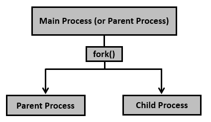


Setelah pemanggilan fungsi fork(), sistem operasi akan membuat salinan dari proses pemanggil (parent) yang disebut child process. Child process memiliki salinan dari ruang alamat dari parent process. Ini berarti bahwa pada awalnya, kedua proses tersebut berbagi memori fisik yang sama, namun setelah fork, sistem operasi akan membuat salinan memori bagi child process untuk memungkinkan modifikasi independen oleh kedua proses.

Selain itu, child process akan memiliki keadaan yang sama seperti parent process pada saat fork() dipanggil, termasuk file yang sedang dibuka, status signal, dan atribut lainnya. Namun, child process akan memiliki PID (Process ID) yang berbeda dari parent process. PID adalah cara sistem operasi mengidentifikasi setiap proses secara unik.

Setelah fork(), kedua proses (parent dan child) akan berjalan secara independen dari satu sama lain. Ini berarti bahwa setiap proses memiliki kontrol penuh atas eksekusi kode mereka sendiri. Perubahan yang dilakukan oleh satu proses terhadap memori tidak akan memengaruhi memori proses lainnya, kecuali jika mereka menggunakan mekanisme komunikasi yang disediakan oleh sistem operasi, seperti shared memory atau mekanisme komunikasi antar-proses lainnya.

Implementasi fork() dalam C memerlukan pemahaman tentang bagaimana sistem operasi menangani proses. Sebagai contoh, ketika proses parent ingin menunggu proses child selesai, ia bisa menggunakan fungsi wait() atau waitpid(). Ini memastikan bahwa proses parent tidak berakhir lebih dulu dari child, yang bisa mengakibatkan child menjadi proses zombie. Contoh kode berikut menunjukkan bagaimana fork() bisa digunakan untuk membuat proses child sederhana yang menjalankan kode tertentu sebelum akhirnya berakhir, sedangkan proses parent menunggu hingga eksekusi child selesai:

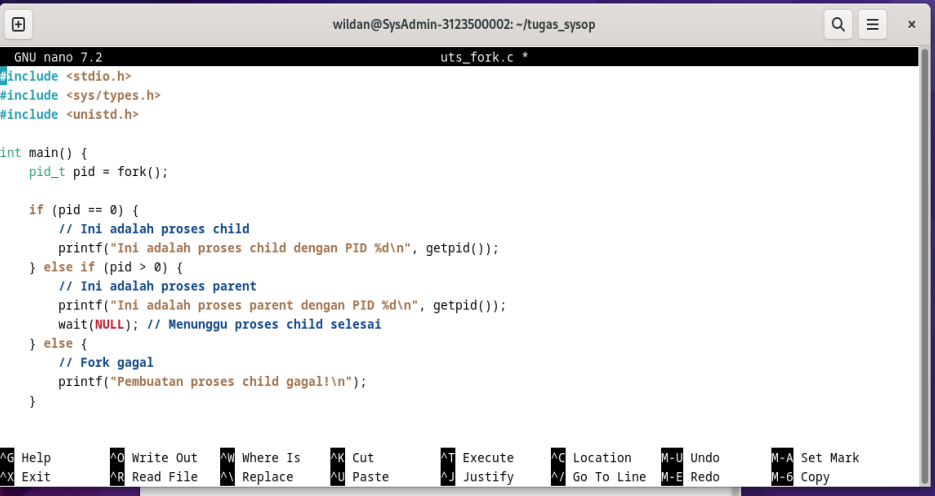


b. Akses dan clonning repo : https://github.com/ferryastika/operatingsystem.git

 - cari dahulu letak direktori untuk menyimpan cloning git
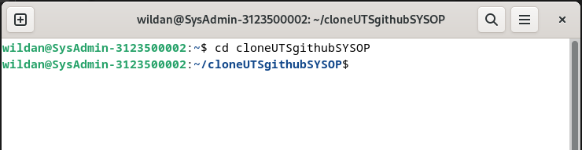

 - lakukan git dengan cara : 
    git clone (link repo github tujuan)
   tunggu proses selesai
  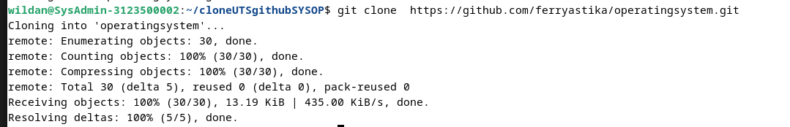
  setelah tampilan seperti gambar diatas, maka clonning repo telah berhasil dilakukan


c. Deskripsikan dan visualisasikan pohon proses hasil eksekusi dari kode program ```fork01.c```, ```fork02.c```, ```fork03.c``` ```fork04.c```, ```fork05.cdan``` ```fork06.c```


 - ```fork01.c```

 Listing program : 

   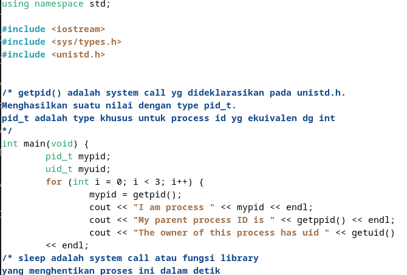


 Output program : 

   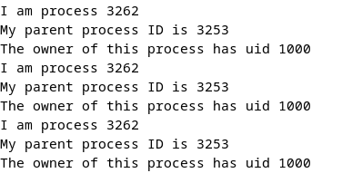

Deskripsi : ```fork01.cpp``` adalah program sederhana yang mencetak informasi tentang proses saat ini, seperti ID proses (PID), ID proses induk (PPID), dan ID pengguna (UID). Program ini kemudian akan tidur selama 3 detik sebelum mencetak informasi tersebut lagi. <br>
i. Awalnya, ada satu proses yang dibuat oleh sistem operasi. Proses ini adalah proses utama atau proses "induk" dari semua proses lainnya.

ii. Proses utama memulai eksekusi kode program. Setelah loop for dieksekusi, terdapat tiga iterasi dari loop tersebut.

iii. Pada setiap iterasi loop, proses utama melakukan panggilan sistem getpid() untuk mendapatkan PID-nya sendiri, kemudian mencetak informasi tentang dirinya sendiri, seperti PID, PPID, dan UID. Selanjutnya, proses utama akan tidur selama 3 detik.

iv Pada setiap iterasi loop, sistem juga membuat salinan dari proses utama, yang disebut child process. Child process memiliki ruang alamat yang sama dengan proses utama, tetapi memiliki PID yang berbeda.

v Setelah proses utama tidur selama 3 detik, ia akan terbangun dan mencetak informasi lagi. Hal yang sama juga terjadi dengan child process.

vi Proses utama dan child process melakukan hal yang sama pada setiap iterasi loop, tetapi karena mereka memiliki PID yang berbeda, mereka mencetak informasi yang berbeda pula

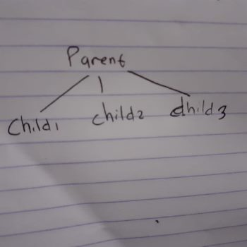


  - ```fork02.cpp```

Listing program :

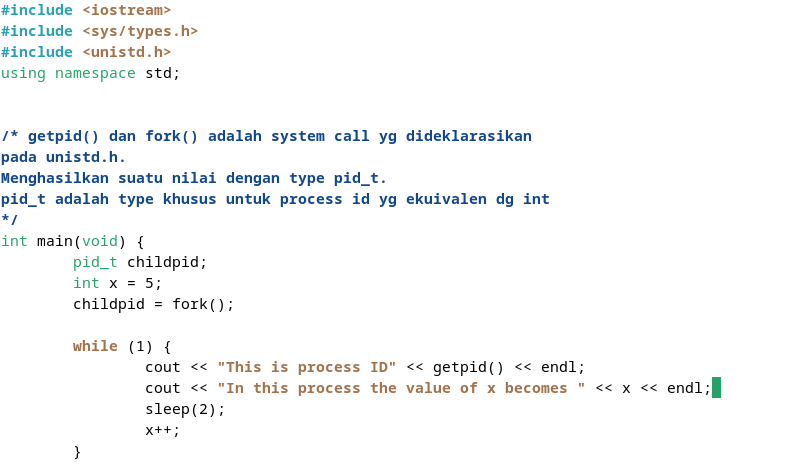

Output program :

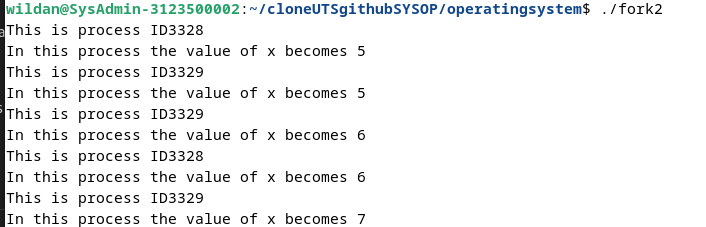

Deskripsi : ```fork02.cpp``` merupakan program yang menggunakan fungsi fork() untuk membuat proses child yang kemudian berjalan dalam loop tanpa batas <br>
i Awalnya, ada satu proses yang dibuat oleh sistem operasi. Proses ini adalah proses utama atau proses "induk" dari semua proses lainnya.

ii Proses utama memulai eksekusi kode program. Kemudian, di dalam program, terdapat pemanggilan fungsi fork(). Pemanggilan ini menyebabkan pembuatan salinan dari proses utama yang disebut child process.

iii Setelah fork(), terdapat dua proses yang berjalan secara paralel: proses utama dan child process. Kedua proses ini memiliki ruang alamat yang sama dengan proses utama, tetapi memiliki PID yang berbeda.

iv Setelah pembuatan child process, kedua proses tersebut memasuki loop while yang tak berujung. Di dalam loop ini, kedua proses akan terus mencetak informasi tentang PID mereka sendiri dan nilai x yang terus bertambah setiap kali loop dieksekusi.

v Karena loop tidak memiliki kondisi berhenti, kedua proses akan terus berjalan secara paralel tanpa henti, mencetak informasi tentang PID mereka dan nilai x yang terus bertambah.

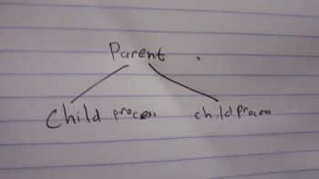


  - ```fork03.cpp```

Listing  Program :

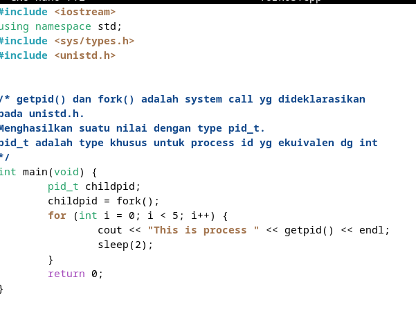

Output program :

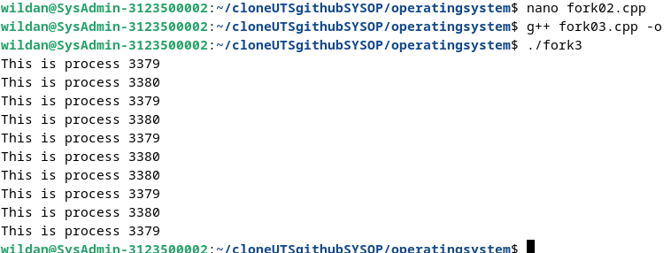

Deskripsi : ```fork03.cpp``` adalah program sederhana yang menggunakan fungsi fork() untuk membuat child process, kemudian mencetak PID dari proses (baik parent maupun child) dalam sebuah loop. Setiap proses akan mencetak PID-nya sendiri beberapa kali sebelum program selesai dieksekusi.<br>
i Awalnya, ada satu proses yang dibuat oleh sistem operasi. Proses ini adalah proses utama atau proses "induk" dari semua proses lainnya.

ii Proses utama memulai eksekusi kode program. Kemudian, di dalam program, terdapat pemanggilan fungsi fork(). Pemanggilan ini menyebabkan pembuatan salinan dari proses utama yang disebut child process.

iii Setelah fork(), terdapat dua proses yang berjalan secara paralel: proses utama dan child process. Kedua proses ini memiliki ruang alamat yang sama dengan proses utama, tetapi memiliki PID yang berbeda.

iv Setiap proses (baik parent maupun child) akan memasuki loop for yang akan mencetak PID-nya sendiri beberapa kali.

v Karena loop memiliki batasan iterasi sebanyak lima kali, masing-masing proses akan mencetak PID-nya sendiri lima kali.


  - ```fork04.cpp```

Listing program : 

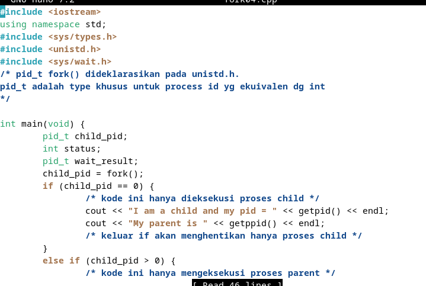
Output program :

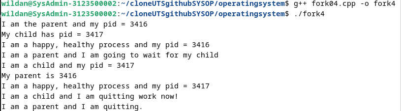

Deskripsi : ```fork04.cpp``` adalah contoh penggunaan fungsi fork() untuk membuat proses child dan melakukan komunikasi antara proses parent dan child menggunakan fungsi wait().<br>
i Awalnya, ada satu proses yang dibuat oleh sistem operasi. Proses ini adalah proses utama atau proses "induk" dari semua proses lainnya.

ii Proses utama memulai eksekusi kode program. Kemudian, di dalam program, terdapat pemanggilan fungsi fork(). Pemanggilan ini menyebabkan pembuatan salinan dari proses utama yang disebut child process.

iii Setelah fork(), terdapat dua jalur eksekusi:

  -  Jalur eksekusi untuk proses child, di mana child process mencetak informasi tentang dirinya sendiri (PID dan PPID).

  -  Jalur eksekusi untuk proses parent, di mana parent process mencetak informasi tentang dirinya sendiri (PID) dan PID dari child process yang baru saja dibuat.

iv Setelah mencetak informasi, baik proses parent maupun child melanjutkan untuk mencetak pesan bahwa mereka adalah proses yang sehat dan bahagia.

v Jika proses yang dieksekusi adalah child process, maka pesan "I am a child and I am quitting work now!" akan dicetak. Jika proses yang dieksekusi adalah parent process, maka pesan "I am a parent and I am going to wait for my child" akan dicetak, dan kemudian proses parent akan masuk ke dalam loop yang menunggu sinyal SIGCHLD yang dikirimkan oleh sistem operasi ketika proses child selesai dieksekusi.

vi Setelah child process selesai dieksekusi, ia akan mengirim sinyal SIGCHLD kepada parent process.

vii Parent process akan keluar dari loop wait() ketika menerima sinyal SIGCHLD dan kemudian mencetak pesan "I am a parent and I am quitting."


  - ```fork05.cpp```

Listing program : 


Output program : 


Deskripsi : ```fork05.cpp``` adalah contoh program yang menggunakan fungsi fork() untuk membuat proses child dan kemudian menggunakan fungsi execl() untuk menjalankan program ls pada direktori /home. Setelah menjalankan execl(), program akan keluar dari child process menggunakan fungsi exit().

i Awalnya, ada satu proses yang dibuat oleh sistem operasi. Proses ini adalah proses utama atau proses "induk" dari semua proses lainnya.

ii Proses utama memulai eksekusi kode program. Kemudian, di dalam program, terdapat pemanggilan fungsi fork(). Pemanggilan ini menyebabkan pembuatan salinan dari proses utama yang disebut child process.

iii Setelah fork(), terdapat dua jalur eksekusi:

  - Jalur eksekusi untuk proses child, di mana child process mencetak informasi tentang dirinya sendiri (PID) dan menjalankan program ls menggunakan fungsi execl(). Setelah itu, child process akan keluar menggunakan fungsi exit().

  - Jalur eksekusi untuk proses parent, di mana parent process mencetak informasi tentang dirinya sendiri (PID) dan kemudian melanjutkan eksekusi program.

iv Jika execl() berhasil dieksekusi, kode setelah execl() dalam proses child tidak akan pernah dieksekusi karena child process akan diganti oleh program ls yang baru dijalankan.

v Program ls akan menampilkan daftar file dan direktori pada direktori /home.

vi Setelah program ls selesai dieksekusi, child process akan keluar dari eksekusi menggunakan fungsi exit().

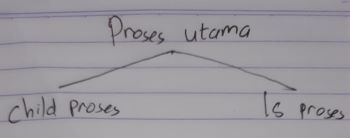


  - ```fork06.cpp```

Listing program : 

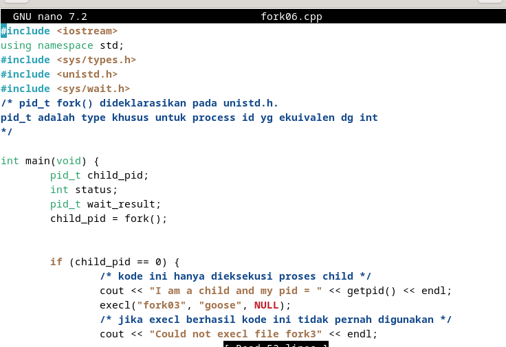

Output program : 

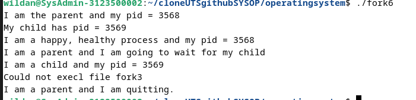

Deskripsi : dalah contoh dari penggunaan fungsi fork() untuk menciptakan sebuah child process. Setelah pembuatan child process, program tersebut melakukan sebuah panggilan ke fungsi execl() untuk menjalankan sebuah program bernama "fork03" 

i Program memanggil fungsi fork() untuk menciptakan sebuah child process.

ii Jika proses yang tercipta adalah child process, maka proses tersebut mencetak sebuah pesan yang menyatakan bahwa ia adalah sebuah child process, serta mencetak PID-nya sendiri. Selanjutnya, proses tersebut menjalankan program "fork03" (atau "goose") menggunakan fungsi execl(). Jika fungsi execl() berhasil, kode setelahnya tidak akan pernah dijalankan. Namun, jika gagal, maka program akan mencetak pesan kesalahan.

iii Jika proses yang tercipta adalah parent process, maka proses tersebut mencetak sebuah pesan yang menyatakan bahwa ia adalah sebuah parent process, serta mencetak PID dari child process yang baru saja diciptakan. Selanjutnya, parent process menunggu hingga child process selesai dieksekusi menggunakan fungsi wait().

iv Setelah child process selesai dieksekusi, parent process keluar dari fungsi wait(). Kemudian, program selesai dieksekusi.

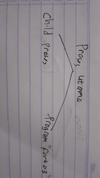


# 2. Tugas 

Buatlah program perkalian 2 matriks [4 x 4] dalam bahasa C yang memanfaatkan ```fork()``` . 

Listing program perkalian 2 matriks [4x4] :

```
#include <stdio.h>
#include <unistd.h>
#include <sys/wait.h>

#define ROWS 4
#define COLS 4

void printMatrix(int matrix[ROWS][COLS]) {
    for (int i = 0; i < ROWS; i++) {
        for (int j = 0; j < COLS; j++) {
            printf("%d\t", matrix[i][j]);
        }
        printf("\n");
    }
}

void multiplyRow(int result[ROWS][COLS], int matrix1[ROWS][COLS], int matrix2[ROWS][COLS], int row1, int row2) {
    for (int i = 0; i < COLS; i++) {
        result[row1][row2] += matrix1[row1][i] * matrix2[i][row2];
    }
}

int main() {
    int matrix1[ROWS][COLS] = {{1, 2, 3, 4},
                                {5, 6, 7, 8},
                                {9, 10, 11, 12},
                                {13, 14, 15, 16}};

    int matrix2[ROWS][COLS] = {{1, 2, 3, 4},
                                {5, 6, 7, 8},
                                {9, 10, 11, 12},
                                {13, 14, 15, 16}};

    int result[ROWS][COLS] = {0};

    for (int i = 0; i < ROWS; i++) {
        pid_t pid = fork();

        if (pid < 0) {
            printf("Fork failed\n");
            return 1;
        } else if (pid == 0) {
            for (int j = 0; j < ROWS; j++) {
                multiplyRow(result, matrix1, matrix2, i, j);
            }
            return 0;
        }
    }

    for (int i = 0; i < ROWS; i++) {
        wait(NULL);
    }

    printf("Matrix 1:\n");
    printMatrix(matrix1);
    printf("\nMatrix 2:\n");
    printMatrix(matrix2);
    printf("\nResult:\n");
    printMatrix(result);

    return 0;
}
```

Output program : 

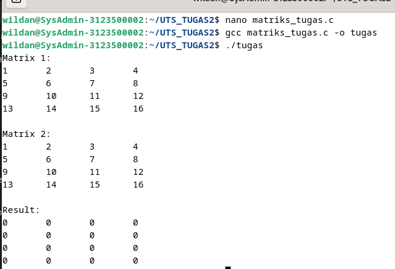

Deskripsi : 

Program ini menggunakan fork() untuk membuat proses child yang akan melakukan perkalian dua matriks. Berikut adalah deskripsi langkah-langkah program tersebut:
1. Program utama (Proses Utama):

- Membuat dua matriks 4x4: matrix1 dan matrix2.
- Membuat matriks kosong untuk menyimpan hasil perkalian, yaitu result.
- Membuat loop untuk melakukan fork() sebanyak jumlah baris pada matriks (4 kali).
- Setiap kali fork() dipanggil, sebuah child process akan tercipta. Child process ini akan melakukan perkalian baris tertentu dari matrix1 dengan seluruh kolom dari matrix2.
- Proses parent menunggu semua child process selesai dieksekusi sebelum melanjutkan ke langkah selanjutnya.

2. Child Process:

- Menerima tugas untuk melakukan perkalian baris tertentu dari matrix1 dengan seluruh kolom dari matrix2.
- Melakukan perkalian tersebut dan menyimpan hasilnya dalam matriks result.
- Setelah selesai melakukan perkalian, child process keluar dari eksekusi.

3. Setelah semua child process selesai dieksekusi, proses parent menampilkan matriks-matriks yang telah dibuat dan hasil perkalian dari kedua matriks tersebut.
<br><br>
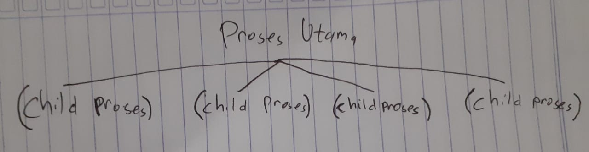