

  <h1 style="text-align: center;font-weight: bold">Praktikum 10 Praktek Sistem Operasi</h1>
  <h4 style="text-align: center;">Dosen Pengampu : Dr. Ferry Astika Saputra, S.T., M.Sc.</h4>

 

  
  <h3 style="text-align: center;">Disusun Oleh : </h3>
  

    <strong>Wildan Krisna Hakim (3123500002) </strong> 
  

<h3 style="text-align: center;line-height: 1.5">Politeknik Elektronika Negeri Surabaya Departemen Teknik Informatika Dan Komputer Program Studi Teknik Informatika 2023/2024</h3>
  

# Threads
## Tujuan 
1. Memperkenalkan Konsep Thread:

- Memperkenalkan konsep thread sebagai unit dasar pemanfaatan CPU yang menjadi dasar dari sistem komputer multithreaded. Thread adalah urutan instruksi yang dapat dieksekusi secara bersamaan dengan thread lainnya dalam satu proses. Setiap thread dalam satu proses berbagi sumber daya seperti memori dan file terbuka, namun beroperasi secara independen.

2. Membahas API untuk Pthreads, Windows, dan Java Thread Libraries:

- Membahas berbagai API yang digunakan untuk pengelolaan thread pada sistem operasi yang berbeda, termasuk Pthreads (POSIX Threads), Windows threads, dan Java threads. Pthreads digunakan pada sistem yang mendukung standar POSIX, Windows threads pada sistem operasi Windows, dan Java threads dalam lingkungan pemrograman Java.

3. Menjelajahi Beberapa Strategi yang Menyediakan Implicit Threading:

- engeksplorasi beberapa strategi untuk pengelolaan thread secara implisit, di mana pembuatan dan sinkronisasi thread diatur oleh konstruk atau kerangka kerja tingkat tinggi. Beberapa strategi termasuk penggunaan thread pools, Fork-Join framework, dan OpenMP.

4. Membahas Isu Terkait Pemrograman Multithreaded:

- Meneliti isu-isu yang muncul dalam pemrograman multithreaded, seperti sinkronisasi, deadlock, dan kondisi balapan (race conditions). Penting untuk memahami mekanisme sinkronisasi seperti mutex, semaphore, dan variabel kondisi untuk memastikan eksekusi thread yang aman dan efisien.

5. Mencakup Dukungan Sistem Operasi untuk Thread di Windows dan Linux:

- Mengulas dukungan sistem operasi untuk pengelolaan thread pada platform Windows dan Linux, termasuk bagaimana kedua sistem ini mengimplementasikan dan mengelola thread, serta fitur-fitur yang mereka sediakan untuk mendukung pemrograman multithreaded.

## Multithread Server Architecture

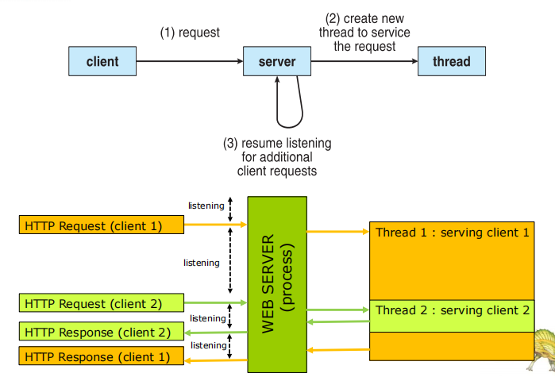

### Keuntungan

#### Responsiveness
  - dapat memungkinkan eksekusi berlanjut jika sebagian proses diblokir, sangat penting untuk user interface
  - Multithreading dalam aplikasi interaktif memungkinkan program untuk tetap berjalan walaupun bagian dari program tersebut sedang diblokir / terhalang atau sedang menjalankan operasi yang memakan waktu. Ini meningkatkan responsivitas terhadap pengguna. Di lingkungan tanpa multithreading, server hanya bisa melayani satu permintaan pada satu waktu. Ini menyebabkan pengguna lain harus menunggu tanpa alasan. Pendekatan yang lebih baik adalah meneruskan permintaan ke thread pekerja dan terus mendengarkan port untuk permintaan lainnya.
#### Resource Sharing
  - thread berbagi sumber daya proses, lebih mudah daripada memori bersama atau pengiriman pesan
  - proses dapat berbagi resources hanya melalui teknik seperti
    - Message passing
    - shared memory
  - dimana teknik-teknik tersebut harus diatur secara eksplisit oleh programmer. Benefit dari berbagi kode dan data adalah memungkinkan aplikasi memiliki beberapa rangkaian aktivitas dalam ruang address yang sama.
#### Economy
  - lebih murah daripada pembuatan proses, pergantian thread lebih rendah overhead daripada context switch
  - mengalokasikan memory dan resources untuk pembuatan proses itu adalah pekerjaan yang mahal dalam segi waktu dan ruang, sehingga lebih murah dan ekonomis untuk membuat dan context switch threads.
#### Scalabilit
  - proses dapat memanfaatkan arsitektur multiprosesor
  - Proses single threaded hanya dapat berjalan pada satu prosesor terlepas dari berapa banyak prosesor yang tersedia. Multi-threading pada multiple CPU meningkatkan paralelisme.

## Multicore Programming

**Multicore** atau sistem **multiprocessor** memberikan tekanan pada pemrogram, tantangannya meliputi:

- **Dividing activities**
  - Tantangannya adalah untuk memeriksa tugas dengan benar untuk menemukan area yang dapat dibagi menjadi sub-tugas terpisah, yang dapat dijalankan secara paralel pada setiap prosesor untuk menggunakan sepenuhnya beberapa inti komputasi.
- **Balance**
  - Dalam pemrograman sistem multicore, tugas harus dibagi menjadi sub-tugas dengan jumlah pekerjaan yang sama untuk meningkatkan kinerja. Distribusi pekerjaan yang tidak merata di antara sub-tugas mungkin tidak akan meningkatkan kinerja dibandingkan dengan sistem single-core.
- **Data splitting**
  - Sama seperti tugas dibagi menjadi sub-tugas yang lebih kecil, data yang diakses dan dimanipulasi oleh tugas tersebut juga harus dibagi untuk dijalankan pada inti yang berbeda sehingga data dapat dengan mudah diakses oleh setiap sub-tugas.
- **Data dependency**
  - Karena berbagai sub-tugas kecil berjalan di berbagai inti, mungkin saja satu sub-tugas bergantung pada data dari sub-tugas lainnya. Jadi data perlu diperiksa dengan baik sehingga eksekusi tugas keseluruhan disinkronkan.
- **Testing and debugging**
  - Ketika berbagai sub-tugas yang lebih kecil sedang dieksekusi secara paralel, maka pengujian dan debugging pada tugas-tugas konkuren seperti itu lebih sulit daripada pengujian dan debugging aplikasi berbasis single threaded.

**_Parallelism_** implies a system can perform more than one task simultaneously

- Paralelisme dalam aplikasi melibatkan pembagian tugas menjadi sub-tugas yang lebih kecil yang diproses seolah-olah secara bersamaan untuk meningkatkan throughput dan kecepatan komputasi. Ini memungkinkan CPU sekuensial tunggal untuk melakukan beberapa tugas "seolah-olah" pada saat yang sama.
- Paralelisme dan konkurensi dalam pengolahan tugas yang tumpang tindih untuk meningkatkan kecepatan, dengan paralelisme berfokus pada tumpang tindih tugas CPU dan input-output dalam dan antara proses, dan konkurensi meningkatkan kecepatan dengan menumpang tindihkan aktivitas input-output dari satu proses dengan proses CPU dari yang lainnya.

**_Concurrency_** supports more than one task making progress Single processor / core, scheduler providing concurrency

- Concurrency merujuk pada suatu aplikasi yang memproses beberapa tugas secara bersamaan, menggunakan satu unit pemrosesan untuk mengurangi waktu respons sistem. Ini menciptakan ilusi paralelisme, karena tugas-tugas tidak diproses secara paralel, tetapi beberapa tugas diproses dalam aplikasi pada saat yang sama.
- Concurrency dicapai melalui operasi interleave proses pada Central Processing Unit (CPU) atau dengan kata lain dengan context switching. itulah alasan mengapa ini seperti pemrosesan paralel. Ini meningkatkan jumlah pekerjaan yang selesai pada suatu waktu.

Jenis-jenis paralelisme

- **Data Paralelism** – mendistribusikan subset dari data yang sama ke beberapa inti, operasi yang sama di setiap inti
- **Task Paralelism** – mendistribusikan thread ke inti, setiap thread melakukan operasi unik

Seiring bertambahnya jumlah thread, dukungan arsitektur untuk threading juga bertambah

- CPU memiliki inti serta **_hardware thread_**
- Pertimbangkan Oracle SPARC T4 dengan 8 inti, dan 8 thread perangkat keras per inti

## Amdahl Law

Hukum Amdahl adalah rumus yang digunakan untuk menghitung peningkatan kecepatan maksimum yang dapat dicapai sistem dengan meningkatkan bagian tertentu. Peningkatan kinerja suatu sistem akan dibatasi oleh bagian sistem yang tidak ditingkatkan. Misalnya, peningkatan kinerja keseluruhan komputer dengan prosesor yang lebih cepat akan dibatasi oleh kecepatan RAM. Rumus Hukum Amdahl adalah: Peningkatan Kecepatan = 1 - (Waktu yang Tidak Dapat Ditingkatkan / Waktu Total).

Dalam rumus ini, "Waktu yang Tidak Dapat Ditingkatkan" adalah waktu yang dibutuhkan untuk menyelesaikan bagian sistem yang tidak dapat ditingkatkan. "Waktu Total" adalah waktu yang dibutuhkan untuk menyelesaikan seluruh tugas.

Hukum Amdahl adalah alat yang berharga untuk memahami batasan kinerja sistem. Hal ini dapat digunakan untuk membuat keputusan tentang cara terbaik untuk meningkatkan kinerja sistem.

## User Threads dan Kernel Threads
user thread adalah thread yang mejalankan proses milih pengguna, dan kernel thread adalah thread yang di atur langusung oleh sistem operasi
**User threads** - manajemen dilakukan oleh perpustakaan thread tingkat pengguna

Tiga perpustakaan thread utama:

- POSIX **Pthreads**
- Windows threads
- Java threads

**Kernel threads** - Didukung oleh Kernel

Contoh - hampir semua sistem operasi tujuan umum, termasuk:

- Windows
- Solaris
- Linux
- Tru64 UNIX
- Mac OS X

## Multithreading Models

### Many to Many

Dalam model ini, kami memiliki beberapa thread pengguna yang dimultiplex ke jumlah thread level kernel yang sama atau lebih sedikit. Jumlah thread level kernel spesifik untuk mesin, keuntungan dari model ini adalah jika thread pengguna diblokir, kami dapat menjadwalkan thread pengguna lain ke thread kernel lain. Jadi, Sistem tidak diblokir jika thread tertentu diblokir. ini adalah model multi threading terbaik

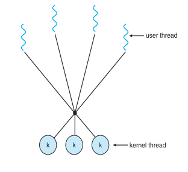

### Many to One

Dalam model ini, kita memiliki beberapa thread pengguna dipetakan ke satu thread kernel. Dalam model ini ketika sebuah thread pengguna membuat panggilan sistem yang memblokir seluruh proses blok. Karena kita hanya memiliki satu thread kernel dan hanya satu thread pengguna yang dapat mengakses kernel pada satu waktu, jadi beberapa thread tidak dapat mengakses multiprosesor secara bersamaan. Manajemen thread dilakukan pada level pengguna sehingga lebih efisien.

### One to One

Dalam model ini, ada hubungan satu-satu antara kernel dan thread pengguna. Dalam model ini, beberapa thread dapat berjalan pada beberapa prosesor. Masalah dengan model ini adalah bahwa membuat thread pengguna memerlukan thread kernel yang sesuai.

Karena setiap thread pengguna terhubung ke kernel yang berbeda, jika ada thread pengguna yang membuat panggilan sistem yang memblokir, thread pengguna lainnya tidak akan diblokir.

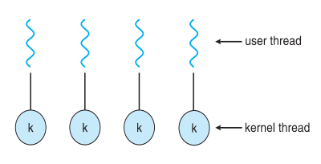

### Two-Level

Ada juga model hibrida yang menggabungkan elemen dari thread tingkat pengguna dan thread tingkat kernel. Sebagai contoh, beberapa sistem operasi menggunakan model hibrida yang disebut "model dua tingkat", di mana setiap proses memiliki satu atau lebih thread tingkat pengguna, yang dipetakan ke thread tingkat kernel oleh sistem operasi.

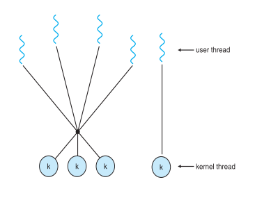

## Threads Library

**Thread LIbrary** menyediakan programmer dengan API untuk membuat dan mengelola thread

Ada dua cara utama untuk implementasi:

- Library sepenuhnya di ruang pengguna
- Library tingkat kernel yang didukung oleh OS

Perpustakaan thread, yang membantu dalam membuat dan mengelola thread, dapat diimplementasikan dengan dua cara: sepenuhnya di ruang pengguna tanpa dukungan kernel, menghasilkan panggilan fungsi lokal, atau sebagai perpustakaan tingkat kernel yang didukung oleh sistem operasi, biasanya menghasilkan panggilan sistem ke kernel.

Tiga perpustakaan thread utama yang digunakan saat ini adalah: POSIX Pthreads, Windows, dan Java. Pthreads, ekstensi thread dari standar POSIX, mungkin disediakan sebagai perpustakaan tingkat pengguna atau perpustakaan tingkat kernel. Perpustakaan thread Windows adalah perpustakaan tingkat kernel yang tersedia di sistem Windows. API thread Java memungkinkan thread dibuat dan dikelola langsung di program Java.

## Pthreads

Dapat disediakan baik sebagai level pengguna atau level kernel

Sebuah API standar POSIX (IEEE 1003.1c) untuk pembuatan dan sinkronisasi thread

**_Spesifikasi_**, bukan **_implementasi_**

API menentukan perilaku dari library thread, implementasi tergantung pada pengembangan library

Umum dalam sistem operasi UNIX (Solaris, Linux, Mac OS X)

POSIX Threads adalah cara untuk membuat dan mengelola utas (threads) dalam sistem operasi yang sesuai dengan standar POSIX (Portable Operating System Interface). Utas adalah unit eksekusi independen yang dapat berjalan secara bersamaan dalam satu proses. Hal ini memungkinkan program untuk dibagi menjadi beberapa tugas yang dapat dijalankan secara bersamaan, sehingga meningkatkan kinerja pada sistem multiprosesor.

Berikut adalah beberapa keunggulan menggunakan POSIX Threads:

- **Meningkatkan kinerja:** Dengan membagi program menjadi beberapa utas, tugas-tugas dapat dijalankan secara bersamaan pada prosesor yang berbeda, sehingga meningkatkan kinerja program secara keseluruhan.
- **Peningkatan skalabilitas:** Program yang menggunakan POSIX Threads dapat dijalankan pada sistem dengan jumlah prosesor yang berbeda tanpa perlu dimodifikasi.
- **Peningkatan responsivitas:** Utas dapat diprioritaskan, sehingga tugas-tugas penting dapat dijalankan lebih cepat daripada tugas-tugas yang kurang penting.
- **Penggunaan memori yang lebih efisien:** Utas berbagi ruang memori yang sama dengan proses tempat mereka dibuat, sehingga mereka tidak memerlukan memori tambahan sebanyak proses.

POSIX Threads diimplementasikan menggunakan pustaka fungsi yang dapat dipanggil dari program C atau C++. Pustaka ini menyediakan fungsi untuk membuat dan mengelola utas, menyinkronkan akses ke data bersama, dan berkomunikasi antar utas.

Berikut adalah beberapa contoh fungsi POSIX Threads yang umum digunakan:

- `pthread_create()`: Membuat utas baru.
- `pthread_join()`: Menunggu utas lain untuk selesai.
- `pthread_mutex_lock()`: Mengunci mutex untuk mencegah akses simultan ke data bersama.
- `pthread_mutex_unlock()`: Membuka kunci mutex.
- `pthread_cond_signal()`: Menandakan kondisi yang telah dipenuhi.
- `pthread_cond_wait()`: Menunggu kondisi yang dipenuhi.

POSIX Threads adalah alat yang ampuh untuk meningkatkan kinerja dan skalabilitas program. Namun, penting untuk menggunakannya dengan hati-hati untuk menghindari kondisi balapan dan masalah sinkronisasi lainnya.

## Java Threads

Threads memungkinkan program beroperasi lebih efisien dengan melakukan banyak hal secara bersamaan.

Threads dapat digunakan untuk melakukan tugas-tugas yang rumit di latar belakang tanpa mengganggu program utama.

Thread Java adalah unit eksekusi program yang ringan dan independen. Thread memungkinkan program multithreaded untuk menjalankan beberapa tugas secara bersamaan, sehingga meningkatkan efisiensi program. Thread juga lebih ringan daripada proses, sehingga tidak menggunakan banyak memori. Java menyediakan beberapa cara untuk membuat dan mengelola thread.

Berikut adalah beberapa poin penting tentang thread Java:

- **Independensi:** Setiap thread memiliki tumpukan eksekusi dan ruang memori sendiri, sehingga dapat berjalan secara independen satu sama lain.
- **Kooperasi:** Thread dapat berkomunikasi dan bertukar data satu sama lain melalui objek bersama.
- **Sinkronisasi:** Mekanisme sinkronisasi seperti kunci dan semaphore digunakan untuk mengontrol akses ke objek bersama dan mencegah konflik antar thread.

Thread Java memiliki banyak manfaat, termasuk:

- **Peningkatan kinerja:** Program multithreaded dapat memanfaatkan beberapa prosesor secara bersamaan, sehingga meningkatkan kinerja secara keseluruhan.
- **Peningkatan respons:** Thread dapat digunakan untuk menangani tugas-tugas yang tidak memblokir, seperti input/output, sehingga meningkatkan respons program.
- **Pemrograman yang lebih mudah:** Thread dapat digunakan untuk menyederhanakan pemrograman tugas-tugas yang kompleks dengan membaginya menjadi subtugas yang lebih kecil dan dapat dikelola.

Jika Anda ingin mempelajari lebih lanjut tentang thread Java, saya sarankan untuk membaca artikel lengkap di GeeksforGeeks. Artikel ini membahas berbagai topik terkait thread Java, termasuk cara membuat dan mengelola thread, mekanisme sinkronisasi, dan common pitfalls.

## Implicit Threading

implicit threading pada dasarnya adalah penggunaan pustaka atau dukungan bahasa lain untuk menyembunyikan manajemen thread. Pustaka implicit threading yang paling umum adalah OpenMP, dalam konteks C.

1. Semakin populer seiring bertambahnya jumlah thread, ketepatan program lebih sulit dengan thread eksplisit
2. Pembuatan dan pengelolaan thread dilakukan oleh kompiler dan run-time libraries daripada programmer
3. Tiga metode yang dieksplorasi
   - Thread Pools
   - OpenMP
   - Grand Central Dispatch
4. Metode lain termasuk Microsoft Threading Building Blocks (TBB), paket **java.util.concurrent**

### Thread Pools

Kumpulan utas (thread pool) adalah sekelompok utas yang menunggu untuk ditugaskan tugas. Hal ini meningkatkan kinerja program dengan menggunakan kembali utas yang sudah ada alih-alih membuat utas baru untuk setiap tugas. Hal ini dapat mengurangi overhead dan meningkatkan stabilitas sistem. Jumlah utas dalam kumpulan dapat disesuaikan berdasarkan beban kerja.

1. Buat sejumlah thread dalam sebuah pool di mana mereka menunggu untuk dikerjakan
2. Keuntungan:
   - Biasanya sedikit lebih cepat untuk melayani permintaan dengan thread yang sudah ada daripada membuat thread baru
   - Memungkinkan jumlah thread dalam aplikasi terikat dengan ukuran pool
   - Memisahkan tugas yang akan dilakukan dari mekanisme pembuatan tugas memungkinkan strategi yang berbeda untuk menjalankan tugas
     - yaitu Tugas dapat dijadwalkan untuk dijalankan secara berkala
3. Windows API supports thread pools:

   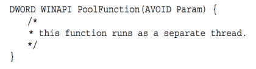

### OpenMP

OpenMP adalah sekumpulan arahan kompiler serta API untuk program yang ditulis dalam bahasa C, C++, atau FORTRAN yang menyediakan dukungan untuk pemrograman paralel dalam lingkungan memori bersama. OpenMP mengidentifikasi wilayah paralel sebagai blok kode yang dapat berjalan secara paralel. Pengembang aplikasi memasukkan arahan kompiler ke dalam kode mereka di wilayah paralel, dan arahan ini menginstruksikan pustaka run-time OpenMP untuk mengeksekusi wilayah tersebut secara paralel.

1. Set of compiler directives and an API for C, C++, FORTRAN
2. Provides support for parallel programming in shared-memory environments
3. Identifies **parallel regions** – blocks of code that can run in parallel

   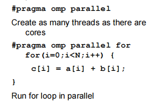

   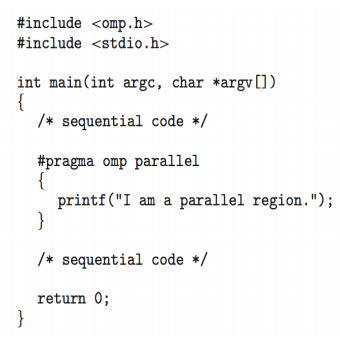

### Grand Central Dispatch

1. Teknologi Apple untuk sistem operasi Mac OS X dan iOS
2. Ekstensi untuk bahasa C, C++, API, dan pustaka run-time
3. Memungkinkan identifikasi bagian paralel
4. Mengelola sebagian besar detail penguliran
5. Blok berada dalam “^{ }” - **ˆ{ printf(“Saya adalah sebuah blok”); }**
6. Blok ditempatkan dalam antrian pengiriman
   - Ditugaskan ke thread yang tersedia di kumpulan thread ketika dihapus dari antrian
7. Dua jenis antrian pengiriman:

   - serial - blok dihapus dalam urutan FIFO, antrian per proses, disebut ** antrian utama**
     - Programmer dapat membuat antrian serial tambahan di dalam program
   - bersamaan - dihapus dalam urutan FIFO tetapi beberapa dapat dihapus pada satu waktu

     - Tiga antrian di seluruh sistem dengan prioritas rendah, default, tinggi

     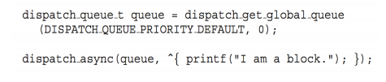

## Threading Issues

### Semantics of fork() and exec() system calls

fork() membuat sebuah proses baru yang merupakan salinan dari proses yang dipanggil. Ini termasuk menyalin semua thread dalam sebuah program multi-threaded pada beberapa sistem UNIX. Ada dua versi fork() yang mengontrol berapa banyak thread yang disalin. fork dapat menduplikasi semua thread dari proses induk ke proses anak atau hanya thread yang dipanggil oleh proses induk.

exec() menggantikan seluruh proses dengan program baru yang ditentukan dalam argumen-argumennya.

Karena exec() menggantikan proses, maka tidak perlu melakukan fork() dan menyalin semua thread jika exec() dipanggil setelahnya. Dalam kasus ini, versi fork() yang hanya menyalin thread yang dipanggil akan lebih efisien.

### Signal Handling

Sinyal **signal** digunakan pada sistem UNIX untuk memberitahukan suatu proses bahwa suatu peristiwa tertentu telah terjadi.

Sebuah **pengelola sinyal** digunakan untuk memproses sinyal

- Sinyal dihasilkan oleh suatu peristiwa tertentu
- Sinyal dikirimkan ke sebuah proses
- Sinyal ditangani oleh salah satu dari dua penangan sinyal:
  - default
  - ditentukan pengguna

Setiap sinyal memiliki **penanganan default** yang dijalankan kernel saat menangani sinyal

- **Penanganan sinyal yang ditentukan pengguna** dapat menggantikan default
- Untuk single-threaded, sinyal dikirim ke proses

Ke mana sinyal harus dikirimkan untuk multi-threaded?

- Mengirimkan sinyal ke utas yang menggunakan sinyal tersebut
- Mengirimkan sinyal ke setiap utas dalam proses
- Mengirimkan sinyal ke utas tertentu dalam proses
- Menetapkan thread tertentu untuk menerima semua sinyal untuk proses

Dalam program multithreaded, sinyal dapat menjadi rumit. Tidak seperti single-threaded apps di mana sinyal menuju ke seluruh proses, multithreading membuat target menjadi tidak jelas.

Ada dua jenis sinyal:

- Synchronous: Dikirim ke thread yang menyebabkannya (seperti kesalahan program).
- Asynchronous: Dapat datang secara tidak terduga dari luar program (seperti sinyal penghentian).
- Sinyal Asynchronous merupakan tantangan dalam multithreading karena tidak jelas thread mana yang harus menerimanya. Pada sistem Unix, thread dapat menentukan sinyal mana yang mereka inginkan, tetapi OS pada akhirnya memutuskan pengirimannya.
- Windows menggunakan Panggilan Prosedur Asinkron (APC) sebagai pengganti sinyal. Tidak seperti Unix di mana sebuah thread memilih sinyalnya, semua thread dalam proses Windows dapat menerima APC.

### Thread Cancellation

Menghentikan thread sebelum selesai dikerjakan
Thread yang akan dibatalkan adalah thread target
Dua pendekatan umum:

- Pembatalan asynchronous menghentikan thread target dengan segera
- Deffered cancellation memungkinkan thread target untuk secara berkala memeriksa apakah harus dibatalkan

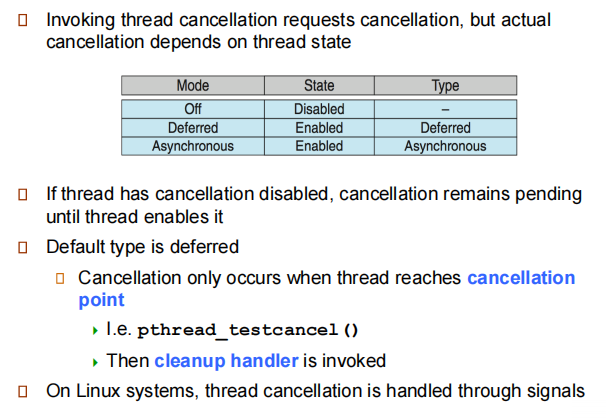

Pembatalan utas memungkinkan Anda menghentikan thread sebelum menyelesaikan tugasnya. Ada dua jenis utama:

- Asynchronous cancellation: Pembatalan secara tiba-tiba menghentikan thread target tanpa memperhatikan statusnya, yang dapat menyebabkan masalah seperti kebocoran sumber daya atau data yang rusak jika thread tersebut memperbarui informasi bersama.
- Deffered cancellation: Ini memberikan kesempatan kepada thread target untuk membersihkan diri dan keluar dengan tenang. Thread memeriksa bendera pembatalan secara berkala untuk melihat apakah thread tersebut harus berhenti. Titik pembatalan adalah saat-saat tertentu dalam kode thread di mana pembatalan aman karena thread tidak berada di tengah-tengah operasi yang kritis.

### Thread-Local Storage

Thread Local Storage (TLS) adalah metode di mana setiap thread dalam proses multithreaded dapat mengalokasikan lokasi untuk menyimpan data spesifik thread. Data spesifik thread yang terikat secara dinamis (run-time) didukung melalui API TLS (TlsAlloc).

- **thread-local storage** (**TLS**) memungkinkan setiap thread memiliki salinan datanya sendiri
- Berguna ketika Anda tidak memiliki kendali atas proses pembuatan thread (misalnya, ketika menggunakan kumpulan thread)
- Berbeda dengan variabel lokal
  - Variabel lokal hanya terlihat selama pemanggilan fungsi tunggal
  - TLS terlihat di seluruh pemanggilan fungsi
- Mirip dengan data **statis**
  - TLS bersifat unik untuk setiap thread

### Scheduler Activations

Baik model M:M dan two-level model memerlukan komunikasi untuk mempertahankan jumlah thread kernel yang sesuai yang dialokasikan ke aplikasi

Biasanya menggunakan struktur data perantara antara thread pengguna dan kernel - **lightweight process** (**LWP**)

- Tampak sebagai prosesor virtual di mana proses dapat menjadwalkan thread pengguna untuk dijalankan
- Setiap LWP dilampirkan ke thread kernel
- Berapa banyak LWP yang harus dibuat?

Aktivasi penjadwal menyediakan **upcalls** - mekanisme komunikasi dari kernel ke **upcall handler** di pustaka thread

Komunikasi ini memungkinkan aplikasi untuk mempertahankan jumlah thread kernel yang benar

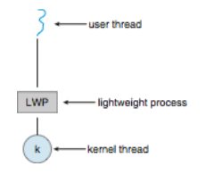

## Windows Threads

1. Windows mengimplementasikan API Windows - primary API untuk Win 98, Win NT, Win 2000, Win XP, dan Win 7
2. Mengimplementasikan one-to-one mapping, tingkat kernel
3. Setiap threads berisi
   - Sebuah id thread
   - Set register yang mewakili status processor
   - Tumpukan pengguna dan kernel yang terpisah ketika thread berjalan dalam mode pengguna atau mode kernel
   - Area penyimpanan data pribadi yang digunakan oleh pustaka run-time dan pustaka tautan dinamis (DLL)
4. Kumpulan register, tumpukan, dan area penyimpanan pribadi dikenal sebagai **konteks** dari thread
5. Struktur data utama dari sebuah thread meliputi:
   - ETHREAD (blok thread eksekutif) - termasuk pointer ke proses yang mana thread tersebut berada dan ke KTHREAD, di ruang kernel
   - KTHREAD (blok thread kernel) - scheduling dan synchronization info, tumpukan kernel-mode, pointer ke TEB, dalam ruang kernel
   - TEB (blok lingkungan thread) - id thread, tumpukan mode-pengguna, penyimpanan thread-lokal, di ruang pengguna

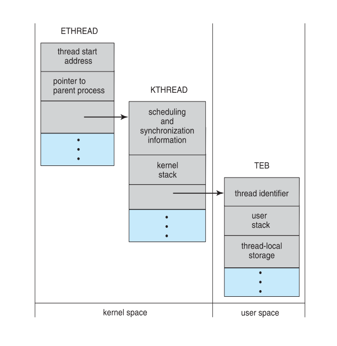

## Linux Threads

1. Linux menyebutnya sebagai ***tasks*** dan bukan ***threads***
2. Pembuatan thread dilakukan melalui panggilan sistem **clone()**
3. **clone()** mengijinkan sebuah child task untuk berbagi ruang address dari parent task ( process )
    - Flags mengontrol perilaku (behavior)

      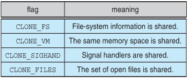

4. **struct task_struct** menunjuk pada struktur data proses ( shared atau unique)

---

## No 1

Berikan tiga contoh pemrograman di mana multithreading memberikan kinerja yang lebih baik daripada solusi single-threaded.

**Jawaban:**

a. Sebuah server Web yang melayani setiap permintaan dalam thread yang berbeda.

b. Aplikasi yang diparalelkan seperti perkalian matriks di mana bagian-bagian yang berbeda dari matriks dapat dikerjakan secara paralel.

c. Sebuah program GUI interaktif seperti debugger di mana sebuah thread digunakan untuk memantau masukan pengguna, thread lain mewakili aplikasi yang berjalan, dan thread ketiga memantau kinerja.

### Penjelasan

a. Dalam skenario server web, setiap permintaan dari klien dapat diproses dalam thread yang terpisah. Dengan menggunakan multithreading, server dapat menangani banyak permintaan secara bersamaan. Jika menggunakan single-threaded, server hanya dapat menangani satu permintaan pada satu waktu, yang dapat menyebabkan penundaan yang signifikan ketika jumlah permintaan meningkat. Multithreading memungkinkan server untuk melayani banyak pengguna secara efisien dan responsif.

b. Perkalian matriks adalah operasi komputasi intensif yang dapat dipecah menjadi tugas-tugas yang lebih kecil dan dilakukan secara paralel. Setiap elemen dari matriks hasil dapat dihitung secara independen dari elemen lainnya. Dengan multithreading, tugas-tugas ini dapat didistribusikan ke beberapa thread yang bekerja secara simultan, sehingga mengurangi waktu komputasi secara keseluruhan dibandingkan dengan pendekatan single-threaded yang memproses elemen satu per satu.  

c. Program GUI interaktif sering kali membutuhkan responsivitas yang tinggi untuk memberikan pengalaman pengguna yang baik. Dengan memanfaatkan multithreading, program dapat membagi tugas-tugas yang berbeda ke dalam thread yang terpisah. Misalnya, satu thread dapat terus memantau masukan pengguna untuk menjaga interaktivitas, sementara thread lain menangani proses aplikasi yang berjalan di latar belakang, dan thread ketiga dapat digunakan untuk memantau kinerja sistem secara real-time. Ini memastikan bahwa antarmuka pengguna tetap responsif meskipun ada tugas berat yang sedang dijalankan di latar belakang, yang tidak mungkin dicapai dengan pendekatan single-threaded.

## No 2

Apa dua perbedaan antara thread tingkat pengguna dan thread tingkat kernel? Dalam keadaan apa satu jenis lebih baik daripada yang lain?

**Jawaban:**

- Thread tingkat pengguna tidak diketahui oleh kernel, sedangkan kernel mengetahui thread tingkat kernel.
- Pada sistem yang menggunakan pemetaan M:1 atau M:N, thread pengguna diatur oleh pustaka thread dan kernel mengatur thread kernel.
- Thread kernel tidak harus dikaitkan dengan proses sedangkan setiap thread pengguna milik proses. Thread kernel umumnya lebih mahal untuk dipertahankan daripada thread pengguna karena mereka harus diwakili dengan struktur data kernel.

### Penjelasan

Perbedaan antara user-level threads dan kernel-level threads terletak pada tingkat di mana sistem operasi terlibat dan bagaimana proses penjadwalan dilakukan. User-level threads tidak dikenal oleh kernel, sementara kernel-level threads dikenal oleh kernel. Selain itu, pada sistem dengan pemetaan M:1 atau M:N, user-level threads dijadwalkan oleh perpustakaan thread, sedangkan kernel-level threads dijadwalkan oleh kernel.

Pilihan antara kedua jenis ini tergantung pada kebutuhan aplikasi. User-level threads memiliki overhead yang lebih rendah karena mereka dikelola sepenuhnya oleh program pengguna tanpa intervensi kernel. Namun, kernel-level threads dapat memberikan kinerja yang lebih baik dan lebih stabil karena mereka dapat dijadwalkan langsung oleh kernel dan memiliki kemampuan untuk menggunakan multiple core. Sebagai aturan umum, user-level threads lebih cocok untuk aplikasi yang membutuhkan manajemen yang sangat ringan, sementara kernel-level threads lebih cocok untuk aplikasi yang memerlukan kinerja dan skalabilitas yang tinggi.

## No 3

Jelaskan tindakan yang diambil oleh kernel untuk context switch antara kernel level threads.

**Jawaban:**

Peralihan konteks antara benang kernel biasanya memerlukan penyimpanan nilai dari register CPU dari thread yang sedang dipindahkan dan mengembalikan register CPU dari thread baru yang sedang dijadwalkan.

### Penjelasan

Saat melakukan context-switch antara thread-thread di level kernel, kernel perlu menyimpan nilai-nilai register CPU dari thread yang akan diganti dan mengembalikan nilai-nilai register CPU dari thread baru yang akan dijadwalkan.

### Apa itu Context Swicth

Context-switch adalah proses di mana CPU beralih dari eksekusi satu proses atau thread ke proses atau thread lainnya. Saat melakukan context-switch, sistem operasi menyimpan status (atau konteks) dari proses atau thread yang sedang berjalan saat ini, termasuk nilai-nilai register CPU, pointer instruksi, dan informasi lain yang diperlukan untuk melanjutkan eksekusi nanti. Kemudian, sistem operasi memuat konteks dari proses atau thread baru yang akan dieksekusi sehingga CPU dapat melanjutkan eksekusi dari titik terakhir di mana proses atau thread sebelumnya dihentikan. Context-switch memungkinkan sistem operasi untuk memberikan kesan bahwa banyak proses atau thread sedang berjalan secara bersamaan, meskipun CPU sebenarnya melakukan eksekusi secara bergantian di antara mereka.

## No 4

Sumber daya apa saja yang digunakan ketika thread dibuat? Bagaimana perbedaannya dengan yang digunakan ketika proses dibuat?

**Jawaban:**

Karena thread lebih kecil daripada proses, pembuatan thread biasanya menggunakan sumber daya yang lebih sedikit dibandingkan dengan pembuatan proses. Membuat proses membutuhkan alokasi blok kontrol proses (PCB), struktur data yang cukup besar. PCB mencakup peta memori, daftar file yang dibuka, dan variabel lingkungan. Mengalokasikan dan mengelola peta memori biasanya merupakan aktivitas yang paling memakan waktu. Membuat thread pengguna atau kernel melibatkan alokasi struktur data kecil untuk menampung set register, tumpukan, dan prioritas.

### Penjelasan

Ketika membuat sebuah thread, digunakan lebih sedikit sumber daya dibandingkan dengan membuat sebuah proses. Proses memerlukan alokasi blok kontrol proses (PCB), struktur data yang cukup besar, yang mencakup peta memori, daftar file terbuka, dan variabel lingkungan. Pembuatan PCB dan pengelolaan peta memori biasanya memakan waktu paling lama. Sedangkan, pembuatan sebuah thread melibatkan alokasi struktur data kecil untuk menampung set register, tumpukan, dan prioritas.

## No 5

Asumsikan bahwa sistem operasi memetakan thread tingkat pengguna ke kernel menggunakan model many-to-many dan bahwa pemetaan dilakukan melalui LWPs. Selain itu, sistem memungkinkan pengembang untuk membuat thread real-time untuk digunakan dalam sistem real-time. Apakah perlu mengikat thread real-time ke LWP? Jelaskan.

**Jawaban:**

Ya. Waktu sangat krusial untuk aplikasi real-time. Jika thread ditandai sebagai real-time tetapi tidak terikat ke LWP, thread mungkin harus menunggu untuk dihubungkan ke LWP sebelum berjalan. Pertimbangkan jika thread real-time sedang berjalan (terhubung ke LWP) dan kemudian melanjutkan untuk memblokir (mis. harus melakukan I/O, telah dipraemptif oleh thread real-time prioritas lebih tinggi, sedang menunggu kunci penguncian mutual, dll.) Sementara thread real-time diblokir, LWP yang sebelumnya terhubung telah ditugaskan ke thread lain. Ketika thread real-time telah dijadwalkan untuk berjalan lagi, ia harus menunggu untuk dihubungkan ke LWP. Dengan mengikat LWP ke thread real-time, Anda memastikan thread akan dapat berjalan dengan penundaan minimal setelah dijadwalkan.

### Penjelasan

Tentu! Saat menggunakan thread real-time dalam sistem, penting untuk mengikatnya ke dalam unit pemrosesan yang disebut LWP. Tanpa ikatan ini, thread real-time mungkin harus menunggu sebelum bisa berjalan. Ini bisa menyebabkan penundaan yang tidak diinginkan dalam kinerja aplikasi yang membutuhkan waktu respons cepat. Dengan mengikat thread real-time ke LWP, kita memastikan bahwa thread tersebut bisa langsung berjalan begitu dijadwalkan tanpa penundaan tambahan.

### Apa itu LWP?

LWP singkatan dari "Lightweight Process" atau Proses Ringan. Ini adalah unit pemrosesan kecil yang dikelola oleh sistem operasi untuk mengeksekusi thread. Dalam sistem operasi yang menggunakan model many-to-many untuk memetakan thread pengguna ke kernel, seperti Solaris dan beberapa versi UNIX lainnya, LWP berfungsi sebagai perantara antara thread pengguna dan kernel. Mereka membantu dalam penjadwalan dan pengelolaan sumber daya untuk thread, memungkinkan sistem operasi untuk mengelola thread secara efisien. Dalam konteks ini, mengikat thread real-time ke LWP berarti menghubungkan thread tersebut ke unit pemrosesan yang akan mengeksekusinya.

### No 6

Apa saja tantangan dalam menggunakan thread?

**Jawaban:**

Ada beberapa tantangan dalam menggunakan thread, termasuk:

- **Sinkronisasi:** Thread dalam proses yang sama dapat mengakses dan memodifikasi data yang sama, yang dapat menyebabkan kondisi balapan. Kondisi balapan adalah situasi di mana hasil dari program bergantung pada urutan di mana thread dieksekusi.
- **Deadlock:** Deadlock adalah situasi di mana dua atau lebih thread saling menunggu satu sama lain untuk melepaskan sumber daya. Deadlock dapat menyebabkan program macet.
- **Kelaparan:** Kelaparan adalah situasi di mana satu atau lebih thread tidak dapat mendapatkan waktu CPU untuk dieksekusi. Kelaparan dapat menyebabkan program berjalan lambat.

## References

- https://socs.binus.ac.id/2020/12/13/thread-unit-pemanfaatan-cpu/
- [https://rdr11.it.student.pens.ac.id/Semester2/Sistem Operasi/Teori/TeoriOS7rev1_1D4TIB_2110191044.pdf](https://rdr11.it.student.pens.ac.id/Semester2/Sistem%20Operasi/Teori/TeoriOS7rev1_1D4TIB_2110191044.pdf)
- https://www.geeksforgeeks.org/context-switch-in-operating-system/
