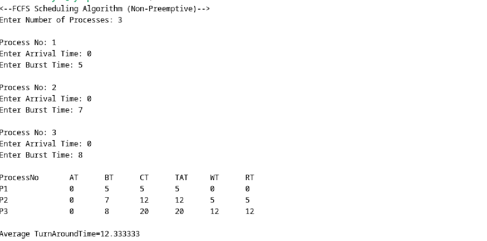

  <h1 class="text-align: center;font-weight: bold">Praktikum 11 Sistem Operasi</h1>
  <h3 class="text-align: center;">Dosen Pengampu : Dr. Ferry Astika Saputra, S.T., M.Sc.</h3>

 

  
  <h3 style="text-align: center;">Disusun Oleh :  Kelompok 4</h3>
  

    <strong>Wildan Krisna Hakim (3123500002)</strong>
  

<h3 style="text-align: center;line-height: 1.5">Politeknik Elektronika Negeri Surabaya Departemen Teknik Informatika Dan Komputer Program Studi Teknik Informatika 2023/2024</h3>
  

## Scheduling Algorithms

### First-Come First-Serve Algorithm (FCFS)

#### Contoh perhitungan proses secara teori

#### Hasil percobaan running program

#### Flowchart FCFS

#### Analisis 
Penjadwalan First-Come First-Serve (FCFS) beroperasi seperti sistem antrian linier, di mana proses yang datang terlebih dahulu akan dieksekusi lebih dahulu, berdasarkan waktu kedatangan mereka. Hal ini menyebabkan proses dieksekusi secara berurutan sesuai urutan kedatangan. Namun, jika antrian memiliki panjang yang signifikan dan durasi eksekusi proses bervariasi, FCFS dapat menjadi tidak efisien karena proses dengan waktu eksekusi yang lama dapat menyebabkan penundaan yang signifikan bagi proses-proses berikutnya.

--- 

### Shortest Job First (SJF)

#### Contoh perhitungan proses secara teori

#### Hasil percobaan running program

#### Flowchart SJF

#### Analisis
Algoritma penjadwalan Shortest Job First (SJF) merupakan metode yang sangat efektif untuk meminimalkan waktu tunggu rata-rata dan meningkatkan kinerja sistem, terutama ketika terdapat variasi dalam burst time antar proses. SJF bekerja dengan memprioritaskan proses yang memiliki burst time paling sedikit. Proses pertama yang tiba di sistem akan dieksekusi hingga selesai, setelah itu algoritma akan memilih proses berikutnya dari ready queue berdasarkan burst time terkecil. Ini berarti proses dengan durasi eksekusi lebih pendek akan diselesaikan terlebih dahulu, mengurangi waktu tunggu untuk proses lain dan menghindari efek "convoy" yang sering terjadi pada algoritma First-Come First-Serve (FCFS).

SJF juga mempertimbangkan waktu kedatangan jika dua atau lebih proses memiliki burst time yang sama, dengan memberi prioritas pada proses yang tiba lebih awal. Meskipun efektif dalam teori, implementasi SJF dalam praktik bisa menantang karena memerlukan pengetahuan sebelumnya mengenai burst time setiap proses, yang tidak selalu tersedia. SJF dapat diterapkan dalam bentuk preemptive dan non-preemptive, di mana bentuk preemptive memungkinkan proses dihentikan sementara jika ada proses baru dengan burst time lebih pendek yang tiba. Secara keseluruhan, SJF adalah algoritma yang kuat untuk sistem dengan beban kerja yang dapat diprediksi dan variasi burst time yang signifikan, memastikan proses dengan durasi eksekusi pendek dapat diselesaikan lebih cepat, sehingga meningkatkan efisiensi dan responsivitas sistem.

---

### Round Robin (RR)

#### Contoh perhitungan proses secara teori

#### Hasil percobaan running program

#### Flowchart Round Robin

#### Analisis
Round-Robin (RR) Scheduling merupakan salah satu algoritma scheduling pada CPU dimana semua proses yang dijalankan oleh algoritma ini akan dieksekusi secara Cyclic. Dengan kata lain, algoritma ini akan menjalankan suatu proses dalam batas waktu tertentu dan apabila proses tersebut telah berjalan melewati batas waktu yang ditentukan, maka proses ini akan otomatis diberhentikan sementara dan dimasukkan ke dalam antrian proses (queue) yang paling belakang (kemudian algoritma ini akan lanjut menjalankan proses lain dari queue yang paling depan). Dari percobaan diatas, detail output dari queue bagaimana proses berjalan yaitu dimulai dari P1 -> P2 -> P1 -> P3 -> P2.
