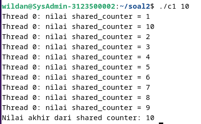
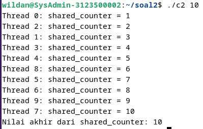

  <h1 style="text-align: center;font-weight: bold">Praktikum 12 (Post test) Praktek Sistem Operasi</h1>
  <h4 style="text-align: center;">Dosen Pengampu : Dr. Ferry Astika Saputra, S.T., M.Sc.</h4>

 

  
  <h3 style="text-align: center;">Disusun Oleh : </h3>
  

    <strong>Wildan Krisna Hakim (3123500002)</strong>
  

<h3 style="text-align: center;line-height: 1.5">Politeknik Elektronika Negeri Surabaya Departemen Teknik Informatika Dan Komputer Program Studi Teknik Informatika 2023/2024</h3>
  

# Buat analisa dari kedua program terlampir. Jelaskan penggunaan mutex pada program kedua!

### Output dari kodingan pertama :

### Analisa codingan pertama :
Kode tersebut adalah contoh program sederhana yang menggunakan konsep multithreading.
1. Tujuan Program: Program ini bertujuan untuk menunjukkan bagaimana beberapa tugas
dapat dieksekusi secara bersamaan menggunakan thread dalam bahasa pemrograman C.
2. Fungsi Utama Program:
- Program dimulai dengan memeriksa apakah jumlah argumen yang diberikan saat
menjalankan program sesuai. Jika tidak, program akan memberikan instruksi tentang
cara menggunakan program tersebut.
- Selanjutnya, program mengambil jumlah thread yang diinginkan dari argumen baris
perintah.
- Program membuat sejumlah thread sesuai dengan jumlah yang diminta.
- Setiap thread yang dibuat akan menjalankan fungsi thread_function(), yang
bertanggung jawab untuk menambahkan nilai ke variabel global shared_counter dan
mencetak nilai tersebut bersama dengan ID thread yang sesuai.
- Setelah semua thread dibuat, program menunggu sampai semua thread selesai
dieksekusi sebelum melanjutkan ke langkah berikutnya.
- Setelah semua thread selesai dieksekusi, program mencetak nilai akhir dari
shared_counter, yang mencerminkan seberapa banyak thread telah menambahkan
nilai ke variabel tersebut.
3. Variabel Global: Variabel shared_counter digunakan oleh semua thread. Ini adalah variabel
yang nilainya akan dimodifikasi oleh setiap thread.
4. Thread Function (thread_function()):
- Fungsi thread_function() adalah fungsi yang dieksekusi oleh setiap thread yang
dibuat.
- Setiap kali fungsi ini dijalankan oleh thread, ia menambahkan satu ke nilai
shared_counter.
- Setelah menambahkan nilai, thread mencetak nilai shared_counter yang baru bersama
dengan ID thread yang sesuai.
Dengan demikian, program ini memberikan contoh sederhana tentang bagaimana thread
dapat digunakan untuk mengeksekusi tugas secara bersamaan dan berbagi data melalui
variabel global. Hasilnya adalah peningkatan nilai variabel global oleh setiap thread dan
mencetak nilai akhirnya setelah semua thread selesai dieksekusi.

### Output Kodingan ke 2 :

### Analisa Codingan:
Penggunaan mutex pada program tersebut untuk memastikan bahwa akses ke variabel
global `shared_counter` dilakukan secara aman oleh setiap thread
1. Inisialisasi Mutex: Sebelum program dimulai, sebuah mutex dideklarasikan sebagai
`pthread_mutex_t shared_counter_mutex` dan diinisialisasi menggunakan
`PTHREAD_MUTEX_INITIALIZER`. Ini membuat mutex siap digunakan dalam program.
2. Penguncian Mutex: Setiap kali sebuah thread ingin mengakses dan memodifikasi variabel
`shared_counter`, ia pertama-tama memanggil
`pthread_mutex_lock(&shared_counter_mutex)`. Ini mengunci mutex, sehingga thread lain
tidak dapat mengakses variabel `shared_counter` pada saat yang sama. Dalam konteks ini,
mutex bertindak sebagai pintu gerbang yang hanya bisa dilewati oleh satu thread pada suatu
waktu. Jika mutex sudah terkunci oleh thread lain, thread yang ingin mengunci akan terblokir
hingga mutex terbuka kembali.
3. Modifikasi Variabel: Setelah mutex terkunci, thread dapat dengan aman memodifikasi nilai
variabel `shared_counter` sesuai kebutuhan.
4. Pembukaan Kunci Mutex: Setelah selesai memodifikasi variabel, thread membuka kunci
mutex menggunakan `pthread_mutex_unlock(&shared_counter_mutex)`. Ini mengizinkan
thread lain untuk mengunci mutex dan mengakses variabel `shared_counter`.
Dengan menggunakan mutex, program memastikan bahwa hanya satu thread yang dapat
mengakses dan memodifikasi variabel `shared_counter` pada satu waktu. Hal ini menghindari
terjadinya race condition di mana beberapa thread mencoba untuk mengubah nilai variabel
secara bersamaan, yang dapat menghasilkan hasil yang tidak terduga atau tidak diinginkan.
Dengan demikian, penggunaan mutex memastikan keselamatan operasi pada variabel
bersama di lingkungan multithreaded.

# Perbedaan kedua Code (Kesimpulan)

Perbedaan utama antara Code 1 dan Code 2 adalah penggunaan mekanisme sinkronisasi untuk melindungi akses ke variabel global `shared_counter` yang dibagi oleh beberapa thread. 

1. Sinkronisasi dengan Mutex:

Code 1 tidak menggunakan mekanisme sinkronisasi. Hal ini bisa menyebabkan (race condition) karena beberapa thread dapat mengakses dan memodifikasi `shared_counter` secara bersamaan tanpa koordinasi.
Code 2 menggunakan mutex (`pthread_mutex_t shared_counter_mutex`) untuk melindungi akses ke `shared_counter`. Mutex digunakan untuk mengunci (lock) sebelum mengakses dan memodifikasi `shared_counter` dan membuka kunci (unlock) setelah modifikasi selesai. Ini memastikan bahwa hanya satu thread yang dapat mengakses `shared_counter` pada satu waktu, mencegah kondisi balapan.

2. Inisialisasi dan Penggunaan Mutex:

Code 1 tidak memiliki inisialisasi atau penggunaan mutex.
Code 2 menginisialisasi mutex dengan `PTHREAD_MUTEX_INITIALIZER` dan menggunakan fungsi `pthread_mutex_lock` untuk mengunci dan pthread_mutex_unlock untuk membuka kunci.

3. Argumen Thread:

Code 1 melewatkan ID thread dengan cara yang salah. pthread_create menerima argumen terakhir sebagai pointer ke argumen yang akan dilewatkan ke fungsi thread, tetapi dalam hal ini, itu hanya melewatkan alamat thread ID yang sedang dibuat, bukan ID thread itu sendiri.
Code 2 melewatkan indeks i dari loop sebagai argumen thread. Ini adalah cara yang benar untuk mengidentifikasi thread secara unik dalam fungsi thread_function.