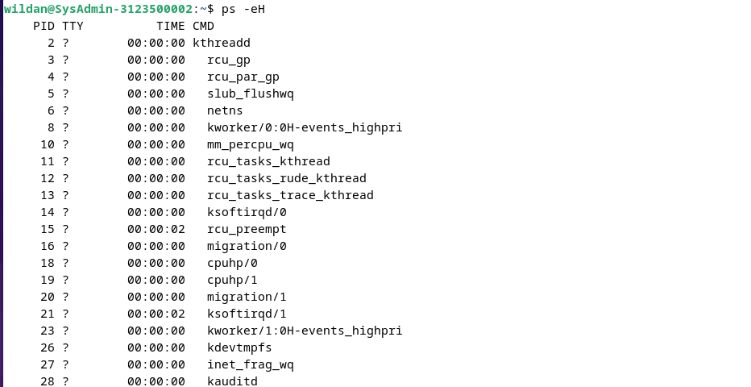
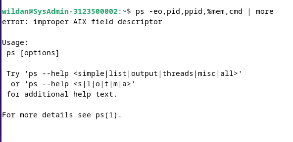
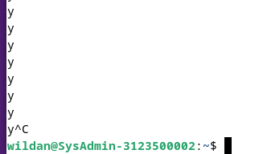

  <h1 style="font-weight: bold"> LAPORAN PRAKTIKUM V SISTEM OPERASI Proses dan Manajemen Proses</h1>
  <h4 style="text-align: center;">Dosen Pengampu : Dr. Ferry Astika Saputra, S.T., M.Sc.</h4>

 
 

  
  <h3 style="text-align: center;">Disusun Oleh : </h3>
  

    Wildan Krisna Hakim (3123500002) 
  

  <h3 style="text-align: center;line-height: 1.5">Program Studi Teknik Informatika Departemen Teknik Informatika Dan Komputer Politeknik Elektronika Negeri Surabaya 2023/2024</h3>
  

# Daftar Isi
- [Tugas Pendahuluan](#tugas-pendahuluan)
- [Percobaan](#percobaan) 
  [percobaan - 1](#percobaan-1) 
  [percobaan - 2](#percobaan-2) 
  [percobaan - 3](#percobaan-3) 
  [percobaan - 4](#percobaan-4)
- [Kesimpulan](#kesimpulan)

# Tugas Pendahuluan 

### Jawablah pertanyaan-pertanyaan di bawah ini :
1. Apa yang dimaksud dengan proses ?  
<b>Jawaban : </b>
proses adalah sebuah instance atau eksekusi dari sebuah program.

2. Apa yang dimaksud perintah untuk menampilkan status proses :  
ps, pstree.
<b>Jawaban</b> :  
- perintah "ps" : merupakan singkatan dari "process status". Perintah ini digunakan untuk menampilkan snapshot dari proses-proses yang sedang berjalan di sistem pada saat perintah tersebut dieksekusi.

- perintah "pstree" :  digunakan untuk menampilkan struktur pohon dari semua proses yang sedang berjalan di sistem. Dengan kata lain, perintah ini akan menampilkan hubungan parent-child antara proses-proses tersebut dalam bentuk pohon.

3. Sebutkan opsi yang dapat diberikan pada perintah ps
<b>Jawaban :</b>  
Opsi yang umum digunakan pada perintah ps yaitu :  
- "e" : Menampilkan semua proses.
- "f" : Menampilkan informasi lengkap tentang setiap proses.
- "u user" : Menampilkan proses yang dimiliki oleh pengguna tertentu.
- "p pid" : Menampilkan informasi tentang proses dengan PID tertentu.
- "a" : Menampilkan semua proses, kecuali proses yang diabaikan.
- "x" : Menampilkan proses yang tidak terkait dengan terminal.
- "l" : Menampilkan informasi tambahan dalam format panjang.
- "C command" : Menampilkan proses yang sesuai dengan nama perintah tertentu.
- "N" : Menampilkan proses yang tidak sesuai dengan pola yang diberikan.
- "T" : Menampilkan informasi tentang semua thread yang terkait dengan setiap proses.

4. Apa yang dimaksud dengan sinyal ? Apa perintah untuk mengirim sinyal ? 
<b>Jawaban :</b>  
- Mengirim sinyal adalah satu alat komunikasi antar proses, yaitu memberitahukan proses yang sedang berjalan bahwa ada sesuatu yang harus dikendalikan. Berdasarkan sinyal yang dikirim ini maka proses dapat bereaksi dan administrator/programmer dapat menentukan reaksi tersebut.

- perintah untuk mengirim sinyal yaitu :  
kill [-nomor sinyal] PID

5. Apa yang dimaksud dengan proses foreground dan background pada job control? 
<b>Jawaban :</b>  

    a. Job pada foreground adalah roses yang diciptakan oleh pemakai langsung pada terminal (interaktif, dialog). Pada foreground hanya diperuntukkan untuk satu job pada satu waktu. Job pada foreground akan mengontrol shell menerima input dari keyboard dan mengirim output ke layar.

    b. Job pada background tidak menerima input dari terminal, biasanya berjalan tanpa memerlukan interaksi.

6. Apa yang dimaksud dengan perintah – perintah penjadwalan prioritas ? 
top, nice, renice. 
<b>Jawaban :</b> 
- top: menampilkan daftar proses yang sedang berjalan secara real-time beserta informasi terkait penggunaan sumber daya seperti CPU, memori, dan lainnya
  
- nice : melihat proses mana yang memakan sumber daya yang paling banyak, sehingga dapat membantu dalam mengidentifikasi proses-proses yang membutuhkan perhatian khusus dengan memberikan nilai (biasanya dari -20 hingga 19) yang menentukan prioritas proses tersebut. Semakin rendah nilai yang diberikan, semakin tinggi prioritasnya.  
- renice : digunakan untuk mengubah prioritas proses yang sedang berjalan dengan menyesuaikan prioritas proses yang sudah berjalan dengan memberikan nilai prioritas baru yang dilakukan setelah proses telah dimulai untuk memodifikasikan prioritasnya sesuai kebutuhan
  

# Percobaan

1. login sebagai User

2. Download program C++ untuk menampilkan bilangan prima yang bernama primes.

analisis : Saya sudah menginstall g++ sebelumnya, g++ merupakan compiler untuk menjalankan program cpp  

analisis: perintah g++ primes.cpp -o primes untuk meng-compile file, perintah ./prime untuk running program cpp yang dibuat.  

<b>3. Lakukan percobaan-percobaan di bawah ini kemudian analisa hasil percobaan</b>

## Percobaan 1

analisis : Perintah ps menampilkan daftar semua proses yang berjalan saat ini  

analisis : Perintah ps-u menampilkan daftar semua proses yang berjalan di sistem beserta informasi pengguna terkait  

analisis :  menampilkan daftar proses yang dimiliki pengguna tertentu (username) beserta informasi penggunanya.  

 

analisis : Perintah ps -a hanya menampilkan daftar proses tanpa informasi tambahan tentang pemilik proses  

 

analisis : perintah ps -au menampilkan daftar proses denfan menyertakan informasi pengguna disetiap proses.  

## Percobaan 2

analisis : Perintah ps -eH digunakan untuk melihat daftar proses yang berjalan di sistem dan disusun dalam bentuk hirarki dimana bagan tersebut saling berhubungan  

analisis : Perintah ps -ef menampilkan semua proses yang berjalan disistem dengan informasi lengkapnya  

analisis : Perintah pstree digunakan untuk menampilkan struktur pohon proses dari sistem secara hierarkis yang dimulai dari proses induk utama seperti systemd, dan kemudian turun ke proses-proses anak yang lebih spesifik.  

analisis : pstree | grep mingetty digunakan untuk memfilter struktur pohon pada perintah pstree dengan hanya menampilkan baris yang mengandung kata "mingetty"  

Analisis: pstree -p menampilkan struktur pohon dengan menambahkan nomor PID (Proses ID) setiap proses.  

analisis: pstree -h digunakan untuk menampilkan struktur pohon proses seperti yang dilakukan oleh pstree, tetapi dengan menggunakan indentasi yang disesuaikan untuk setiap level dalam hierarki proses sehingga memudahkan untuk memahami hubungan parent-child antara proses-proses tersebut.  

## Percobaan 3 

analisis: ps -e | more menampilkan daftar semua proses dimana jika ditambah dengan perintah more akan ditampilkan satu halaman  

analisis : ps -ax | more manampilkan daftar proses secara bertahap  

analisis : ps -ef digunakan untuk menampilkan daftar semua proses yang berjalan di sistem, bersama dengan informasi lengkap tentang setiap proses, seperti UID (User ID), PID (Process ID), PPID (Parent Process ID), TTY (controlling terminal), STAT (status), TIME (CPU time), dan CMD (command) secara bertahap  

analisis : ps -eo pid cmd digunakan untuk menampilkan daftar semua proses yang berjalan di sistem, dengan menampilkan hanya PID (Process ID) dan perintah (cmd) yang menjalankan proses tersebut  

analisis:  ps -eo,pid,ppid,%mem,cmd | more digunakan untuk menampilkan daftar semua proses yang berjalan di sistem, dengan menampilkan hanya kolom PID (Process ID), PPID (Parent Process ID), %MEM (persentase memori yang digunakan oleh proses), dan CMD (command) yang menjalankan proses tersebut  

## Percobaan 4

analisis : perintah yes akan menampilkan y tanpa henti, namun kita bisa memberhentikannya dengan memencet ctrl-c  

analisis : mengalirkan output yes ke /dev/null, yang berarti output tersebut akan dibuang dan tidak ditampilkan di terminal.
  

analisis :sama seperti sebelumnya namun "&" : Menandakan bahwa proses tersebut akan berjalan di latar belakang (background), yang berarti Anda dapat melanjutkan menggunakan terminal tanpa harus menunggu proses tersebut selesai.  

analisis :  digunakan di dalam shell untuk menampilkan daftar pekerjaan (jobs) yang sedang berjalan di latar belakang (background) atau berhenti (stopped) dalam sesi shell saat ini.  

analisis: 
- kill %1 :  untuk mengirimkan sinyal penutup ke proses yang memiliki nomor identifikasi 1.
- jobs itu untuk cek daftar proses yang berjalan ia running atau terminated.  

# Kesimpulan 
Laporan praktikum ini mencakup materi tentang proses dan manajemen proses dalam sistem operasi. Ini mencakup konsep dasar proses, perintah-perintah seperti ps dan pstree untuk menampilkan status dan hirarki proses, serta opsi-opsi yang dapat diberikan pada perintah ps. Laporan ini juga membahas tentang sinyal dan perintah-perintah terkait, seperti kill, serta konsep proses foreground dan background dalam job control. Selain itu, laporan ini mencakup percobaan praktikum yang melibatkan penggunaan perintah-perintah tersebut dalam situasi nyata, seperti melihat daftar proses, melihat struktur pohon proses, dan mengelola proses yang berjalan di latar belakang. Terdapat juga contoh penggunaan perintah yes untuk menghasilkan output yang diarahkan ke /dev/null dan dijalankan di latar belakang, serta pembahasan tentang penggunaan jobs dan kill untuk mengelola proses yang berjalan di latar belakang. Overall, laporan ini memberikan pemahaman yang komprehensif tentang proses dan manajemen proses dalam sistem operasi.
