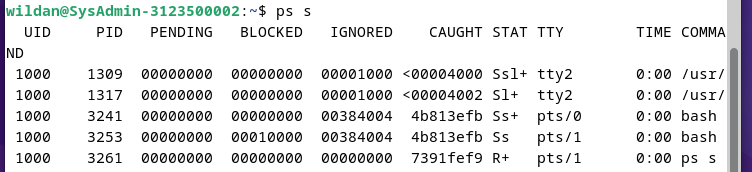
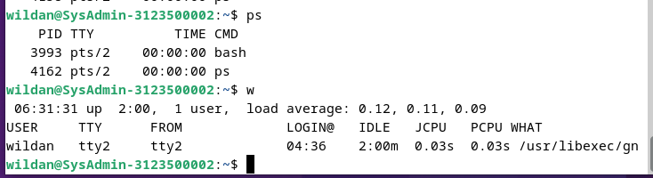

<div align="center">
  <h1 style="text-align: center;font-weight: bold">praktikum 6<br>Sistem Operasi</h1>
  <h4 style="text-align: center;">Dosen Pengampu : Dr. Ferry Astika Saputra, S.T., M.Sc.</h4>
</div>
<br />
<div align="center">
  
  <h3 style="text-align: center;">Disusun Oleh : </h3>
  <p style="text-align: center;">
    <strong>Wildan Krisna Hakim (3123500002) </strong>
  </p>
<h3 style="text-align: center;line-height: 1.5">Politeknik Elektronika Negeri Surabaya<br>Departemen Teknik Informatika Dan Komputer<br>Program Studi Teknik Informatika<br>2023/2024</h3>
  <hr><hr>
</div>

## Percobaan 5 : Menghentikan dan memulai kembali job

<strong>1. Cara lain meletakkan job pada background dengan memulai job secara normal (pada foreground), stop job dan memulai lagi pada background </strong>
```
$ yes > /dev/null
```
Hentikan sementara job (suspend ), bukan menghentikannya (terminate ), 
tetapi menghentikan sementara job sampai di restart. Untuk menghentikan 
sementara job gunakan Ctrl-Z


Analisisa : Hentikan sementara job (suspend ), bukan menghentikannya (terminate ), tetapi menghentikan sementara job sampai di restart. Untuk menghentikan sementara job gunakan Ctrl-Z.

<strong>2. Untuk restart job pada foreground , gunakan perintah fg.<br></strong>
```
$ fg
```
<br>
Analisa : $fg untuk merestart job pada foreground

<strong>3. Shell akan menampilkan nama perintah yang diletakkan di foreground . Stop job lagi dengan Ctrl-Z. Kemudian gunakan perintah bg untuk meletakkan job pada background .</strong>
```
$ bg
````

Job tidak bisa dihentikan dengan Ctrl-Z karena job berada pada background. Untuk menghentikannya, letakkan job pada foreground dengan fg dan kemudian hentikan sementara dengan Ctrl-Z.
```
$ fg
```


Analisisa : setelah $fg dan outpunya job yang ada pada
foreground, lakukan stop dengan ctrl-z. setelah stop pindah job ke background dengan $bg.  

<strong>4. Job pada background dapat digunakan untuk menampilkan teks pada terminal, dimana dapat diabaikan jika mencoba mengerjakan job lain.</strong>
```
$ yes &
```
Untuk menghentikannya tidak dapat menggunakan Ctrl-C. Job harus dipindah ke foreground, baru dihentikan dengan cara tekan fg dan tekan Enter, kemudian dilanjutkan dengan Ctrl-Z untuk menghentikan sementara. <br>
 <br>
  <br>

Analisa : untuk menghentikan yes tidak bisa hanya ctl-c, kita harus memindahkan job ke foreground lalu ctl-z untuk menghentikan sementara. 

<strong>5. Apabila ingin menjalankan banyak job dalam satu waktu, letakkan job pada foreground atau background dengan memberikan job ID</strong>
```
$ fg %2 atau $ %2
$ bg %2
```
 <br>
  <br>
Analisa: disitu saya melakukan perintaah $jobs untuk melihat id job yang bekerja, dan perinah $bg %1 untuk meletakkan job pada background, %1 disitu adalah job id nomer1.<br>

<strong>6. tekan fg dan tekan Enter, kemudian dilanjutkan dengan Ctrl-Z untuk menghentikan sementara.<br></strong>


<strong>7. Lihat job dengan perintah ps -fae dan tekan Enter. Kemudian hentikan proses dengan perintah kill.</strong>
```
$ ps -fae
$ kill -9 <NomorPID>
```
 <br>
 <br>
Analisa : di situ saya ingin menghentikan proses yes namun saya harus melihat nomor pidnya dahulu dengan perintah $ps -fae, lalu setelah mengetahui nomor pidnya saya melakukan perintah $kill -9 2508, dimana 2508 adalah nomor pid dari yes.

## Percobaan 6 : Percobaan dengan Penjadwalan Prioritas

<strong>1. Login sebagai root.</strong><br>
<strong>2. Buka 3 terminal, tampilkan pada screen yang sama.</strong>
 <br>
<strong>3. Pada setiap terminal, ketik PS1 = ” \w:” diikuti Enter. \w menampilkan path 
pada direktori home.</strong>
 <br>

<strong>4. Karena login sebagai root, maka akan ditampilkan ~: pada setiap terminal. 
Untuk setiap terminal ketik pwd dan tekan Enter untuk melihat bahwa Anda 
sedang berada pada direktori /root.</strong>
 <br>

<strong>5. Buka terminal lagi (keempat), atur posisi sehingga keempat terminal terlihat 
pada screen.</strong>
 <br>

<strong>6. Pada terminal keempat, ketik top dan tekan Enter. Maka program top
akan muncul. Ketik i. Top akan menampilkan proses yang aktif. Ketik lmt. 
Top tidak lagi menampilkan informasi pada bagian atas dari screen. Pada 
percobaan ini, terminal ke empat sebagai je ndela Top.</strong>

<strong>7. Pada terminal 1, bukalah program executable C++ dengan mengetik program 
yes dan tekan Enter. <br>
8. Ulangi langkah 7 untuk terminal 2. <br>
9. Jendela Top akan menampilkan dua program yes sebagai proses yang
berjalan. Nilai %CPU sama pada keduanya. Hal ini berarti kedua proses 
mengkonsumsi waktu proses yang sama dan berjalan sama cepat. PID dari 
kedua proses akan berbeda, misalnya 3148 dan 3149. Kemudian gunakan 
terminal 3 (yang tidak menjalankan primes maupun Jendela Top) dan ketik 
renice 19 <PID terimnal 1> (contoh : renice 19 3148) dan diikuti Enter. 
Hal ini berarti mengganti penjadwalan prioritas dari proses ke 19.<br></strong>
 <br>

<strong>10. Tunggu beberapa saat sampai program top berubah dan terlihat pada jendela 
Top. Pada kolom STAT memperlihatkan N untuk proses 3148. Hal ini 
berarti bahwa penjadwalan prioritas untuk proses 3148 lebih besar (lebih 
lambat) dari 0. Proses 3149 berjalan lebih cepat.<br>
11. Program top juga mempunyai fungsi yang sama dengan program renice. 
Pilih Jendela Top dan tekan r. Program top terdapat prompt PID to 
renice: tekan 3148 (ingat bahwa Anda harus mengganti 3148 dengan PID 
Anda sendiri) dan tekan Enter. Program top memberikan prompt Renice 
PID 3148 to value: tekan -19 dan tekan Enter.<br></strong>
 <br>
 <br>

<strong>13. Pilih terminal 3 (yang sedang tidak menjalankan yes atau program top) 
dan ketik nice –n -10 yes dan tekan Enter. Tunggu beberapa saat agar 
program top berubah dan akan terlihat proses primes ketiga. Misalnya 
PID nya 4107. Opsi -10 berada pada kolom NI (penjadwalan prioritas). <br>
14. Jangan menggunakan mouse dan keyboard selama 10 detik. Program top
menampilkan proses yang aktif selain program yes. Maka akan terlihat 
proses top terdaftar tetapi %CPU kecil (dibawah 1.0) dan konsisten. Juga 
terlihat proses berhubungan dengan dekstop grafis seperti X, panel dll.<br></strong>
 <br>

<strong>15. Pindahkan mouse sehingga kursor berubah pada screen dan lihat apa yang 
terjadi dengan tampilan top. Proses tambahan akan muncul dan nilai
%CPU berubah sebagai bagian grafis yang bekerja. Satu alasan adalah
bahwa proses 4107 berjalan pada penjadwalan prioritas tinggi. Pilih jendela 
Top, ketik r. PID to renice : muncul prompt. Ketik 4107 (ubahlah 4107
dengan PID Anda) dan tekan Enter. Renice PID 4107 to value: muncul 
prompt. Ketik 0 dan tekan Enter. Sekarang pindahkan mouse ke sekeliling 
screen. Lihat perubahannya.<br>
16. Tutup semua terminal window.<br>
17. Logout dan login kembali sebagai user<br></strong>
 <br>
 <br>

Analisa percobaan 6:<br>
- Program top membantu memantau aktivitas sistem secara real-time, seperti penggunaan CPU oleh berbagai proses.
- Dengan menggunakan renice, kita dapat mengalokasikan sumber daya komputasi dengan lebih efisien, memberikan prioritas kepada proses yang lebih penting.

# Latihan 
1. Masuk ke tty2 dengan Ctrl+Alt+F2. Ketik ps –au dan tekan Enter. Kemudian 
perhatikan keluaran sebagai berikut : 
 <br>

a. Sebutkan nama-nama proses yang bukan root : 
Jawaban : semua proses kecuali /bin/login -p-- adalah bukan root <br>
b. Tulis PID dan COMMAND dari proses yang paling banyak menggunakan CPU time
Jawaban : pid 3986 dengan nama prosesnya '/bin/login -p--/'<br>
c. Sebutkan buyut proses dan PID dari proses tersebut<br>
jawaban : pid 3986 dengan nama prosesnya '/bin/login -p--/'<br>
d. proses daemon :<br>
jawaban : 
/bin/login -p -- dengan PID 2353

e. Pada prompt login lakukan hal- hal sebagai berikut :
```
$ csh
$ who
$ bash
$ ls
$ sh
$ ps
```
 <br>
- perintah $ csh adalah sebuah shell interaktif yang menawarkan lebih banyak sintaks dibandingkan dengan Bourne Shell. 
- perintah $ bash digunakan untuk mengkonversi instruksi yang dimasukkan ke dalam bahasa biner yang dapat dimengerti oleh kernel Linux. perintah $ ls digunakan untuk menunjukkan semua file yang terletak dalam direktori aktif. 
- perintah $ sh adalah singkatan dari Bourne Shell, yang bertindak sebagai interpreter perintah atau shell standar di unix. 
- perintah $ ps digunakan untuk menampilkan daftar proses yang sedang berlangsung dalam sistem. Tampilan dari perintah ps mencakup empat kolom utama: PID, TTY, TIME, dan CMD. 
- Perintah $ who digunakan untuk menampilkan daftar pengguna yang saat ini login ke sistem. Ini menampilkan informasi seperti nama pengguna, terminal yang mereka gunakan, waktu login, dan sebagainya. Perintah ini sering digunakan untuk memeriksa siapa yang sedang menggunakan sistem atau untuk melihat apakah ada pengguna yang login secara tidak sah.

f. Sebutkan PID yang paling besar dan kemudian buat urut-urutan proses sampai 
ke PPID = 1.<br>
Jawaban: 
- PID 2612: Perintah ps.
- PID 2611: Shell sh.
- PID 2603: Shell bash.
- PID 2597: Shell csh.
- PID 2431: Shell bash.


2. coba format ps :<br>
-f : daftar penuh 

 

- -j : format job

 

- j : format job control


- l : daftar memanjang

 

- s : format sinyal

 

- v : format virtual memory

 

- X : format register i386


3. Lakukan urutan pekerjaan berikut :<br>
  a. Gunakan perintah ```find``` ke seluruh direktory pada sistem, belokkan output
sehingga daftar direktori dialihkan ke file ```directories.txt``` dan daftar pesan 
error dialihkan ke file ```errors.txt```

 

  b. Gunakan perintah ```sleep 5```. Apa yang terjadi dengan perintah ini ?


yang terjadi : hanya menunda eksekusi selanjutnya selama 5 detik. Setelah 5 detik, prompt akan kembali dan Anda dapat melanjutkan dengan perintah selanjutnya.

  c. Jalankan perintah pada background menggunakan &


  d. Jalankan ```sleep 15``` pada foreground, hentikan sementara dengan Ctrl-Z dan
kemudian letakkan pada background dengan ```bg```. Ketikkan ```jobs```. Ketikkan 
ps. Kembalikan job ke foreground dengan perintah ```fg```.


  e. Jalankan ```sleep 15``` pada background menggunakan & dan kemudian gunakan 
perintah ```kill``` untuk menghentikan proses diikuti job number.


  f. Jalankan ```sleep 15``` pada background menggunakan & dan kemudian gunakan 
```kill``` untuk menghentikan sementara proses. Gunakan ```bg``` untuk melanjutkan 
menjalankan proses.


  g. Jalankan ```sleep 60``` pada background 5 kali dan terminasi semua pada dengan 
menggunakan perintah ```killall```.


  h. Gunakan perintah ```ps, w``` dan ```top``` untuk menunjukkan semua proses yang
sedang dieksekusi.




i. Gunakan perintah ps –aeH untuk menampilkan hierarki proses. Carilah init 
proses. Apakah Anda bisa identifikasi sistem daemon yang penting ? 
Dapatkan Anda identifikasi shell dan subprose s ?


<strong>sistem daemon yang penting : </strong>

- systemd (PID 1): Ini adalah sistem init yang mengelola proses awal sistem dan mengontrol sistem daemon lainnya.

-  dbus-daemon (PID 499, 1424, 1285): Ini adalah daemon yang menyediakan layanan pertukaran pesan antar proses, umumnya digunakan dalam komunikasi antar aplikasi.

- NetworkManager (PID 523): Ini adalah daemon yang mengelola koneksi jaringan pada sistem.

- cupsd (PID 620): Ini adalah Common Unix Printing System, yang bertanggung jawab untuk mencetak di sistem.

- avahi-daemon (PID 488, 515): Ini adalah daemon layanan jaringan yang memungkinkan perangkat di jaringan lokal dikenali dengan nama yang mudah diingat.

<strong>Untuk proses shell dan subproses, Anda dapat melihat:</strong>

- Shell (bash): Anda memiliki beberapa instansi bash, contohnya adalah PID 3993, 4132.
- Subproses: Ada banyak subproses di bawah hierarki systemd

j. Kombinasikan ps –fae dan grep, apa yang Anda lihat ?


Keluaran perintah ps -fae | grep tty2 menunjukkan proses yang terkait dengan terminal tty2:

k. Jalankan proses sleep 300 pada background. Log off komputer dan log in 
kembali. Lihat daftar semua proses yang berjalan. Apa yang terjadi pada 
proses sleep


Setelah login ulang  :


 yang terjadi : perintah sleep 300 & akan terhenti saat logout, oleh karena itu setelah login ulang proses sleep 300 & telah tiada


# Kesimpulan Praktikum
Dari praktikum ini kami belajar konsep dasar proses dan manajemen proses pada sistem operasi Linux. diajarkan untuk memahami konsep proses, hubungan parent dan child, serta cara mengontrol proses menggunakan perintah shell. Materi juga mencakup penjadwalan prioritas dan penggunaan utilitas seperti 'ps' dan 'top' untuk memantau dan mengelola proses secara interaktif