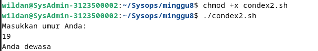
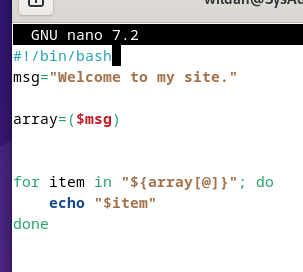
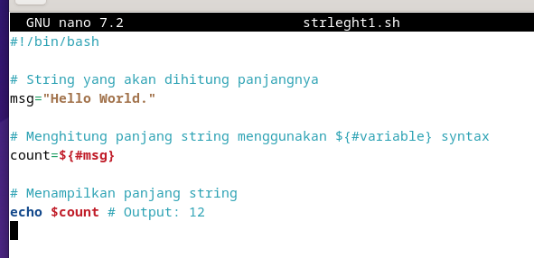
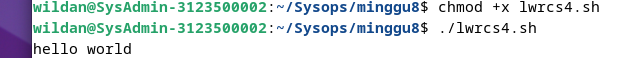

<div align="center">
  <h1 style="text-align: center;font-weight: bold">Minggu 8<br>Sistem Operasi</h1>
  <h4 style="text-align: center;">Dosen Pengampu : Dr. Ferry Astika Saputra, S.T., M.Sc.</h4>
</div>
<br />
<div align="center">
  
  <h3 style="text-align: center;">Disusun Oleh : </h3>
  <p style="text-align: center;">
    <strong>Wildan Krisna Hakim (31210000002) </strong>
  </p>
<h3 style="text-align: center;line-height: 1.5">Politeknik Elektronika Negeri Surabaya<br>Departemen Teknik Informatika Dan Komputer<br>Program Studi Teknik Informatika<br>2023/2024</h3>
  <hr><hr>
</div>

# Apa itu Bash ?
### -  penjelasan singkat Bash
Bash adalah singkatan dari "Bourne Again Shell," sebuah shell untuk sistem operasi Unix dan Linux yang membantu pengguna untuk berinteraksi dengan sistem melalui baris perintah, menjalankan perintah sistem, dan menulis skrip untuk otomatisasi tugas-tugas sistem.

### -  jenis mode bash
dua jenis bash mode : 

- Interactive mode adalah saat pengguna berinteraksi langsung dengan shell melalui terminal, di mana pengguna dapat menjalankan perintah satu per satu dan menerima respons langsung.

- Non-interactive mode digunakan saat menjalankan skrip Bash atau ketika tidak ada interaksi langsung yang diperlukan dari pengguna. Dalam mode ini, perintah-perintah dieksekusi dari skrip secara otomatis, dan biasanya outputnya disimpan dalam file atau digunakan oleh program lain.

singkatnya, Bash adalah shell yang disempurnakan.

### -  Langkah menulis bash
Sebelum belajar ke selanjutnya kita harus mengerti bagaimana cara menulis Bash script.

langkah menulis Bash script : 
1. buka terminal, buat file dengan perintah ```vi tesh.sh```
2. tambahkan ```#!/bin/bash``` di bagian atas file
3. setelah itu tulis code shell di file tersebut
4. jika sudah, simpan file tersebut dengan ekstensi ```.sh```
5. jika ingin run kode tersebut, gunakan perintah ```./namafile.sh``` di terminal.


### -  Tipe shell
shell memiliki beberapa tipe, berikut contoh tipe shell dan shebangnya. she bang atau hashbang adalah karakter khusus dalam skrip shell atau file eksekusi yang memberi tahu sistem operasi cara mengeksekusi file tersebut.

 - Bourne shell(sh) dengan hasbangnya adalah ```#!/bin/sh```
 - Bourne again shell(bash) dengan hasbangnya adalah ```#!/bin/bash```
 - C shell(cshell) dengan hasbangnya adalah ```#!/bin/csh```


 ### -  perbedaan script dan comand line

Pada Mata Kuliah sistem operasi kali ini kan kita belajar Bash script, namun sebelum-sebelumnya kita juga belajar command line atau perintah di Linux, Lalu apa sih bedanya?

Berikut adalah perbedaan antara keduanya : 

- Jika command line itu tidak disimpan berupa File oleh sistem operasi, namun jika Script disimpan dan dapat ditulis ulang atau diubah di file script tersebut.
- jika command line hanya bisa menjalankan satu perintah dalam satu waktu, namun jika Script dapat menjalankan beberapa perintah dalam satu file.


# Bagaimana cara membuat variabel di Bash?

### -  Penjelasan  Variabel Shell Bash

Dalam pemrograman shell dan script bash, variabel digunakan seperti dalam bahasa pemrograman lainnya. Variabel berfungsi sebagai wadah untuk menyimpan data dalam pemrograman, yang mencakup pointer ke lokasi memori data tersebut.

```bash
#!/bin/bash
NamaVariabel=NilaiVariabel
```
variabel "NamaVariabel" diisi dengan value "NilaiVariabel

```bash
#!/bin/bash
NilaiMahasiswa=85
```
variabel `NilaiMahasiswa` diberikan nilai 85.

### -  cara mengakses Variabel di Bash

cara mengakses Variabel adalah menggunakan simbol dolar ($) diikuti dengan nama variabel. Sebagai contoh,

```bash
#!/bin/bash
NilaiMahasiswa=85
echo $NilaiMahasiswa
```

variabel `NilaiMahasiswa` diisi dengan nilai 85 dan kemudian menggunakan `echo` untuk menampilkan nilai variabel `NilaiMahasiswa`. `echo` di bahasa C sama saja dengan `Printf` gampangnya seperti itu.

### -  Variabel Readonly Shell Bash

Variabel yang sudah dideklarasikan bisa diganti valuenya dengan cara mendeklarasi ulang variabel tersebut namun dengan nilai yang berbeda. Sebagai contoh,

```bash
#!/bin/bash
NilaiMahasiswa=85
echo $NilaiMahasiswa
NilaiMahasiswa=100
echo $NilaiMahasiswa
```

output :

```
85
100
```
diatas Variabel NilaiMahasiswa yang semua 85 diubah menjadi 100. Namun jika kita menggunakan perintah `readonly`, maka variabel tidak bisa dirubah karena variabel tersebut menjadi konstan, dan jika tetap mencoba mendeklarasi ulang namun dengan value yang beda maka outpunya akan error. Sebagai contoh,

```bash
#!/bin/bash
NilaiMahasiswa=85
echo $NilaiMahasiswa
readonly NilaiMahasiswa
NilaiMahasiswa=100
echo $NilaiMahasiswa
```

menghasilkan error, menunjukkan bahwa `NilaiMahasiswa` hanya bisa dibaca:

```
85
line 6: NilaiMahasiswa: is read-only
```

### -  Menghapus Variabel Shell Bash

`unset` digunakan untuk menghapus nilai variabel yang ditentukan, Varibel tetap bisa diakses namun valuenya kosong. Sebagai contoh,

```bash
#!/bin/bash
NilaiMahasiswa=85
echo $NilaiMahasiswa
unset NilaiMahasiswa
echo "kosong":$NilaiMahasiswa
```

menghasilkan:

```
85
kosong:
```

Variabel `NilaiMahasiswa` pertama kali diatur menjadi 85, nilainya dicetak, dan kemudian dihapus menggunakan `unset NilaiMahasiswa`. Selanjutnya, mencetak "kosong" diikuti oleh nilai `NilaiMahasiswa`, yang sekarang muncul sebagai spasi kosong.

### -  Variabel Global dan lokal

Variabel memiliki cakupan tersendiri, ada yang Global dan Lokal. jika variabel Global bisa diakses di fungsi lain, namun jika lokal hanya bisa di fungsi itu sendiri.

- contoh variabel global : 

```bash
#!/bin/bash
setNilaiMahasiswa() {
    echo "Di Dalam Fungsi Nilai: $NilaiMahasiswa"
}
NilaiMahasiswa=40
setNilaiMahasiswa
echo "Script: $tmp"
```

menghasilkan:

```
Di Dalam Fungsi Usia: 40
Usia Skrip: 40
```
- Variabel lokal
berikut penulisan variabel lokal : 

```local variablename=variablevalue```

contoh : 

```bash
#!/bin/bash
setNilaiMahasiswa() {
    local NilaiMahasiswa=85
    echo "Variabel Lokal Nilai: $NilaiMahasiswa"
}
NilaiMahasiswa=40
setNilaiMahasiswa
echo "Global: $tmp"
```

menghasilkan:

```
Variabel Lokal Nilai: 85
Global: 40
```
jadi kenapa kok dioutput global berisi 40? padahal kita sudah memanggil fungsi `setNilaiMahasiswa` setelah deklarasi Variabel global `setNilaiMahasiswa`, karena variabel `setNilaiMahasiswa` yang lokal hanya bisa diakses di fungsinya saja. 

### -  Tipe Data Variabel

Bash juga memiliki tipe data, cara penulisannya sebagai berikut : 

```bash
#!/bin/bash
declare options variablename=value
```

Di sini, `options` adalah tipe variabel.

Tipe Variabel | Sintaks | Deskripsi
--- | --- | ---
Array | `declare -a variable` | Mendeklarasikan variabel array yang diindeks yang menyimpan string
Array Terkait | `declare -A variable` | Mendeklarasikan array terkait
Integer | `declare -i variable` | Mendeklarasikan nilai numerik untuk disimpan dalam variabel
Readonly | `declare -r variable` | Mendeklarasikan variabel hanya bisa dibaca yang tidak dapat diubah atau dihapus
Export | `declare -x variable` | Mengekspor variabel untuk digunakan oleh semua proses anak

### -  Menampilkan enviroment variable di Bash

Environment variable merupakan variabel yang berada di lapisan runtime sistem operasi. jadi singkatnya adalah letak disimpannya file runtime codingan tersebut.

ada dua di bash yaitu `printenv` dan `env`

### -  Cara penulisan Variabel

- Variabel dibaca dengan menambahkan simbol $.
- Nama variabel terdiri dari alfabet, angka, atau garis bawah.
- Variabel bersifat case-sensitive; misalnya, `test` dan `Test` dianggap dua variabel yang berbeda.
- Meskipun nama variabel biasanya ditulis dalam HURUF KAPITAL, Anda dapat membuatnya dengan menggunakan huruf besar atau kecil jika diperlukan. Variabel lingkungan dan shell keduanya dalam HURUF KAPITAL.
- Nama variabel tidak boleh mengandung spasi.
- Nama-nama biasanya ditulis dalam gaya camelCase. Contoh: `firstName`.

### -  Variabel-Shell

Variabel-shell disetel oleh shell, bukan oleh pengguna. kenapa begitu? ya karena biar berlajan lebih lancar. 

Contohnya adalah:

- PWD: Menyimpan direktori kerja saat ini.
- HOME: Mewakili direktori rumah dari pengguna saat ini.
- PATH: Berisi daftar direktori di mana file-file eksekusi berada.
- IFS: Singkatan dari Internal Field Separator dan digunakan untuk membagi string menjadi bagian.
- UID: Mewakili nomor identifikasi pengguna.
- SHELL: Menentukan jalur ke executable shell.
- TERM: Menentukan jenis terminal yang digunakan.
- PS1: Mendefinisikan string prompt utama untuk shell interaktif.

Variabel-varibel ini ditetapkan dan dikelola oleh lingkungan shell itu sendiri dan memainkan peran penting dalam operasi shell serta interaksi antara pengguna dan sistem operasi. Mereka menyediakan informasi penting tentang lingkungan sistem dan pengaturan pengguna yang digunakan oleh berbagai proses shell selama eksekusi.


# Loop File di Bash

Looping file di Bash adalah teknik untuk mengiterasi melalui daftar file atau direktori dalam skrip Bash. Ini memungkinkan pengguna untuk menjalankan serangkaian perintah untuk setiap file atau direktori dalam daftar tersebut.

Ada beberapa cara untuk melakukan looping file di Bash, di antaranya adalah menggunakan perintah `for`, `while`, atau `find`. Berikut adalah contoh penggunaan perintah `for` untuk melakukan loop file di dalam sebuah direktori:

```bash
#!/bin/bash

for file in /path/to/directory/*; do
    if [[ -f "$file" ]]; then
        echo "Processing file: $file"
    fi
done
```

Dalam contoh di atas, `for file in /path/to/directory/*` menghasilkan daftar file di dalam direktori yang ditentukan. Setiap file kemudian diproses secara terpisah di dalam loop dengan perintah-perintah yang ditempatkan di dalam blok loop.

Dengan menggunakan looping file di Bash, pengguna dapat melakukan berbagai operasi, seperti memproses file, melakukan pencarian, atau menjalankan perintah berdasarkan file-file yang ada di sistem.


# Comment di Bash

Komentar di Bash adalah teks yang ditambahkan ke dalam skrip Bash untuk memberikan penjelasan atau dokumentasi tentang apa yang dilakukan oleh skrip tersebut. Komentar tidak akan dieksekusi oleh shell dan hanya berfungsi sebagai catatan untuk pembaca skrip.

Komentar dapat ditandai dengan karakter `#` untuk single line dan untuk multiple line menggunakan `:` diikuti oleh `'` untuk awal line dan diakhiri `'` di line terakhir.

Contoh:
```bash
#!/bin/bash

# Ini adalah komentar di Bash
echo "Halo, dunia!"  # Ini juga komentar.
```

# Array di bash

### -  Pengenalan tentang Array di Bash:

Array adalah struktur data yang memungkinkan pengguna untuk menyimpan dan mengelola sejumlah nilai dalam satu variabel. Dalam konteks Bash, array adalah kumpulan nilai yang diidentifikasi oleh nomor indeks, yang dimulai dari 0. Ini memungkinkan Anda untuk mengorganisir data dengan lebih baik dan mengaksesnya dengan mudah.

### -  Membuat Array di Bash:

Anda dapat membuat array di Bash dengan menggunakan sintaks berikut:

```bash
#!/bin/bash
nama_array=(nilai1 nilai2 nilai3 ...)
```

Misalnya:
```bash
#!/bin/bash
buah=("Apel" "Pisang" "Jeruk" "Anggur")
```

Di sini, variabel "buah" adalah array yang berisi empat elemen: Apel, Pisang, Jeruk, dan Anggur.

### -  Mengakses Nilai dalam Array:

Anda dapat mengakses nilai dalam array dengan menggunakan nomor indeks. Misalnya, untuk mengakses nilai kedua dalam array "buah", Anda dapat menggunakan sintaks berikut:

```bash
#!/bin/bash
echo ${buah[1]}
```

Hasilnya akan mencetak nilai "Pisang", karena indeks array dimulai dari 0.

### -  Menambahkan Nilai ke Array: 

Anda dapat menambahkan nilai baru ke dalam array dengan menggunakan sintaks berikut:

```bash
#!/bin/bash
buah+=("Mangga")
```

Ini akan menambahkan nilai "Mangga" ke dalam array "buah".

### -  Menghapus Nilai dari Array: 

Anda juga dapat menghapus nilai dari array dengan mengatur nilainya menjadi kosong. Misalnya:

```bash
#!/bin/bash
buah[2]=""
```

Ini akan menghapus nilai "Jeruk" dari array "buah".

### -  Menampilkan Seluruh Array:

Untuk menampilkan seluruh nilai dalam array, Anda dapat menggunakan sintaks berikut:

```bash
#!/bin/bash
echo ${buah[@]}
```

### -  Menghitung Jumlah Elemen dalam Array: 

Untuk menghitung jumlah elemen dalam array, Anda dapat menggunakan sintaks berikut:

```bash
#!/bin/bash
echo ${#buah[@]}
```

Ini akan mencetak jumlah elemen dalam array "buah".

Dengan pemahaman tentang array di Bash dan menggunakan sintaks yang sesuai, Anda dapat membuat skrip Bash yang lebih dinamis dan efisien untuk mengelola data dan operasi.


# Expansion 

Cara menulis skrip shell di bash : 

- Pilih Editor atau editor teks
- Buat file dengan ekstensi .sh atau .bash
- Tulis perintah dalam file
- Simpan file sebagai test.sh


Ubah izin untuk mengeksekusi file


# Condional Expression

### -  Apa Itu Conditional Expression?

Conditional expression, atau ekspresi kondisional, merupakan cara di mana Bash mengevaluasi kondisi logis. Dalam konteks Bash, ini sering digunakan dalam pernyataan kontrol aliran seperti if, elif, dan while. Ekspresi kondisional sering menggunakan operator perbandingan seperti ==, !=, <, >, <=, dan >= untuk membandingkan nilai.

Sintaksis Dasar
Sintaksis dasar untuk ekspresi kondisional dalam Bash adalah sebagai berikut:

```bash
if [ kondisi ]
then
    # kode yang akan dieksekusi jika kondisi benar
else
    # kode yang akan dieksekusi jika kondisi salah
fi
```

Contoh sederhana:


output : 


### -  Operator Logika
Bash mendukung berbagai operator logika untuk membangun ekspresi kondisional yang kompleks. Operator logika yang umum digunakan adalah:

-eq: sama dengan
-ne: tidak sama dengan
-lt: kurang dari
-gt: lebih dari
-le: kurang dari atau sama dengan
-ge: lebih dari atau sama dengan
&&: AND logika
||: OR logika
!: NOT logika

Penggunaan Ekspresi Kondisional dalam Skrip Bash
Mari kita lihat contoh penggunaan ekspresi kondisional dalam skrip Bash yang lebih kompleks:


Output :



Dalam contoh di atas, kita menggunakan if, elif, dan else untuk membuat keputusan berdasarkan umur yang dimasukkan pengguna

# Case Statements

Case statements di bahasa pemrograman biasanya dipanggil dengan switch case.

Sintaks :

case expression in
```bash
pattern1)
  ### -  Commands
  ;;
pattern1)
  ### -  Commands
  ;;
*)
  ### -  Default case to execute if none of the pattern is matched
  ;;
```

Contoh penggunaan : 


Output : 


Dalam contoh di atas, pengguna diminta untuk memasukkan pilihan (A, B, atau C). Nilai yang dimasukkan kemudian dievaluasi dalam pernyataan case. Jika nilai adalah A, B, atau C, pesan yang sesuai akan ditampilkan. Jika tidak, pesan "Pilihan tidak valid" akan ditampilkan.

# Karakter khusus yang ada di Bash

### -  Bash - Special Characters

Dalam bahasa pemrograman Bash, karakter khusus memiliki peran penting dalam menentukan perilaku dan fungsionalitas dari skrip yang User tulis. Berikut beberapa karakter khusus yang paling penting dalam Bash:

### -  1. `$` - Ekspansi Variabel
   - Tanda dollar digunakan untuk mengakses nilai dari sebuah variabel. Sebagai contoh, `$var` akan mengembalikan nilai yang disimpan dalam variabel `var`.

### -  2. `#` - Komentar
   - Tanda pagar menandakan komentar dalam skrip Bash. Segala sesuatu yang mengikuti `#` pada baris yang sama dianggap sebagai komentar dan diabaikan oleh interpreter.

### -  3. `\` - Karakter Escape
   - Garis miring terbalik digunakan sebagai karakter escape. Ini memungkinkan interpretasi harfiah dari karakter khusus, mencegah eksekusinya oleh shell.

### -  4. `*` - Pencocokan Pola Wildcard
   - Asterisk digunakan untuk pencocokan pola wildcard. Ini mewakili nol atau lebih karakter dalam ekspansi nama file atau globbing.

### -  5. `?` - Pencocokan Pola Wildcard
   - Tanda tanya mewakili satu karakter dalam ekspansi nama file atau globbing.

### -  6. `[ ]` - Kelas Karakter
   - Tanda kurung siku digunakan untuk mendefinisikan kelas karakter dalam pencocokan pola. Sebagai contoh, `[abc]` cocok dengan satu karakter `a`, `b`, atau `c`.

### -  7. `{ }` - Ekspansi Kurung Kurawal
   - Kurung kurawal digunakan untuk ekspansi kurung kurawal, menghasilkan string arbitrer. Sebagai contoh, `{1..5}` akan diubah menjadi `1 2 3 4 5`.

### -  8. `;` - Terminasi Perintah
   - Titik koma digunakan untuk mengakhiri sebuah perintah atau rangkaian perintah, memungkinkan penulisan beberapa perintah dalam satu baris.

### -  9. `|` - Pipa
   - Simbol pipa mengarahkan keluaran dari satu perintah sebagai input ke perintah lainnya (`perintah1 | perintah2`).

### -  10. `>` - Redirect Keluaran
   - Tanda lebih besar mengarahkan keluaran dari sebuah perintah ke sebuah file, menimpa konten yang ada jika diperlukan.

### -  11. `<` - Redirect Input
   - Tanda lebih kecil mengarahkan isi sebuah file sebagai input ke sebuah perintah.

### -  12. `<<` - Dokumen di Tempat
   - Dua tanda kurang dari digunakan untuk dokumen di tempat, memungkinkan User untuk memberikan input multi-baris ke sebuah perintah.

Pemahaman yang kuat tentang karakter khusus ini akan membantu user dalam menulis skrip Bash yang lebih kuat dan efisien.


# Loop di Bash
Dalam pemrograman Bash, loop adalah konstruksi yang memungkinkan User untuk mengeksekusi serangkaian perintah berulang kali, baik berdasarkan kondisi yang diberikan atau dengan menggunakan rangkaian nilai tertentu. Ada empat jenis loop yang umum digunakan di Bash: for, for index, while, dan until loop.

### -  `For` Loop
for loop digunakan untuk mengulangi serangkaian perintah sejumlah kali, berdasarkan kumpulan nilai atau daftar item

Sintaks : 

```bash 
for var in item1 item2 ... itemN
do
    perintah1
    perintah2
    ...
done
```

Contoh penerapan : 


Output : 


### -  `For Index` Loop

for index loop mirip dengan for loop, tetapi variabel loop digunakan untuk menyimpan indeks atau nomor iterasi.

Sintaks : 
```bash
for (( var=mulai; var<=akhir; var++ ))
do
    perintah1
    perintah2
    ...
done
```

Contoh penerapan : 


Output : 


### -  `while` Loop

while loop digunakan untuk mengeksekusi serangkaian perintah selama kondisi tertentu bernilai benar.

Sintaks : 
```bash
while [ kondisi ]
do
    perintah1
    perintah2
    ...
done
```
contoh penggunaan : 


Output : 


### -  `until` Loop
until loop mirip dengan while loop, tetapi mengeksekusi serangkaian perintah selama kondisi tertentu bernilai salah.

Sintaks : 
```bash
until [ kondisi ]
do
    perintah1
    perintah2
    ...
done
```
Contoh penggunaan : 


Output :


# Menambahkan string

Dalam pemrograman Bash, sering kali kita perlu menambahkan string ke variabel yang sudah ada atau membuat string baru dengan menggabungkan beberapa string bersama-sama. Pemahaman tentang cara melakukan ini sangat penting untuk mengembangkan skrip Bash yang lebih kuat dan fleksibel. Mari kita jelajahi bagaimana cara melakukan append string di Bash.

### -  Menggunakan Operator +=
Operator += digunakan untuk menambahkan string ke variabel yang sudah ada.

Contoh:


output : 


### -  Menggunakan Command Substitution
Anda dapat menggunakan command substitution untuk menambahkan output dari perintah atau ekspresi ke string.

Contoh : 


Output : 


### - Menggunakan Concatenation
Anda dapat menggunakan operator concatenation (.) untuk menggabungkan beberapa string bersama-sama.

Contoh : 


Output : 


### - Menggunakan Here Strings
Here strings memungkinkan Anda untuk menambahkan string dengan menyediakan string langsung sebagai input ke sebuah perintah.

Contoh : 


Output :


# Fungsi 

Dalam pemrograman Bash, fungsi adalah blok kode yang dapat dipanggil dan dieksekusi secara terpisah dari bagian lain dari skrip. Fungsi digunakan untuk mengorganisir kode, menghindari duplikasi, dan membuat skrip lebih modular. 

Tentu, di sini adalah tambahan shebang (`#!/bin/bash`) untuk setiap contoh kode Bash dalam rangkuman pembelajaran:

#### 1. Deklarasi Fungsi
   - Fungsi dideklarasikan dengan menggunakan kata kunci `function` diikuti oleh nama fungsi dan blok kode yang diapit oleh `{}`.

   ```bash
   #!/bin/bash
   
   function nama_fungsi {
       perintah1
       perintah2
       ...
   }
   ```

#### 2. Memanggil Fungsi
   - Untuk memanggil fungsi, cukup sebutkan namanya di dalam skrip.

   ```bash
   #!/bin/bash
   
   nama_fungsi
   ```

#### 3. Parameter Fungsi
   - Fungsi dapat menerima parameter yang diteruskan ke dalamnya. Parameter tersebut dapat diakses dalam fungsi menggunakan variabel posisi seperti `$1`, `$2`, dst.

   ```bash
   #!/bin/bash
   
   function sapa {
       echo "Halo, $1!"
   }
   ```

#### 4. Variabel Lokal
   - Variabel yang dideklarasikan di dalam fungsi secara default adalah variabel lokal, yang berarti mereka hanya dapat diakses di dalam fungsi itu sendiri.

   ```bash
   #!/bin/bash
   
   function fungsi_lokal {
       lokal_var="Nilai lokal"
       echo $lokal_var
   }
   ```

#### 5. Nilai Kembalian
   - Fungsi dapat mengembalikan nilai menggunakan pernyataan `return`.

   ```bash
   #!/bin/bash
   
   function tambah {
       return $(($1 + $2))
   }
   ```

#### 6. Fungsi Rekursif
   - Bash mendukung fungsi rekursif, yang berarti fungsi dapat memanggil dirinya sendiri.

   ```bash
   #!/bin/bash
   
   function faktorial {
       if [ $1 -le 1 ]; then
           echo 1
       else
           echo $(($1 * $(faktorial $(($1 - 1)))))
       fi
   }
   ```

#### 7. Fungsi Bawaan
   - Bash memiliki sejumlah fungsi bawaan seperti `echo`, `read`, `printf`, dan lain-lain, yang dapat digunakan langsung tanpa mendefinisikan fungsi sendiri.

   ```bash
   #!/bin/bash
   
   echo "Halo, dunia!"
   ```

Dalam pemrograman Bash, operator digunakan untuk melakukan operasi matematika, perbandingan, atau logika. Berikut adalah beberapa contoh operator yang umum digunakan:

1. Operator Aritmatika:
   - `+` (penjumlahan)
   - `-` (pengurangan)
   - `*` (perkalian)
   - `/` (pembagian)
   - `%` (modulus, sisa pembagian)

   Contoh:


outputnya : 


variabel a yang diberi value 5 dan variabel b yang diberi value 3, outputnya adalah hasil pertambahan kedua variabel tersebut 

2. Operator Perbandingan:
   - `-eq` (sama dengan)
   - `-ne` (tidak sama dengan)
   - `-gt` (lebih besar dari)
   - `-lt` (lebih kecil dari)
   - `-ge` (lebih besar dari atau sama dengan)
   - `-le` (lebih kecil dari atau sama dengan)

   Contoh:


Outputnya : 


membandingkan variabel a dan b dengan operator perbandingan `-gt`

3. Operator Logika:
   - `&&` (AND logika)
   - `||` (OR logika)
   - `!` (NOT logika)

   Contoh:


Outputnya :


menggunakan operator logika dan (&&) menyeleksi apakah variabel age lebih besar (-gt) atau lebih kecil dari 30, jika hasilnya true maka akan menampilkan "Usia berada di antara 18 dan 30 tahun.

4. Operator Penugasan:
   - `=` (penugasan nilai)
   - `+=` (penambahan nilai)
   - `-=` (pengurangan nilai)
   - `*=` (perkalian nilai)
   - `/=` (pembagian nilai)
   - `<<` (penugasan input)

   Contoh:
   ```bash
   x=10
   x=$((x + 5))  # x sekarang 15
   ```
menambahkan variabel dengan 5

5. Operator String:
   - `=` (sama dengan)
   - `!=` (tidak sama dengan)
   - `-z` (string kosong)
   - `-n` (string tidak kosong)

   Contoh:
   ```bash
   name="John"
   if [ "$name" = "John" ]; then
       echo "Halo, John!"
   fi
   ```

# Mengecek Apakah Direktori Ada dalam Script Bash

Untuk memeriksa apakah sebuah direktori ada atau tidak dalam skrip Bash, Anda dapat menggunakan perintah test dengan opsi -d.
Berikut caranya : 


outputnya akan seperti berikut :


# File Name

### 1. Struktur File Name:
   - Nama file dapat terdiri dari karakter huruf, angka, tanda hubung (-), garis bawah (_), dan titik (.).
   - Nama file dapat memiliki panjang maksimum yang tergantung pada sistem file yang digunakan oleh sistem operasi Anda.

### 2. Path File Name:
   - Path file name adalah rangkaian karakter yang menunjukkan lokasi atau alamat file di dalam sistem file.
   - Path file name dapat berupa path absolut (dimulai dari root directory) atau path relatif (dimulai dari directory saat ini).

### 3. Ekstensi File:
   - Ekstensi file adalah bagian dari nama file setelah titik (.) yang menunjukkan jenis atau format file.
   - Ekstensi file sering digunakan untuk mengidentifikasi jenis file secara visual atau untuk menentukan program default yang akan digunakan untuk membukanya.
   - Namun, dalam Bash, ekstensi file bukanlah penentu utama untuk mengetahui jenis file karena di Linux atau UNIX, ekstensi file bukanlah keharusan dan tidak memiliki pengaruh pada cara file diperlakukan oleh sistem.

### 4. Penanganan File Name di Bash:
   - Saat bekerja dengan file name di Bash, penting untuk memperhatikan penggunaan tanda kutip ganda ("") untuk menangani nama file yang mengandung spasi atau karakter khusus lainnya.
   - Variabel yang menyimpan nama file harus diapit oleh tanda kutip ganda untuk memastikan bahwa spasi dan karakter khusus tidak diinterpretasikan secara salah oleh Bash.

Contoh:


output : 


# Split string

Dalam bahasa pemrograman Bash, untuk membagi string menjadi potongan-potongan yang lebih kecil berdasarkan pemisah tertentu, Anda bisa menggunakan mekanisme yang disebut dengan "splitting" atau "pemisahan string".

### 1. awk command 


Output : 


Analisis:

- Kode menggunakan utilitas awk untuk memisahkan string.
- Setiap kata dipisahkan menggunakan loop for pada setiap kolom ($i) dalam baris input.
- `NF` adalah variabel bawaan Awk yang menunjukkan jumlah kolom dalam baris.
- Output akan berisi setiap kata dari string yang dipisahkan oleh spasi.

### 2. Menggunakan IFS Variabel:


Output : 


Analisis:

- Kode ini menggunakan IFS (Internal Field Separator) untuk memisahkan string.
- `IFS` diatur ke spasi, yang berarti string akan dipisahkan di setiap spasi.
- Perintah read -ra digunakan untuk membaca setiap potongan string dan menyimpannya dalam array pieces.
- Loop for kemudian digunakan untuk mencetak setiap potongan string yang telah dipisahkan.

### 3. Menggunakan Parameter Expansion dengan Loop:



Output : 


Analisis:

- Kode ini menggunakan parameter expansion ${string%% *} untuk mengambil potongan awal string hingga ditemukan spasi pertama.
- Setelah potongan diambil, potongan tersebut diprint dan dihapus dari string asli menggunakan ${string#* }.
- Loop while digunakan untuk terus memproses string sampai tidak ada string yang tersisa.
- Kondisi if digunakan untuk memeriksa apakah string yang tersisa sama dengan potongan terakhir yang diambil, dan jika ya, loop akan dihentikan.

# Menghitung panjang string
Panjang sebuah string didefinisikan oleh jumlah karakter yang terdapat di dalamnya, dan umumnya cukup mudah untuk mengetahui panjang tersebut untuk teks yang biasa.

### 1. Metode Pertama: Penggunaan ${#variable} Syntax
Metode pertama melibatkan penggunaan sintaks `${#variable}` untuk mendapatkan panjang dari sebuah string. Ini dilakukan dengan menuliskan `${#nama_variable}`. 

Contoh:



Output :


### 2. Metode Kedua: Penggunaan wc -m Command
Metode kedua melibatkan penggunaan perintah wc -m, baik langsung dengan sebuah string maupun melalui sebuah variabel. 

Contoh:


Output : 


### 3. Metode Ketiga: Penggunaan expr Command
Metode ketiga menggunakan perintah expr untuk menemukan panjang sebuah string. 

Contoh:


Output : 


### 4. Metode Keempat: Penggunaan awk Command
Metode keempat menggunakan perintah awk untuk menghitung panjang sebuah string menggunakan ekspresi. 

Contoh:


Output : 


# Bashrc

File .bashrc adalah skrip bash yang dieksekusi saat:
- Eksekusi skrip bash.
- Shell bash dibuka secara interaktif.

File ini tersembunyi secara default karena dimulai dengan titik (.). Terletak di direktori home pengguna.

Anda dapat menggunakan editor Vi atau Nano untuk melihat file .bashrc.

Berikut adalah perintahnya:

```
nano ~/.bashrc
```

Anda juga dapat menggunakan:
```
vi ~/.bashrc
```

Kedua perintah tersebut akan membuka file .bashrc dalam editor Nano atau Vi.

Untuk memuat ulang pengaturan .bashrc tanpa masuk dan keluar lagi, Anda dapat menjalankan perintah berikut di prompt perintah:
```
source ~/.bashrc
```

Perintah ini akan memuat ulang pengaturan .bashrc saat ini tanpa perlu masuk dan keluar dari sesi bash.

# Operator Ternary

Di pemrograman bash tidak bisa menggunakan operator ternarty, namun kita bisa menggunakan alternatifnya yaitu :

### menggunakan if-else sintaks ekspresi


### Cara kedua menggunakan perintah `let`


# Lowecase dan uppercase

ada beberapa cara untuk menghasilkan output lowercase dan uppercase
di bash. berikut caranya :

### Menggunakan Parameter Expansion:
Parameter expansion digunakan untuk memanipulasi nilai variabel. Anda dapat menggunakan parameter expansion untuk mengonversi teks menjadi huruf kecil atau besar. Contoh:


***jika ingin merubah dari lowercase ke uppercase perbedaannya hanya di `"${text^^}"` di line 5*** 

### Menggunakan Perintah tr:
Perintah tr digunakan untuk menerapkan transformasi karakter pada teks. Anda dapat menggunakan tr untuk mengonversi teks menjadi huruf kecil atau besar. Contoh:


***Jika ingin dari lowercase ke uppercase hanya merubah line 5 dari `tr '[:upper"]' '[:lowe:]'` ke `tr '[:upper"]' '[:lowe:]'` jadi hanya merubah urutannya saja ***

### Menggunakan Perintah awk:
Awk adalah alat yang kuat untuk memproses dan memanipulasi teks. Anda dapat menggunakan awk untuk mengubah teks menjadi huruf kecil dan besar . Contoh:


 
***Jika ingin output uppercase hanya merubah line 5 dengan `uppercase=$(echo "$text" | awk '{print toupper($0)}')` jadi dari `awk '{print tolower($0)` ke `awk '{print toupper($0)`


### Menggunakan Perintah sed:
sed (stream editor) adalah alat yang digunakan untuk melakukan manipulasi teks. Anda dapat menggunakan sed untuk mengubah teks menjadi huruf kecil atau besar. Contoh:




***Jika ingin uppercase kita hanya merubah kodingan tersebut bagian line 5 dengan `uppercase=$(echo "$text" | sed 's/.*/\U&/')` jadi dari `L&` ke `U&`