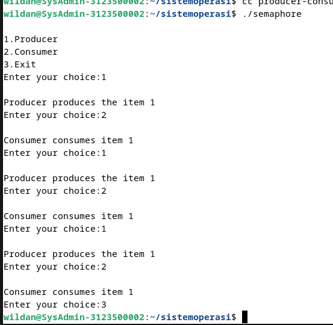
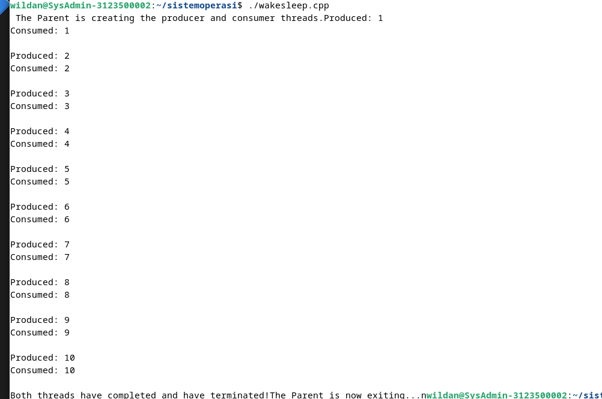

<div align="center">
  <h1 style="text-align: center;font-weight: bold">Minggu 9<br>Sistem Operasi</h1>
  <h4 style="text-align: center;">Dosen Pengampu : Dr. Ferry Astika Saputra, S.T., M.Sc.</h4>
</div>
<br />
<div align="center">
  
  <h3 style="text-align: center;">Disusun Oleh : </h3>
  <p style="text-align: center;">
    <strong>Wildan Krisna Hakim (3123500002) </strong>
  </p>
<h3 style="text-align: center;line-height: 1.5">Politeknik Elektronika Negeri Surabaya<br>Departemen Teknik Informatika Dan Komputer<br>Program Studi Teknik Informatika<br>2023/2024</h3>
  <hr><hr>
</div>

# producer-consumer-semaphore.c
### codingan :
```c
#include<stdio.h>
#include<stdlib.h>
 
int mutex=1,full=0,empty=3,x=0;
 
int main()
{
	int n;
	void producer();
	void consumer();
	int wait(int);
	int signal(int);
	printf("\n1.Producer\n2.Consumer\n3.Exit");
	while(1)
	{
		printf("\nEnter your choice:");
		scanf("%d",&n);
		switch(n)
		{
			case 1:	if((mutex==1)&&(empty!=0))
						producer();
					else
						printf("Buffer is full!!");
					break;
			case 2:	if((mutex==1)&&(full!=0))
						consumer();
					else
						printf("Buffer is empty!!");
					break;
			case 3:
					exit(0);
					break;
		}
	}
	
	return 0;
}
 
int wait(int s)
{
	return (--s);
}
 
int signal(int s)
{
	return(++s);
}
 
void producer()
{
	mutex=wait(mutex);
	full=signal(full);
	empty=wait(empty);
	x++;
	printf("\nProducer produces the item %d",x);
	mutex=signal(mutex);
}
 
void consumer()
{
	mutex=wait(mutex);
	full=wait(full);
	empty=signal(empty);
	printf("\nConsumer consumes item %d",x);
	x--;
	mutex=signal(mutex);
}
```

### Output :



Code di atas adalah implementasi sederhana dari masalah sinkronisasi produsen-konsumen menggunakan konsep semafor. Masalah produsen-konsumen melibatkan dua jenis proses yang berinteraksi menggunakan buffer yang bersamaan. Produsen menempatkan data ke dalam buffer, sementara konsumen mengambil data dari buffer.

# producer-consumer-wake-sleep-thread.cpp

### Codingan :

```c
#include <iostream>
#include <cstdlib>
#include <pthread.h>
using namespace std;

// function prototypes
void* Produce(void* arg);
void* Consume(void* arg);

// global variables
// the mutex and the condition variable
pthread_mutex_t mutex;
pthread_cond_t cond;

// the condition flag
bool condition = false;

// the item produced
int count = 0;

// how much to produce
const int NUM_TO_PRODUCE = 10;

int main()
{
    // declare variables
    pthread_t producerThread;
    pthread_t consumerThread;

    // initialize the mutex and the condition variable
    pthread_mutex_init(&mutex, NULL);
    pthread_cond_init(&cond, NULL);
    
    cerr<<" The Parent is creating the producer and consumer threads.";

    // create a producer thread
    if(pthread_create(&producerThread, NULL, Produce, NULL) < 0)
    {
        cerr<<"pthread_create";
        exit(1);
    }

    // create a consumer thread
    if(pthread_create(&consumerThread, NULL, Consume, NULL) < 0)
    {
        cerr<<"pthread_create";
        exit(1);
    }

    // wait for the threads to complete 
    // similar to the wait() system call for fork() processes
    if(pthread_join(producerThread, NULL) < 0)
    {
        cerr<<"pthread_join";
        exit(1);
    }

    if(pthread_join(consumerThread, NULL) < 0)
    {
        cerr<<"pthread_join";
        exit(1);
    }
    
    cerr<<"Both threads have completed and have terminated!"
        <<"The Parent is now exiting...n";    

    return 0;
}// end of main

/**
 * The producer thread function
 * @param arg - pointer to the thread local data - unused
 */
void* Produce(void* arg)
{
    // produce things until the loop condition is met
    while(count < NUM_TO_PRODUCE)
    {
        // lock the mutex to protect the condition variable
        if(pthread_mutex_lock(&mutex) < 0)
        {
            cerr<<"pthread_mutex_lock";
            exit(1);
        }
        
        // we have produced something that has not been
        // consumed yet, so we sleep (wait) until the consumer 
        // wakes us up.
        while(condition)
        {
            // sleep (wait) on a condition variable until the
            // the consumer wakes the producer up.
            if(pthread_cond_wait(&cond, &mutex) < 0)
            {
                cerr<<"pthread_cond_wait";
                exit(1);
            }
        }

        // produce an item
        cerr<<"Produced: "<<++count<<endl;
        
        // we have produced something
        condition = true;
        
        // wake up the sleeping consumer
        if(pthread_cond_signal(&cond) < 0)
        {
            cerr<<"pthread_cond_signal";
            exit(1);
        }
        
        // release the mutex lock
        if(pthread_mutex_unlock(&mutex) < 0)
        {
            cerr<<"pthread_mutex_unlock";
            exit(1);
        }
    }
    return 0;
}// end of Produce

/**
 * The consumer function
 * @param arg - pointer to the thread local data - unused
 */
void* Consume(void* arg)
{
    // consume things until the loop condition is met
    while(count < NUM_TO_PRODUCE)
    {	
        // lock the mutex to protect the condition variable
        if(pthread_mutex_lock(&mutex) < 0)
        {
            cerr<<"pthread_mutex_lock";
            exit(1);
        }
        
        // if there is nothing to consume, then sleep
        while(!condition)
        {			
            // sleep (wait) on a condition variable until the
            // producer wakes the consumer up.
            if(pthread_cond_wait(&cond, &mutex) < 0)
            {
                cerr<<"pthread_cond_wait";
                exit(1);
            }
        }

        cerr<<"Consumed: "<<count<<endl<<endl;
        
        // consume the item
        condition = false;
            
        // wake up the sleeping producer
        if(pthread_cond_signal(&cond) < 0)
        {
            cerr<<"pthread_cond_signal";
            exit(1);
        }
        
        // unlock the mutex
        if(pthread_mutex_unlock(&mutex) < 0)
        {
            cerr<<"pthread_mutex_unlock";
            exit(1);
        }
    }
    return 0;
}
// http://programmingnotes.org/
```
### Output :


Kode tersebut adalah implementasi dari masalah produsen-konsumen menggunakan thread di C++. Masalah produsen-konsumen melibatkan dua jenis proses yang berinteraksi menggunakan buffer yang bersamaan. Produsen menempatkan data ke dalam buffer, sementara konsumen mengambil data dari buffer.